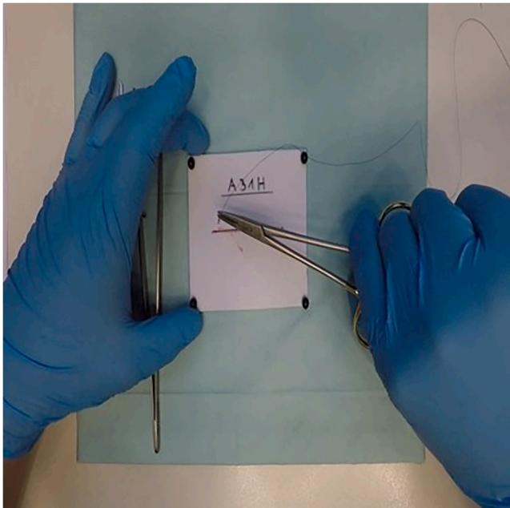
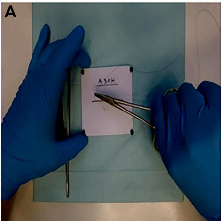
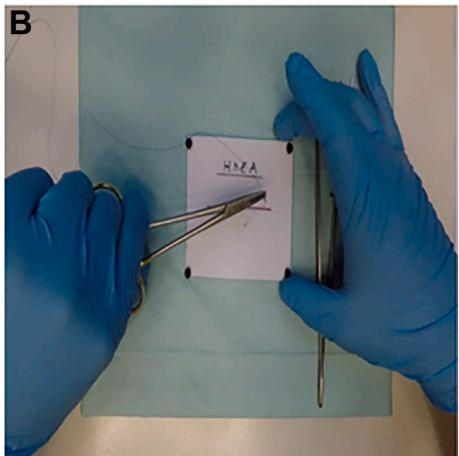
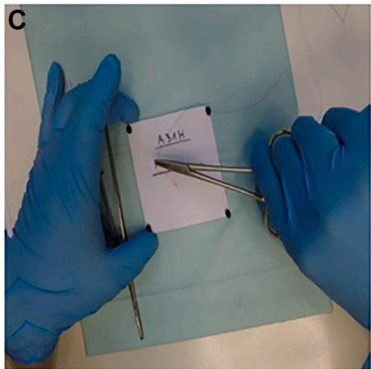
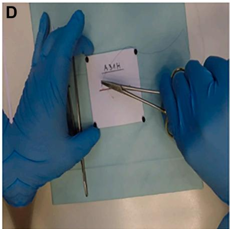
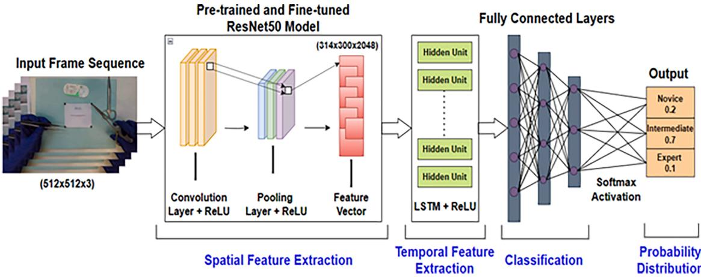
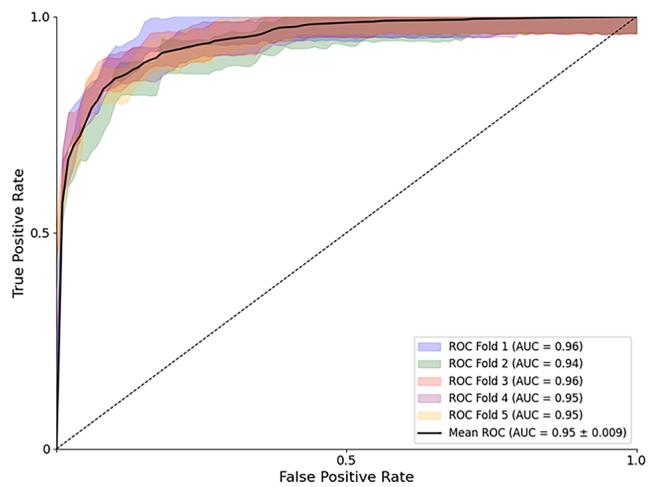
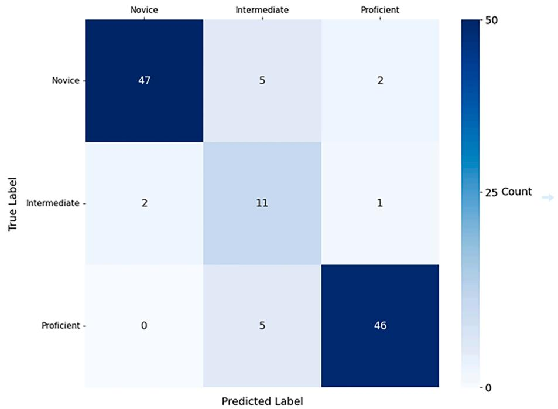
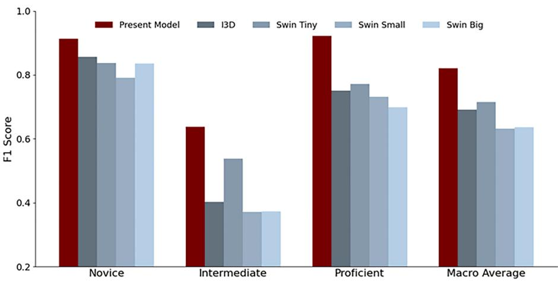

Presented at Academic Surgical Congress

# Integration of spatiotemporal features into machine learning assessment of open surgical skills

Armin Alipour, MSa , Jeffrey Balian, BSa , Kevin Tabibian, BSa , Oh Jin Kwon, MDa , Nguyen Le, MSa , Areti Tillou, MDb , Peyman Benharash, MDa,c,\*

a Cardiovascular Outcomes Research Laboratories (CORELAB), David Geffen School of Medicine at University of California, Los Angeles, CA

b Division of Trauma and Acute Care Surgery, Department of Surgery, University of California, Los Angeles, CA

c Division of Cardiac Surgery, Department of Surgery, David Geffen School of Medicine at University of California, Los Angeles, CA

## a r t i c l e i n f o

Article history: Accepted 24 December 2025 Available online 28 January 2026

## a b s t r a c t

Introduction: Accurate and objective assessment of operative skills is essential for improving training paradigms, patient safety, and quality of surgery. Advances in machine learning have facilitated automated assessment of minimally invasive and robotic operations. This study aims to develop a novel machine learning model for evaluation of open surgical proficiency. Methods: This study used the AIxSuture data set. A global rating score was assigned for each video, categorizing individuals into novice (n = 119), intermediate (n = 79), and proficient (n = 116) classes. Hybrid convolutional neural network and long-short-term-memory networks were employed to train the video classifier model. ResNet50, an image classification model, served as a spatial feature extractor to perform nonlinear transformations. Long-short-term-memory networks selectively retained and discarded both significant and insignificant changes in frame sets that capture the subject's movements. The class-wise F1 score was measured to assess harmonic performance. Results: Our assessment achieved a mean F1 score of 80.1% in determining the performance level of each subject, outperforming previous models. Additionally, the model classified performance with 90.1% accuracy for the novice group, 65.7% for the intermediate group, and 86.3% for the proficient group. Despite lower accuracy in the intermediate class, this metric outperformed other models in this group by nearly 10%. The present model classified each video into appropriate skill levels at an estimated 10.2 ± 0.4 seconds. Conclusions: Our machine learning model provides a robust framework for skill assessment in open surgery. The application of machine learning in clinical practice should be considered to evaluate surgeons' skills and help improve training and outcomes.

© 2026 The Author(s). Published by Elsevier Inc. This is an open access article under the CC BY-NC-ND license (http://creativecommons.org/licenses/by-nc-nd/4.0/).

## Introduction

Ensuring proficiency of trainees in open surgical skills is critical to ensure optimal patient outcomes.1,2 Traditionally reliant on subjective assessment, skill evaluation has evolved to include tools such as the Objective Structured Assessment of Technical Skills (OSATS), which uses direct observation and feedback.3 However, these methods are time-intensive, subject to inter-rater variability, and often lack the granularity to detect subtle technical errors.4 The complexity of open surgery―marked by nuanced hand movements and diverse tissue interactions―poses additional challenges compared to minimally invasive or robotic procedures.4

Recent advances in deep learning have enabled objective, datadriven assessment of surgical skills, predominantly in minimally invasive settings.4,5 Open surgery, however, remains underrepresented, in part due to inconsistent recording protocols and a lack of standardized video data set s.6—8 Early efforts to quantify open surgical proficiency often used simulations or specialized devices (eg, motion gloves, instrumented tools), providing surrogate markers that poorly generalize to real operations.7 Vision-based assessments offer a scalable alternative by capturing spatiotemporal patterns without requiring specialized tracking devices or sensor-instrumented tools.4,9,10 Despite the prevalence of open procedures nationally, validated tools for automated skill assessment remain limited. 10

Therefore, the present study sought to develop and validate a pipeline to evaluate operator proficiency during open suturing tasks using video-based assessments. We hypothesized that a deep learning model trained on spatiotemporal features from surgical videos would accurately classify skill levels (novice, intermediate, proficient) with performance comparable to expert human raters. We further compared the performance of our model with existing methods with an emphasis on fine-tuning and spatial feature extraction.

## Methods

## Data set

The AIxSuture data set used in the present work consists of 314 videos of medical and dental students performing a defined open suturing task in a simulated environment (Figure 1).4 Approximately 5 minutes in duration, videos were recorded at 30 frames per second using a stationary GoPro (San Mateo, CA) Hero 5 from a bird's-eye view. The standardized recording protocol―including consistent camera positioning, controlled lighting, and universal use of surgical gloves by all participants―ensured that visual features relevant to skill assessment (eg, instrument handling, suture technique, and movement patterns) were captured uniformly while minimizing participant-specific anatomic variations (Figure 2). The data set included pre- and post-training recordings for each student evaluated using the Objective Structured Assessment of Technical Skills (OSATS) scale. Three independent raters assessed each video across 8 skill categories, yielding a Global Rating Score (GRS) ranging from 8 to 40. Based on the GRS, performances were categorized into 3 skill levels: novice (GRS <16), intermediate $( 1 6 \leq \mathrm { G R S } < 2 4 )$ , and proficient $( \mathsf { G R S } \ge 2 4 ) . ^ { \circ }$

To capture spatial features from video frames for subsequent analysis, a spatial feature extraction pipeline was developed based on transfer learning. Rather than directly using the generic ImageNet11 pretrained features, we fine-tuned the model, ResNet5,12 on a subset of the video frames. Our hypothesis is that this approach enhances the model's ability to learn domainspecific spatial patterns.

A custom-built data generator was used to load and preprocess frames from the data warehouse to reduce delays. To prepare the data, 20% of the entire data set was initially set aside as a held-out test set to ensure unbiased final evaluation. The remaining 80% was then split into 87.5% for training and 12.5% for validation (corresponding to a 70:10 ratio relative to the original data set) to create stratified training and validation sets without overlap. This split was used specifically for fine-tuning the ResNet50 spatial feature extractor. Fixed numbers of instances per category were allocated to the training and validation set, with the remainder distributed between validation and testing. The generator resized images, applied augmentations (flips, rotations, color adjustments, affine transformations), and yielded batches of preprocessed images with 1-hot encoded labels. These transformations were represented as

modified brightness/contrast, $T _ { \mathrm { R o t a t e } }$ rotated the image within a range $\left[ - 1 5 ^ { \circ } , 1 5 ^ { \circ } \right] \ , T _ { \mathrm { A f f i n e } }$ included random shifts $( [ - \ 0 . 1 , 0 . 1 ] )$ scaling ([0:9; 1:1]), and rotations $( [ - 1 0 ^ { \circ } , 1 0 ^ { \circ } ] )$

## Fine-tuning: data preprocessing

where I was the original image, Resize: resized I to 512× 512 pixels, and Preprocess applied ResNet50-specific preprocessing. The augmentation operator $T _ { \mathrm { A u g m e n t } }$ was defined as

$$
I _ { \mathrm { f i n a l } } = \mathrm { P r e p r o c e s s } \left( T _ { \mathrm { A u g m e n t } } \circ \mathrm { R e s i z e } ( I ) \right)
$$

$$
T _ { A u g m e n t } = { \bf T } _ { F l i p } \circ { \bf T } _ { B r i g h t n e s s } / { \cal C } o n t r a s t ^ { \circ } { \bf T } _ { R o t a t e } \circ { \bf T } _ { A f f i n e }
$$

where $T _ { \mathrm { F l i p } } \mathrm { : }$ is the applied horizontal flipping, $T _ { \mathrm { A d j u s t } } { \mathrm { : } }$ is the

Figure 1. Sample frame depicting a surgical training environment. This frame is representative of the data used for model training in surgical skill assessment.

## Fine-tuning: model architecture

ResNet50's original classification layers were removed and replaced with a custom classification head tailored for this task. The new head began with a Global Average Pooling layer to reduce spatial dimensions,13 followed by 2 dense layers that enhanced feature abstraction. Regularization techniques, including L1-L2 regularization,14,15 batch normalization16 for stable training, and dropout layers 1 were applied to mitigate possible overfitting. Finally, a softmax activation function was employed in the output layer to produce class probabilities across the 3 target categories (Novice, Intermediate, and Proficient).

## Fine-tuning: training strategy

A 2-phase training approach was used to optimize model performance. In the first phase, the ResNet50 backbone was frozen, and the custom classification head was trained with the Adam optimizer. 18 Dynamic adjustment reduced the learning rate upon validation plateau, while early stopping prevented overfitting. In the second phase, fine-tuning was performed by unfreezing the last layers while keeping the earlier layers frozen. This approach allowed high-level features to adapt to the data set while retaining pretrained low-level representations. A smaller learning rate was applied to preserve pretrained features, while retaining the same scheduling and early stopping strategies from the first phase. The scheduler could be represented as

$\eta _ { t + 1 } = { \left\{ \begin{array} { l l } { \eta _ { t } \cdot f a c t o r , i f } \\ { \eta _ { t } , o t h e r w i s t } \end{array} \right. }$ validation loss plateaus for patience epochs; e;

subject to the constraint $\boldsymbol \mathsf { n } _ { \pm 1 } \geq$ ηmin

  
Figure 2. Sample data augmentations applied to the original frame (Figure 1). The augmentations include brightness and contrast adjustments $( \mathsf { A } ) ,$ horizontal flipping (B), rotation (C), and shift-scale-rotate transformations (D), respectively. These augmentations introduce variability to improve model generalization and robustness during training.

where $\boldsymbol { \mathsf { n } } _ { t }$ is the learning rate at epoch t, factor = 0.5: (reduction factor), patience = 2: epochs (threshold for reducing the learning rate), and $\eta _ { m i n } = 0 . 0 0 0 0 0 1$ : (minimum learning rate).

## Classification model: data preparation

To ensure uniform temporal representation, each video was standardized to 5 minutes (300 seconds) and uniformly sampled at 1 frame per second (every 30th frame), yielding a fixed sequence of 300 frames per video without overlapping windows. Each frame underwent standardization―including resizing and normalization―to ensure consistent dimensions across all inputs. The same 20% held-out test set from the fine-tuning phase was reserved for final evaluation, while the remaining 80% was prepared for k-fold cross-validation with balanced representation across all skill categories.

The fine-tuned ResNet50 model was used as a spatial feature extractor by removing its final classification layers. Each video frame was processed through this model to extract high-level spatial features, which were then stored in a cache directory. This caching strategy optimized computational efficiency by preventing redundant feature extraction during training iterations.

## Classification model: architecture

The temporal modeling component of our architecture relies on bidirectional long short-term memory (LSTM) networks to capture long-range temporal dependencies in sequential data. LSTMs employ a gated memory mechanism consisting of input, forget, and output gates that selectively retain or discard information across timesteps, addressing the vanishing gradient problem inherent in standard recurrent neural networks. The selection of LSTMs for this application was motivated by 3 key considerations. First, surgical skill assessment inherently requires analysis of extended temporal sequences where actions separated by multiple frames influence overall proficiency evaluation. Second, LSTMs' ability to maintain selective memory over long sequences enables discrimination between efficient versus inefficient surgical workflows, where the temporal spacing and sequencing of movements distinguishes expert from novice performance. Third, the bidirectional architecture ensures comprehensive temporal context by processing sequences in both forward and backward directions, capturing dependencies that manifest across the entire surgical task rather than isolated segments.

Each video's sequence of spatial features extracted from ResNet50 serves as input to the bidirectional LSTM layer (Figure 3). The LSTM processes these features timestep by timestep, with its internal gates determining which spatial patterns should be preserved in long-term memory versus discarded as transient variations. To further enhance discriminative capability, we augmented the LSTM architecture with a single-head soft attention mechanism. This attention mechanism dynamically assigned importance weights to different moments in the video sequence, allowing the model to focus on crucial frames while maintaining awareness of the local and global temporal context. The attention head could be represented as

  
Figure 3. Architecture of the hybrid convolutional neural network with long-short-term memory (LSTM). Input frames (512 × 512 × 3) are processed by a fine-tuned ResNet50 model for spatial feature extraction, producing a feature vector (314 × 300 × 2048). Temporal features are extracted using an LSTM network, followed by fully connected layers for classification. A softmax function generates probabilities for skill levels: novice, intermediate, and proficient.

$$
e _ { t } = t a n h \left( x _ { t } ^ { \Gamma } W + b _ { t } \right) \alpha _ { t } = \frac { e x p ( e _ { t } ) } { \sum _ { k = 1 } ^ { T } e x p ( e _ { k } ) } \mathrm { f o r } t = 1 , 2 , . . . , T
$$

Simplified as

$$
o u t p u t = \sum _ { t = 1 } ^ { T } \alpha _ { t } \cdot x _ { t }
$$

where $\mathbf { X _ { t } } \in \mathbb { R } ^ { \mathbf { d } }$ is the input vector at timestep $t , \mathbf { W } \in \mathbb { R } ^ { \mathbf { d } \times 1 }$ is the weight matrix, and $\mathbf { b _ { t } } \in \mathbb { R }$ is the bias term for timestep t.

Following the spatiotemporal analysis, the features were passed through fully connected layers that progressively transformed the features, while maintaining model generalization through regularization. The normalized feature representations were ultimately transformed into class-specific probabilities for final classification.

## Classification model: training strategy

K-fold cross-validation with 5 folds was employed on the 80% training data to ensure comprehensive model evaluation and generalization. In each fold, approximately 64% of the total data (4 folds) was used for training and 16% (1-fold) for validation. This process yielded 5 distinct models, each trained and validated on different data partitions. Grid search with Bayesian optimization was used to find optimal hyperparameters across 4 key dimensions:

Learning rate: 0.000001—0.001, dropout rates: 0.1—0.5, batch size: 8—32, BiLSTM units: 64—512.

Furthermore, the adaptive learning rate was adjusted based on validation performance, ensuring optimal convergence while avoiding local minima. Early stopping mechanisms monitored validation loss to prevent overfitting.

## Results

The evaluation process involved 2 main stages: cross-validation of the model and analysis of its final performance. Using 5-fold cross-validation, we comprehensively evaluated our model's validity; with each fold alternately serving as validation data while the remaining folds were used for training. After hyperparameter optimization, this process yielded 5 distinct models where each were evaluated on a single held-out test data set. Figure 4 illustrates the receiver operating characteristic (ROC) curves of these models on the test data set, demonstrating consistently strong discriminative ability, with ROC scores ranging from 0.94 to 0.96 (mean area under the ROC ${ \tt c u r v e } = 0 . 9 5 \pm 0 . 0 0 9 )$ . The tight clustering of ROC curves and small standard deviation indicates model stability across different data partitions.

Following cross-validation, a final model was trained using the combined training and validation data sets to leverage the full spectrum of available training data. The performance metrics of this model presented in Table and Figure 5 demonstrate significant improvements over existing approaches. The model achieved strong discrimination across all 3 skill levels (Novice, Intermediate, and Proficient) with a macro-averaged precision of 0.82. Particularly noteworthy was the model's performance in identifying both Novice (F1 = 0.91) and Proficient (F1 = 0.92) skill levels. Although the Intermediate class showed lower but acceptable performance (F1 = 0.63), this pattern aligns with the inherent challenges of distinguishing middle-tier performance levels in imbalanced data sets.

The confusion matrix in Figure 5 reveals an important pattern in classification behavior: misclassifications predominantly occurred between adjacent skill levels with minimal confusion between Novice and Proficient classes (only 2 cases of the entire test set). This pattern strongly suggests that our model effectively captures the ordinal nature of skill progression, maintaining logical consistency in its classification errors. The concentration of misclassifications between adjacent categories indicates that when the model makes errors it tends to place subjects into skill levels that are at least close to their true proficiency.

  
Figure 4. ROC curves from 5-fold cross-validation showing the model's classification performance at different probability thresholds. Test set performances for each fold are shown as shaded regions (AUC: 0.94—0.96), whereas the black line represents the mean ROC curve $( \mathsf { A U C } = 0 . 9 5 \pm 0 . 0 0 9 ) .$ . AUC, area under the curve; ROC, receiver operating characteristic.

Comparison of F1 score across models, stratified by different skill levels
<table><tr><td>Model</td><td>Novice</td><td>Intermediate</td><td>Proficient</td><td>Macro average</td></tr><tr><td>Present model</td><td>0.9126</td><td>0.6286</td><td>0.9200</td><td>0.8204</td></tr><tr><td>I3D</td><td>0.8571</td><td>0.4030</td><td>0.7523</td><td>0.6917</td></tr><tr><td>Swin Tiny</td><td>0.8373</td><td>0.5378</td><td>0.7723</td><td>0.7157</td></tr><tr><td>Swin Small</td><td>0.7907</td><td>0.3713</td><td>0.7317</td><td>0.6313</td></tr><tr><td>Swin Big</td><td>0.8357</td><td>0.3724</td><td>0.6986</td><td>0.6356</td></tr></table>

The present model achieved the highest F1 scores across all skill levels (bold), with a Macro Average score of 0.8204.

In comparison with previous approaches Figure 6, our model demonstrated superior performance across all skill levels. The most substantial improvement was observed in the Intermediate class, where our model achieved an F1 score of 0.63, significantly outperforming both I3D (0.40) and various Swin Transformer variants (0.37—0.54). This improvement can be mainly credited to our fine-tuning strategy on a subset of frames, along with the application of an LSTM architecture reinforced by attention mechanisms for spatiotemporal processing. The model also showed remarkable improvements in Proficient (F1 = 0.92) and Novice (F1 = 0.91) classification accuracy. The overall macro-averaged F1 score of 0.82 represents a substantial advancement over previous methods, which achieved scores ranging from 0.63 to 0.71.

## Discussion

The objective assessment of surgical proficiency represents a critical challenge in medical education.4,20 Our findings demonstrate that deep learning approaches can effectively distinguish between skill levels in open surgical procedures, with important implications for surgical training and certification. The high discriminatory power achieved by our model (area under the ROC curve 0.94—0.96) suggests that video-based assessment could potentially supplement or even enhance traditional expert-dependent evaluation methods.

The evolution of surgical skill assessment has historically been constrained by reliance on either subjective expert evaluation or highly specialized motion-tracking equipment.21 Although expert assessment remains valuable, its inherent subjectivity and resource intensity limit standardization across training programs. 22 Previous automated approaches using motion sensors offered objective measurements but required specialized hardware setups impractical for widespread implementation.23,24 Our video-based approach addresses these limitations by using standard recording equipment already present in most training environments, potentially democratizing access to objective assessment tools.24 What distinguishes our findings from previous work is not merely the technical architecture employed, but rather how the integration of spatial and temporal features mirrors the actual cognitive process of surgical evaluation.25 Just as expert surgeons assess trainees by observing both individual technical elements and their continuous flow throughout a procedure, our model's combined convoluted neural network—LSTM architecture with attention mechanisms captures both discrete actions and their sequential relationships. This approach produced particularly strong differentiation between novice and proficient performers (F1 scores of 0.91 and 0.92 respectively), suggesting that the model identifies meaningful patterns that align with expert assessment criteria.

The strong and consistent performance observed across 5-fold cross-validation (area under the ROC curve 0.94—0.96, ±0.009) transcends mere technical validation―it addresses a fundamental concern in surgical assessment: reliability .26,27 Traditional expert evaluations often suffer from inter-rater variability, with assessment outcomes potentially differing based on evaluator experience, institutional background, or even time of day. Our model's tight clustering of ROC curves and minimal variance across different data partitions suggests a level of consistency that human evaluators struggle to maintain. This stability represents a crucial advancement for standardizing surgical training, particularly as residency programs increasingly emphasize competencybased education requiring reliable, objective performance metrics.28 Moreover, the classification patterns in our results reveal insights into surgical skill development and showcase improvements over previous approaches.26,27,29 The "intermediate challenge" persists because midlevel performers exhibit inconsistent mastery, sometimes demonstrating advanced techniques while reverting to novice approaches under pressure.24 Our confusion matrix showed misclassifications occurred primarily between adjacent skill levels, confirming that our model effectively captures the ordinal nature of skill progression. Accurately recognizing the intermediate skill category resolves a major gap in assessment technology, enabling educators to provide tailored feedback at this crucial developmental stage.21 The model's success stems from its comprehensive approach that processes both spatial features through fine-tuned ResNet50 and temporal relationships via LSTM, enhanced by attention mechanisms that highlight salient technical elements―mirroring how expert evaluators assess trainees. 30

  
Figure 5. Confusion matrix of the final model trained on the combined training and validation data set after 5-fold cross-validation. Rows represent true labels, columns represent predicted labels, and the color intensity reflects the count of samples. Diagonal cells show correct classifications, whereas off-diagonal cells indicate misclassifications.

  
Figure 6. Comparison of F1 scores across models and skill levels. The present model outperforms I3D and Swin Transformer variants (Tiny, Small, Big) across all skill levels (Novice, Intermediate, Proficient) and in the macro average. The models are evaluated based on their F1 scores, highlighting the balance between precision and recall. I3D: Inflated 3D ConvNet; Swin Tiny: optimized for speed; Swin Small: balance of detail and efficiency; Swin Big: designed for in-depth video understanding.

The most intriguing aspect of our findings comes from the analysis of attention weights, which provides a window into the model's decision-making process and offers insights for surgical education. By visualizing attention patterns across the temporal dimension, we identified distinct signatures that differentiated skill levels with attention peaks corresponding to critical moments in the surgical procedure.9 For novice performances, the model consistently assigned heightened attention to fundamental handling techniques including needle grip patterns and initial tool positioning. This aligns with Hoffman and colleagues' findings on vision-based surgical skill assessment,4 confirming that basic device handling remains a cornerstone of suturing proficiency evaluation. More striking was the model's ability to identify critical transition points in the surgical workflow―moments where technical proficiency most significantly impacts overall performance quality. Initial needle positioning and suture transitions consistently received higher attention scores across all skill levels, suggesting these moments serve as discriminative features regardless of overall proficiency.31 The attention mechanism's sensitivity to both obvious technical errors and subtle efficiency patterns reveals an advantage over traditional assessment methods. Human evaluators typically excel at identifying major technical mistakes but may struggle to consistently recognize the more nuanced aspects of surgical expertise―the small efficiencies in movement, anticipatory positioning, and workflow continuity that distinguish highly proficient surgeons. Our model captured these subtle distinctions, particularly in the transitions between suturing steps, where attention weights highlighted efficiency differences invisible to casual observation. Errors during these high-attention moments frequently coincided with technical inefficiencies or deviations from optimal technique, providing objective targets for improvement. This capacity for detecting both pronounced errors and subtle expertise markers suggests our approach could complement human evaluation by quantifying aspects of performance that expert surgeons recognize intuitively but struggle to consistently verbalize or score.32

These findings point toward a transformative potential for surgical education: personalized, objective feedback based on moment-by-moment analysis rather than global performance metrics. By identifying specific points in a procedure that strongly influence skill classification, educators could provide trainees with precisely targeted feedback addressing their unique developmental needs. Rather than generic advice to "improve needle handling," instructors could highlight exact moments where technique deviated from expert patterns, creating learning opportunities tailored to individual learning curves. Integration of such video-based assessments into surgical residency programs could supplement existing curricula and potentially accelerate skill acquisition by focusing educational interventions on the highest-yield technical elements, as suggested by Pryor's recent work on competency-based surgical education. 10

The present study has several limitations. Despite memory efficiency relative to 3D convoluted neural networks or video transformers, our model demands substantial computational power.33 The ResNet50 backbone requires individual frame processing through deep convolutional layers, generating highdimensional feature vectors. Therefore, in resource-constrained environments such as smaller institutions and educational facilities, the required GPU infrastructure and processing power may be prohibitively expensive or unavailable.34 Furthermore, the sequential nature of LSTM processing, combined with frame-byframe analysis through ResNet50, makes real-time assessment challenging. The attention mechanism adds another layer of computational overhead as attention weights must be calculated at each timestep. Nonetheless, our study utilized a robust computational pipeline with integrated spatiotemporal processing to develop precise and objective open surgery skill assessment.

Beyond computational considerations, the AIxSuture data set's standardized recording conditions present important implications for model generalizability. All recordings were performed in a controlled simulation environment with uniform camera angles, lighting conditions, and participants wearing surgical gloves. Although this standardization prevents overfitting to participantspecific features and enables focus on task-relevant skill patterns, future validation on videos from diverse clinical environments with varied recording setups would strengthen external validity. Nevertheless, the controlled protocol mirrors standardized surgical training environments and provides a robust foundation for initial model development.

In conclusion, this study developed a novel video-based assessment framework for open surgical skills by integrating a fine-tuned ResNet50 architecture with LSTM networks and attention mechanisms. This approach demonstrated high predictive power and reliability in classifying surgical skill levels across different proficiency categories. By enabling the development of educational regimens customized to individual learning curves, our model offers a data-driven approach to optimize surgical training.35 Initial examination in low-stakes settings is warranted to enhance the clinical utility of the present approach. Future surgical assessments can incorporate video-based frameworks tailored toward procedure-specific techniques, transition points, and desired outcomes for subspecialty trainees. When integrated with current surgical certification processes, these objective proficiency metrics show promise for standardizing technical expertise across institutions. Taken together, this adaptive framework has the potential to enhance learning efficiency, ultimately contributing to improved patient outcomes.

Although our model demonstrates strong performance on standardized simulation videos, several key areas warrant future investigation to enhance clinical applicability. First, validation across diverse recording environments―including varied camera angles, lighting conditions, and multi-institutional settings―is essential to ensure generalizability beyond controlled simulation. Second, adaptation to intraoperative settings presents unique challenges, as real operative videos introduce visual complexity including organ backgrounds, blood presence, multiple hands, and variable camera framing that may obscure relevant surgical actions. Developing robust attention mechanisms that isolate taskrelevant motions from these confounding elements represents a crucial step toward real-world deployment. Third, computational efficiency improvements through model compression and optimized architectures could facilitate real-time feedback during training sessions, addressing current processing limitations. Finally, integration with milestone-based competency frameworks and investigation of optimal feedback delivery methods would strengthen translational potential and enable assessment of longterm impacts on skill acquisition and patient outcomes.

## Funding/Support

No direct or indirect financial support by extramural sources were received for this research.

## Conflict of Interest/Disclosure statement

P.D. received proctor fees from Atricure as a surgical proctor. All others declare no financial or nonfinancial competing interests.

## CRediT authorship contribution statement

Armin Alipour: Writing — review & editing, Writing — original draft, Validation, Data curation, Conceptualization. Jeffrey Balian: Writing — review & editing, Writing — original draft, Methodology, Formal analysis. Kevin Tabibian: Writing — review & editing, Writing — original draft, Methodology. Oh Jin Kwon: Writing — review & editing, Writing — original draft, Supervision, Methodology, Investigation. Nguyen Le: Writing — review & editing, Methodology, Investigation. Areti Tillou: Supervision. Peyman Benharash: Writing — review & editing, Validation, Supervision, Methodology, Investigation.

## Review Statement

Peyman Benharash is a member of Surgery's Executive Board and did not have anything to do with the Presented at the Academic Surgical Congress.

## References

1. Curtis NJ, Foster JD, Miskovic D, et al. Association of surgical skill assess ment with clinical outcomes in cancer surgery. JAMA Surg. 2020;155: 590—598.

2. Stulberg JJ, Huang R, Kreutzer L, et al. Association between surgeon technical skills and patient outcomes. JAMA Surg. 2020;155:960—968.

3. Groenier M, Brummer L, Bunting BP, Gallagher AG. Reliability of observational assessment methods for outcome-based assessment of surgical skill: systematic review and meta-analyses. J Surg Educ. 2020;77:189—201.

4. Hoffmann H, Funke I, Peters P, et al. AIxSuture: vision-based assessment of open suturing skills. Int J Comput Assist Radiol Surg. 2024;19:1045—1052.

5. Kankanamge D, Wijeweera C, Ong Z, et al. Artificial Intelligence (AI) based assessment of minimally invasive surgical skills using standardised objective metrics — a narrative review. Am J Surg. 2024;241:116074.

6. Saggio G, Lazzaro A, Sbernini L, et al. Objective surgical skill assessment: an initial experience by means of a sensory glove paving the way to open surgery simulation? J Surg Educ. 2015;72:910—917.

7. Goldbraikh A, D’Angelo AL, Pugh CM, Laufer S. Video-based fully automatic assessment of open surgery suturing skills. Int J Comput Assist Radiol Surg. 2022;17:437—448.

8. Kil I, Eidt JF, Groff RE, Singapogu RB. Assessment of open surgery suturing skill: simulator platform, force-based, and motion-based metrics. Front Med. 2022;9:897219.

9. Yanik E, Kruger U, Intes X, Rahul R, De S. Video-based formative and summative assessment of surgical tasks using deep learning. Sci Rep. 2023;13: 1038.

10. Pryor AD, Lendvay T, Jones A, Iba�nez \~ B, Pugh C. An American board of surgery pilot of video assessment of surgeon technical performance in surgery. Ann Surg. 2023;277:591.

11. Russakovsky O, Deng J, Su H, et al. ImageNet large scale visual recognition challenge. arXiv. 2015;115:211—252.

12. He K, Zhang X, Ren S, Sun J. Deep residual learning for image recognition. In: 2016 IEEE Conference on Computer Vision and Pattern Recognition (CVPR). NV: Las Vegas; 2016:770—778.

13. Lin M, Chen Q, Yan S. Network in network. arXiv; 2014. https://doi.org/10. 48550/arXiv.1312.4400

14. Hoerl AE, Kennard RW. Ridge regression: biased estimation for nonorthogonal problems. Technometrics. 1970;12:55—67.

15. Tibshirani R. Regression shrinkage and selection via the lasso. J R Stat Soc Ser B Methodol, 1996:58:267288.

16. Ioffe S, Szegedy C. Batch normalization: accelerating deep network training by reducing internal covariate shift. arXiv; 2015. https://doi.org/10.48550/arXiv. 1502.03167.

17. Srivastava N, Hinton G, Krizhevsky A, Sutskever I, Salakhutdinov R. Dropout: a simple way to prevent neural networks from overfitting. J Mach Learn Res. 2014;15:1929—1958.

18. Kingma DP, Ba J. Adam: a method for stochastic optimization. arXiv; 2014. https://doi.org/10.48550/arXiv.1412.6980.

19. Hochreiter S, Schmidhuber J. Long short-term memory. Neural Comput. 1997;9:1735—1780.

20. Yule S, Dearani JA, Pugh C. Surgical instant Replay―A national video-based performance assessment toolbox. JAMA Surg. 2023;158:1344—1345.

21. Hashimoto DA, Dimick JB, Pugh CM. Practical guide to use of simulation and video data. JAMA Surg. 2025;160:586—587.

22. Pugh CM, Youngblood P. Development and validation of assessment measures for a newly developed physical examination simulator. J Am Med Inform Assoc. 2002;9:448—460.

23. Smith R, Julian D, Dubin A. Deep neural networks are effective tools for assessing performance during surgical training. J Robot Surg. 2022;16:559—562.

24. Funke I, Mees ST, Weitz J, Speidel S. Video-based surgical skill assessment using 3D convolutional neural networks. Int J Comput Assist Radiol Surg. 2019;14:1217—1225.

25. Hira S, Singh D, Kim TS, et al. Video-based assessment of intraoperative surgical skill. Int J Comput Assist Radiol Surg. 2022;17:1801—1811.

26. Aggarwal R, Grantcharov T, Moorthy K, et al. An evaluation of the feasibility, validity, and reliability of laparoscopic skills assessment in the operating room. Ann Surg. 2007;245:992.

27. Aggarwal R, Grantcharov T, Moorthy K, Milland T, Darzi A. Toward feasible, valid, and reliable video-based assessments of technical surgical skills in the operating room. Ann Surg. 2008;247:372.

28. Daniel R, McKechnie T, Kruse CC, et al. Video-based coaching for surgical residents: a systematic review and meta-analysis. Surg Endosc. 2023;37:1429—1439.

29. van Hove PD, Tuijthof GJM, , Verdaasdonk EGG, Stassen LPS, Dankelman J. Objective assessment of technical surgical skills. Br J Surg. 2010;97:972—987.

30. Hashimoto DA, Rosman G, Witkowski ER, et al. Computer vision analysis of intraoperative video: automated recognition of operative steps in laparoscopic sleeve gastrectomy. Ann Surg. 2019;270:414.

31. Nwoye CI, Yu T, Gonzalez C, et al. Rendezvous: attention mechanisms for the recognition of surgical action triplets in endoscopic videos. Med Image Anal. 2022;78:102433.

32. Yanik E, Schwaitzberg S, De S. Deep learning for video-based assessment in surgery. JAMA Surg. 2024;159:957.

33. Mathai M, Liu Y, Ling N. A hybrid Transformer-LSTM model with 3D separable convolution for video prediction. IEEE Access. 2024;12: 39589—39602.

34. Dorn K, Ukis V, Friese T. A cloud-deployed 3D medical imaging System with dynamically optimized scalability and cloud costs. In: 2011 37th EUROMICRO Conference on Software Engineering and Advanced Applications. IEEE; 2011: 155—158.

35. Birkmeyer JD, Finks JF, O’Reilly A, et al. Surgical skill and complication rates after bariatric surgery. N Engl J Med. 2013;369:1434—1442.