# Assessment of Open Surgery Suturing Skill: Image-based Metrics Using Computer Vision

Irfan Kil, PhD,\* John F. Eidt, MD,† Ravikiran B. Singapogu, PhD,‡ and Richard E. Groff, PhD\*

\* Department of Electrical & Computer Engineering, Clemson University, Clemson, South Carolina; † Division of Vascular Surgery, Baylor Scott & White Heart and Vascular Hospital, Dallas, Texas; and ‡ Department of Bioengineering, Clemson University, Clemson, South Carolina

OBJECTIVE: This paper presents a computer vision algo rithm for extraction of image-based metrics for suturing skill assessment and the corresponding results from an experimental study of resident and attending surgeons.

DESIGN: A suturing simulator that adapts the radial suturing task from the Fundamentals of Vascular Surgery (FVS) skills assessment is used to collect data. The simulator includes a camera positioned under the suturing membrane, which records needle and thread movement during the suturing task. A computer vision algorithm processes the video data and extracts objective metrics inspired by expert surgeons’ recommended best practice, to “follow the curvature of the needle.”

PARTICIPANTS AND RESULTS: Experimental data from a study involving subjects with various levels of suturing expertise (attending surgeons and surgery residents) are presented. Analysis shows that attendings and residents had statistically different performance on 6 of 9 image-based metrics, including the four new metrics introduced in this paper: Needle Tip Path Length, Needle Swept Area, Needle Tip Area and Needle Sway Length.

CONCLUSION AND SIGNIFICANCE: These imagebased process metrics may be represented graphically in a manner conducive to training. The results demonstrate the potential of image-based metrics for assessment and training of suturing skill in open surgery. ( J Surg Ed 81:983 993.  2024 Association of Program Directors in Surgery. Published by Elsevier Inc. All rights reserved.)

KEY WORDS: image-based metrics, medical simulator, objective metrics, open surgery, skill assessment, suturing

ACGME COMPETENCIES: Systems-based Practice, Medical Knowledge, and Practice-based Learning and Improvement

## INTRODUCTION

In recent years, researchers have sought objective metrics for surgical skill and have developed simulators to measure these metrics. 23 Computer vision could potentially yield information-rich metrics for suturing skill assessment. Numerous applications of computer vision to suturing have been explored previously. For example, Iyer et al.24 used computer vision in an automated robot arm for suturing. This system, however, required modification of the needle’s color to ensure needle detection, which is not ideal in a real procedure. Wengert and colleagues25 used computer vision to track and estimate the pose of a suturing need in real-time for autonomous suturing.25 Further, computer vision has been used to extract image-based metrics for surgical skills assessment.18,19,22,23 Frischknecht et al.18 used image analysis on photographs taken postprocedure to assess suturing performance. Metrics that were most meaningfully related to suturing quality included the number of stitches, stitch length, total bite size, and stitch orientation. Islam et al.19,22,23 used computer vision to track hand motion and measure “motion smoothness” during a simulated surgical task.

Metrics used for skill assessment can be grouped into two categories: product and process metrics. Product metrics are based on measurements that could be obtained from a final product or output, while process metrics are based on measurements that could only be obtained during task performance.6 In one task from the Fundamentals of Vascular Surgery (FVS),26 a standardized training curriculum under development, trainees practice radial suturing on a membrane (e.g., GoreTex). Performance is assessed by an expert surgeon at a later time via visual analysis of the sutured membrane. Because assessment occurs afterwards, FVS necessarily involves only product measures, e.g., stitch length, stitch consistency, and accuracy. Process metrics can provide more insight into skill assessment and can be beneficial for skill training. For example, Dubrowski et al.6 extracted process metrics from the forces produced during a surgical task. Needle motion contains extensive information about the suturing process, but to our knowledge, the use of computer vision for computing process metrics based on needle motion remains unexplored. We have designed a simulator that captures video from below the suture membrane to facilitate extraction of process and product metrics based on needle motion as viewed from below. In this paper, a computer vision algorithm is presented for extraction of image-based metrics for suturing skill assessment in open surgery. Corresponding results from a study of attending and resident surgeons will be presented. We previously described the suturing simulator capable of collecting synchronized data from multiple sensors. 27 Force, motion, and touch metrics were described along with corresponding results from a study of surgical residents and attending surgeons.

A preliminary version of the computer vision needle tracking algorithm was presented in Int Conf Biomed Health Inform 2017.28 Preliminary analysis of suturing at surface versus at depth was presented in Int Conf Eng Med Biol Soc 2018.29 This paper formally introduces and defines our new image-based metrics and presents a study examining both existing and new image-based metrics. The paper is organized as follows. Section II describes the experimental setup and the computer vision algorithm. Section III presents the corresponding results from a study involving attending and resident surgeons. Section IV presents conclusion and future work.

## MATERIALS AND METHODS

This paper focuses on the computer vision algorithm for metric extraction and on the study to validate these metrics. More information about the simulator construction can be found in our previous study.27

The suturing platform (Figure 1) was designed with a camera positioned under the membrane to record the movement of needle and thread during the suturing exercise. Specifically, a Firefly MV USB 2.0 camera (PointGrey Inc.) was used, which records video at 640x480 resolution at 60fps and has a 2.8 mm focal length lens (Fujinon). FlyCapture SDK (PointGrey Inc.) was used to interface with the camera. A white LED strip was placed inside the membrane housing to provide consistent lightning. The suture membrane is synthetic leather patch marked with a “clock-face” pattern consisting of 12 equispaced entry points around a cir cular incision line (see Figure 1A). The membrane sat inside a transparent acrylic cylinder and the cylinder’s vertical position can be set to different heights to simulate suturing inside a body cavity at a certain depth (see Figure 1C).

## Computer Vision Algorithm

The computer vision algorithm involves two successive stages: 1) Image Processing and 2) Metrics Extraction. In the Image Processing stage, the following information is obtained: (i) segmentation of the needle and thread, (ii) tracking of the needle tip and swage, and (iii) detection of needle entry and exit points and times. In the Metrics Extraction stage, the needle information is used to compute metrics for skill assessment. Software for the image processing stage was written in C++ in Microsoft Visual Studio 2013 using the open source computer vision library (OpenCV 3.0.0). Software for the metrics extraction stage was written in MATLAB 2015a. A flowchart of the algorithm is provided in Figure 2.

## Image Processing Stage

Using a precomputed camera calibration, the algorithm warps each frame to correct for lens distortion. After this correction, contrast and brightness of each frame are adjusted to enhance image quality. Static marker locations (two red and two green, as seen in Figure 1B), each with relative known distance, are detected and used to calibrate pixel-to-mm conversion rate $( k _ { c a m } = 0 . 1 9$ pixels/mm). The markers are also used to identify the membrane center as the intersection point of lines drawn between opposing markers. Next, the image is masked to focus attention on a circular region of interest where all needle and thread movement appear. Each frame is converted from RGB color space to HSV color space. Separate threshold values are applied for (i) detection of the needle and (ii) detection of the needle with thread. Arithmetic and morphological operations are used to segment the thread from the needle and to remove noise. After detection, the needle is enclosed with a green circle, and the thread is marked with blue.

After the needle is detected under the membrane, the end points of the segmented needle are detected as the intersection points of the visible needle and the minimum enclosing circle. Frame-to-frame differences in the needle end points are used to distinguish the needle tip from the entry location and to distinguish the needle swage from the exit location. The needle swage is the point where the thread is attached to the needle. When the needle first enters the membrane, the needle entry point is recorded and assigned as the needle tip. For each subsequent frame, the distances from the entry point to each of the endpoints of the visible needle are calculated and compared. During the driving phase of the suture process, the needle tip moves away from the needle entry point. Therefore, the furthest endpoint from the needle entry point is identified as the needle tip. Later, after the needle begins to exit, the needle swage moves away from the needle entry point. This coincides with thread appearing in the frame. Hence, when thread is detected, the point closest to the needle entry is assigned to the needle swage. Separate pixel trajectories are recorded for the needle tip and for the needle swage. An example of needle tip and needle swage trajectory detection are illustrated in the Figure 3.

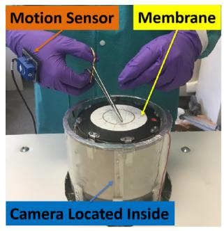  
(A)

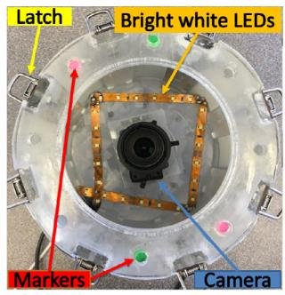  
(B)

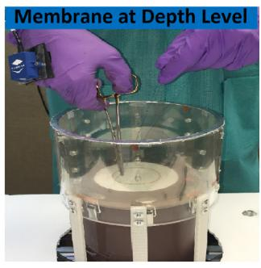  
(C)  
FIGURE 1. Suturing membrane housing: A) side view of the membrane housing and membrane at surface level, B) top view of the membrane housing and C) membrane at depth level.

Several of the metrics presented in the next section are computed from the needle tip trajectory. Denote the list of pixels on the needle tip trajectory for a given suture location as:

$$
\tilde { P } = [ \tilde { p } _ { 1 } \tilde { p } _ { 2 } . . . \tilde { p } _ { \tilde { n } } ]\tag{ð1Þ}
$$

where $\tilde { p } _ { j } = \left\lceil { \tilde { x } _ { j } } \right\rceil$ are coordinates of the $j ^ { t h }$ pixel in the list. Note that the length n\~ of the pixel list in (1) may vary from suture to suture.

To reduce the noise in the needle tip trajectory, the pixel values are smoothed as follows: (1) the path is first filtered by a second order Butterworth low-pass zerophase filter with a 15 Hz cut-off frequency and (2) the list of filtered pixel values representing the needle tip trajectory was weeded; that is, pixels were removed from the list to guarantee that the Euclidean distance between any two sequential pixels in the resulting list was at least 2.0 pixels, corresponding to 0.38 mm. The filtered and weeded pixel list for the needle tip trajectory is denoted as:

$$
P = [ p _ { 1 } p _ { 2 } . . . p _ { n } ] , \quad { \mathrm { w h e r e } } \quad p _ { j } = { \binom { x _ { j } } { y _ { j } } } .\tag{ð2Þ}
$$

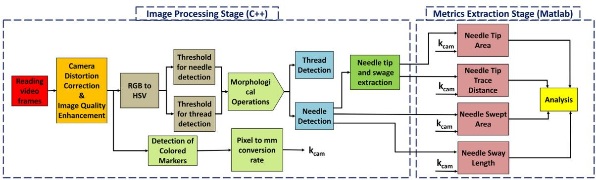  
FIGURE 2. The algorithm consists of two stages: In the Image Processing Stage, the needle and thread are detected and needle entry and exit points are identified. In the Metrics Extraction Stage, metrics were computed based on information from the Image Processing Stage.

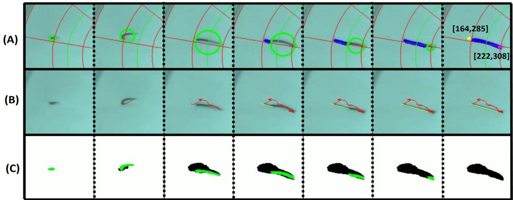  
FIGURE 3. Computer vision frame-by-frame display of A) needle and thread detection along with the entry and exit points; B) needle tip path (in red), and swage path (in yellow); C) needle swept area (in black) with the needle detection (in green).

Note that due to weeding, $n { \le } \tilde { n } .$ . Weeding the pixel list reduces jitter and improves stability of the computed metrics (see Figure 4). The filtered, weeded pixel list is used in postprocessing to compute performance metrics.

In addition, needle entry and exit times are determined. When the needle enters the membrane, the time is recorded as the needle entry time, $t _ { e n } .$ . Similarly, when the needle completely exits the membrane, the time is recorded as the needle exit time, $t _ { e x }$

## Metrics Extraction Stage

Previously Studied Metrics: The Metrics Extraction Stage uses information from the Image Processing Stage, such as the needle tip trajectory, to compute performance metrics. In earlier studies,3,5 8 the temporal process metrics Stitch Time and Idle Time were introduced and extracted from force-based data or from motion-based data. Similarly, the product metric Stitch Length was obtained from image analysis on pictures taken after procedure.18 In contrast, our system extracts these metrics, along with new metrics Entry Distance and Exit Distance automatically from video recorded during the procedure.21,28,29

Distances from optimal entry point and distance from optimal exit point, called Entry Distance $( d _ { o e } )$ and Exit

Distance $( d _ { o x } )$ from here on, are measurements of performance accuracy and were calculated using Euclidean distance (indicated by ) between two points as:

$$
d _ { o e } = k _ { c a m } \parallel p _ { 1 } - p _ { o e } \parallel\tag{ð3aÞ}
$$

$$
d _ { o x } = k _ { c a m } \parallel p _ { n } - p _ { o x } \parallel\tag{ð3bÞ}
$$

where $p _ { o e }$ and $p _ { o x }$ are the predetermined optimal entry and exit locations as marked on the suture membrane, respectively, and $p _ { 1 }$ and $p _ { n }$ are the needle entry and exit locations from the filtered, weeded pixel list (2). The calibration parameter $k _ { c a m }$ converts the metric from pixels to millimeters to make the metric independent of the specific camera and optics used in our suturing simulator.

Stitch length $( l _ { s } )$ is the length of the stitch and was calculated from the needle entry and exit points for each suture:

$$
l _ { s } = k _ { c a m } \parallel p _ { n } - p _ { 1 } \parallel .\tag{ð4Þ}
$$

Stitch time $( t _ { s } )$ is the time to complete a single suture, from needle entry $( t _ { e n } )$ to needle exit $( t _ { e x } )$ . Stitch time was calculated as:

$$
t _ { s } = t _ { e x } - t _ { e n } .\tag{ð5Þ}
$$

Similarly, Idle time $( t _ { d } )$ is the time between needle exit on one suture $( t _ { e x } ^ { i } )$ and needle entry on the next

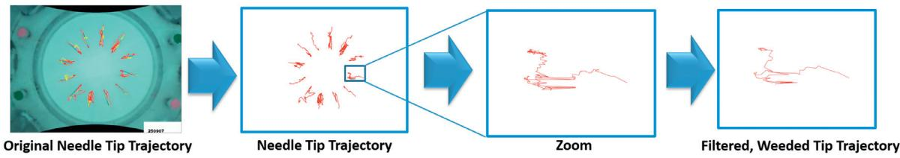  
FIGURE 4. Needle Tip Trajectory: pixel list of the needle tip filtered and weeded to be used in postprocessing to compute performance metrics.

suture $( t _ { e n } ^ { i + 1 } )$ . Idle time after suture i was calculated as:

$$
t _ { d } ^ { i } = t _ { e n } ^ { i + 1 } - t _ { e x } ^ { i } \quad \mathrm { f o r } \quad 1 { \leq } i { \leq } 1 1\tag{ð6Þ}
$$

where i indicates the suture number. Idle time captures a subject’s preparation time for the subsequent suture.

## New Image-based Process Metrics

In addition to the previously studied metrics described above, the system computed four new image-based process metrics, described in this paper for the first time: Needle Tip Path Length, Needle Tip Area, Needle Swept Area, and Needle Sway Length. All four of these process metrics are inspired by expert surgeons’ recommended best practice for suturing: “follow the curvature of the needle”.30 Driving the needle along a path that follows the curvature of the needle minimizes tissue trauma and eases penetration into the tissue.31,32

a) Needle Tip Path Length: Following the curve of the needle implies that the needle tip, as viewed by the camera under the membrane, should move directly from the entry point to the exit point with minimal lateral motion. Needle Tip Path Length metric $( l _ { t p } )$ is the length of the path followed by the needle tip from entry to exit. Intuitively, shorter path lengths indicate greater skill, longer paths indicate that the needle is straying or wiggling from the ideal path. In practice, path lengths become especially long if the needle holder is repeatedly repositioned on the needle. Needle Tip Path Length is computed as the sum of Euclidean distance between sequential pixels in the filtered, weeded tip trajectory (2), specifically,

$$
l _ { t p } = k _ { c a m } \sum _ { j = 1 } ^ { n - 1 } \parallel p _ { j + 1 } - p _ { j } \parallel .\tag{ð7Þ}
$$

b) Needle Tip Area: Needle tip area is defined as the absolute area between the needle tip path and the straight line from entry point to exit point. In other words, this metric is a measure of how much the needle tip deviates from the straight line path from the needle entry point to exit point, with larger deviations penalized more. This metric is designed to penalize motion of the needle tip which is orthogonal to the direction of the stitch. The needle tip area is calculated using the filtered, weeded pixel list (2) as:

$$
a _ { t } = { k _ { c a m } } ^ { 2 } \sum _ { j = 1 } ^ { n - 1 } \Bigl | { ( p _ { j + 1 } - p _ { j } ) ^ { T } \vec { e } _ { t } } \Bigr | . \Bigl | { \textstyle \frac { 1 } { 2 } } { ( p _ { j + 1 } + p _ { j } ) ^ { T } \vec { e } _ { o } } \Bigr |\tag{ð8Þ}
$$

where $\vec { e } _ { t }$ is the unit vector tangential to stitch direction, i.e. in the $\left( p _ { n } - p _ { 1 } \right)$ direction, pointing from entry point to exit point, and $\scriptstyle { \vec { e } } _ { o }$ is the unit vector orthogonal to $\vec { e } _ { t }$ An example of the incremental needle tip area due to two sequential pixels of the needle tip trajectory is shown in Figure 6.

c) Needle Swept Area: Needle swept area is the union of all area covered by the needle body during suturing. Needle Swept Area will be high if the needle rolls during suturing, even if the tip does not deviate from the straight line between entry and exit. To compute Needle Swept Area, all pixels corresponding to the portion of the needle visible below the membrane from each video frame in the active suturing time are superimposed onto a single binary image. The total number of “on” pixels in this image is $\widehat { \boldsymbol { n } }$ . The Needle Swept Area in mm is computed as

$$
a _ { s } = k _ { c a m } { } ^ { 2 } \widehat { n } .\tag{ð9Þ}
$$

A visualization of the pixels used to compute the needle swept area metric is shown in Figure 3C.

d) Needle Sway Length: This metric was designed to measure roll of the needle, i.e., rotation about the axis connecting needle tip and swage, during suturing. Needle Sway Length is computed as follows. After needle detection, the end points of the visible portion of the needle are identified by finding the two points where the needle meets the minimum enclosing circle. The midpoint of the chord connecting the two end points is calculated. The instantaneous needle sway length, $l _ { s w } ( t )$ , is the signed distance from the midpoint of the chord to the needle body, along a line orthogonal to the chord. The instantaneous needle sway length is stored for each frame (see Figure 5). The Needle Sway Length metric $( l _ { s w m } )$ was calculated as:

$$
l _ { s w m } = \mathbf { m a x } ( l _ { s w } ( t ) ) - \mathbf { m i n } ( l _ { s w } ( t ) ) .\tag{ð10Þ}
$$

This metric captures the maximum deviations in the roll of the needle during a suture. Rolling the needle during a suture violates the maxim to follow the curve of the needle and may result in tissue damage.

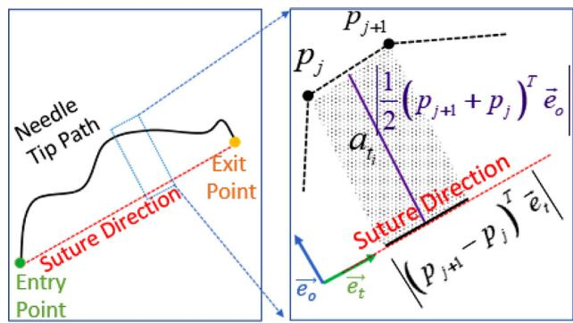  
FIGURE 5. A plot of the sway length $l _ { s w } ( t )$ for one suture cycle, along with example images illustrating the needle with positive (blue) and negative (green) orientation.

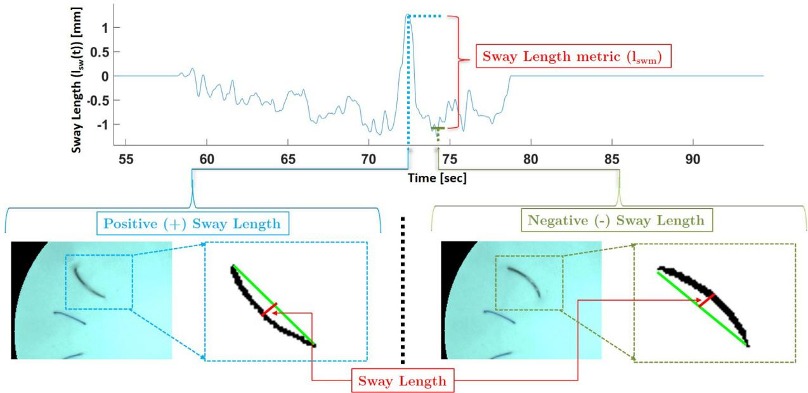  
FIGURE 6. An example of one term in the summation (8) to find Needle Tip Area. The shaded area represents the area added to the summation of index i.

## Relationship between Image-based Metrics

The metrics Needle Tip Path Length, Needle Swept Area, Needle Tip Area, and Needle Sway Length are all related to the motion of the needle, but capture distinct aspects of the motion. To illustrate similarities and differences, we will discuss a set of thought experiments, illustrated in Figure 7.

First, consider a suture in which the needle tip frequently makes a small deviation from the straight line path from entry to exit (see Figure 7, images C1 - C7). Here, Needle Tip Area will be insignificant, suggesting high skill level. However, this information alone may be misleading since Needle Tip Path Length could be large here, indicating lower skill level.

Second, consider Figure 7 A7 - A11, in which the needle rolls back and forth about the chord connecting the needle tip to the exit location. Needle Swept Area increases significantly due to this motion, but Needle Tip Path Length does not increase significantly, nor does Needle Tip Area.

Third, consider a case in which both Needle Swept Area and Needle Tip Area are large. In this case, Needle Sway Length will identify the underlying reason, roll or yaw of the needle, most responsible for this large area.

## Data Collection and Protocol

The study presented in Kil et al.27 and analyzed for forceand motion-based metrics, was also used to evaluate the effectiveness of image-based metrics. The details of the study are repeated here for convenience. After ethics approval obtained from the Institutional Review Board (IRB # Pro00011886), 15 subjects were recruited from a local hospital to participate in the study in order to investigate the proposed metrics’ ability to distinguish between varying levels of suturing experience. The data from 12 subjects1 (5 Attending Surgeons and 7 Surgery Residents) were used in analysis. Prior to participation, all subjects provided consent and were presented with a questionnaire to obtain information regarding experience, types of surgery performed, etc. For subjects in the study, the number of years practicing surgical procedures involving suturing ranged from 7 to 25 years for attendings and 2 to 5 years for residents. Before starting the exercise, participants were allowed to adjust the table to a comfortable height. Polypropylene suture needles (SH, 26 mm, 3-0; Ethicon Inc., Somerville, NJ) were provided to every subject for suturing on a synthetic leather patch. Subjects were asked to practice uninterrupted, i.e., continuous, suturing. Each subject was asked to perform the 12-stitch suturing task at two different membrane depths: at “surface” (0 in. depth) and at “depth” (4 in. depth).

Data collected from subjects were processed using the same method used in our previous study, as follows.27 First, each subject’s data were partitioned into twelve individual suture cycles using the entry and exit times obtained from the computer vision algorithm. Each stitch was considered as an individual trial. Then, proposed metrics were calculated for each subject.

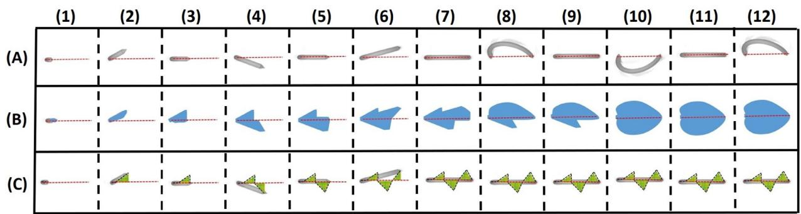  
FIGURE 7. Frame-by-frame illustration of (A) needle position (in gray); (B) cumulative area swept out by the needle body from first frame to current frame (in blue); and (C) needle tip trajectory from first frame to current frame (in black dashed line). Needle Swept Area metric is the area of the blue in the last frame. Needle Tip Path Length metric is the entire length of the black dashed line in the last frame. Needle Tip Area metric is the total area between the straight-line from entry to exit (red dashed line) and the needle tip path (in green) in the last frame.

Performance of attendings and residents was compared for the various metrics at surface level and at depth level separately. Since the observed distribution of the metrics was not Gaussian, the Wilcoxon rank sum tests (5% significance level) was used.

## RESULTS AND DISCUSSION

Box plots comparing the performance of attendings and residents in terms of the image-based metrics are presented in Figure 9. Corresponding p-values for the statistical tests for each of the metrics are shown in Table 1. The results presented in the figure and table are discussed below, first for the previously studied metrics and then for the new image-based process metrics.

Results for Entry Distance and Exit Distance show that entry and exit point accuracy for all subjects was widely distributed on both the surface and depth level and there was no significant difference in performance between attendings and residents. The median Stitch Length for attendings was significantly shorter than for residents at both surface and depth (p<0.01). Similar accuracy for entry and exit locations but differences in stitch length may seem like a contradiction at first glance, but this is resolved by noting that attending surgeons appear to emphasize short stitches rather than accuracy of entry and exit locations.

The results show that Stitch Time could not be used to distinguish between residents and attendings at either surface or depth levels. Technically, there was a statistically significant difference for Idle Time at the surface level $( \mathbf { p } = \mathbf { 0 . 0 1 1 } )$ , but given the relatively high p-value

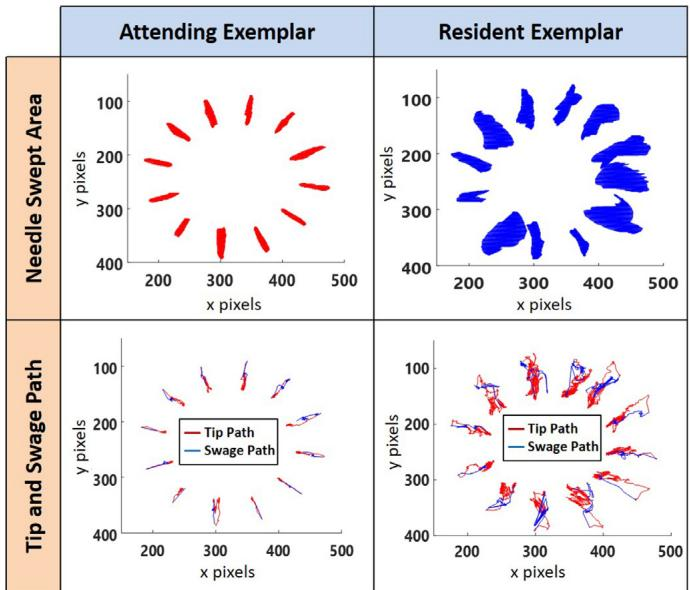  
FIGURE 8. Needle Swept Area and Needle Tip Trajectory Exemplars for an attending and a resident.

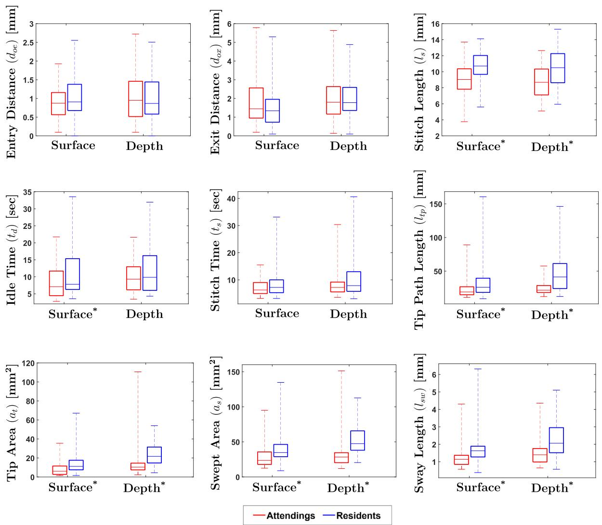  
FIGURE 9. Experimental results: \* indicates statistical significance for p < 0.05. (On each box, the middle line indicates the median, and the bottom and top edges of the box indicate the 25th and 75th percentiles, respectively. The whiskers are extended to the most extreme data points including outliers.)

TABLE 1. Statistical Results for All Metrics
<table><tr><td rowspan="2">Metrics</td><td colspan="2">p value</td></tr><tr><td>Surface Level</td><td>Depth Level</td></tr><tr><td>popoc</td><td>Entry Distance  $( d _ { o e } )$  Exit Distance  $( d _ { o x } )$ </td><td>0.11</td></tr><tr><td rowspan="4">Stitch length (ls) Stitch. Time ts Idle Tme (td)</td><td>0.14</td><td>0.96 0.52</td></tr><tr><td>&lt;0.01*</td><td>&lt;0.01*</td></tr><tr><td>0.09</td><td>0.13</td></tr><tr><td>&lt; 0.05*</td><td>0.34</td></tr><tr><td>ProssS</td><td>Needle Tip Path Length  $\left( l _ { t p } \right)$ </td><td>&lt;0.01*</td><td>&lt;0.01*</td></tr><tr><td rowspan="4"></td><td>Needle Tip Area (at)</td><td>&lt;0.01*</td><td>&lt;0.01*</td></tr><tr><td></td><td>&lt; 0.01*</td><td></td></tr><tr><td>Needle Swept Area (as)</td><td></td><td>&lt; 0.01*</td></tr><tr><td>Needle Sway Length  $( l _ { s w } )$ </td><td>&lt; 0.01*</td><td>&lt;0.01*</td></tr></table>

Note: Metrics with statistical significance are shown with \*.

and the fact that there was no statistically significant dif ference was observed for Idle Time at depth, we suspect that the results for Idle Time at surface level was a statistical fluke. In earlier studies,3,5 8 metrics Stitch Time and Idle Time were able to differentiate skill between experts and novices. In contrast, our results suggest that these temporal metrics are less useful for distinguishing skill level between resident and attending surgeons.

Visualizations of Needle Tip Path, Swage Path, and the Needle Swept Area for a typical attending and a typical resident subject are presented in Figure 8. Note the obvious visual distinctions between the resident and attending examples. Intuitively, better-suturing performance should be associated with the smaller needle swept area and a smoother needle path. Statistical analysis shows that

Needle Swept Area for attendings is significantly less than for residents at both surface and depth, as expected. Similarly, attendings’ needle paths are visually more steady than residents’, suggesting that image-based process metrics are able to quantify the differences in a way that is intuitive and easy to interpret. This visual interpretation may serve as useful feedback during skill training.

Needle Tip Path Length and Needle Tip Area at both surface and depth (see Fig. 9) were significantly higher for residents than for attendings. During suturing, residents strayed farther from the ideal path and were less accurate in following the curvature of the needle from entry to exit. Similarly, Needle Swept Area and Needle Sway Length results (see Fig. 9) at both surface and depth were significantly higher for residents than attendings p < 0:01 . Large needle sway length suggests that residents had large deviations in the roll of the needle, which caused large swept area. Further, the results agree with expectations based on the maxim to “follow the curvature of the needle.” Specifically, the metrics Needle Swept Area, Needle Tip Path Length, Needle Tip Area, and Needle Sway Length, at both surface and depth levels, are lower for attendings than for residents. Therefore, it may be interpreted that smaller values of the image-based metrics indicate better suturing performance. It is apparent from these results that image-based metrics are better than the temporal and product metrics at distinguishing skill between attendings and residents.

It should be emphasized that the metrics are distinguishing between subpopulations of surgeons, i.e., residents versus attendings. Even the “novice” group, residents, had substantial task-specific experience. In contrast, skill differentiation in other work1,2,18 was between expert (attendings and/or residents) and novice (medical students and/or no medical background).

As seen from Figure 9, for attendings, there was very little variation in image-based metrics when suturing at surface versus at depth. On the other hand, residents’ performance was worse at depth than at surface. Moreover, statistical tests for Needle Swept Area p < 0:01 and Needle Tip Path Length ðp < 0:01Þ comparing residents’ performance at surface versus at depth show statistically significant differences, suggesting that suturing at depth is a more challenging task for subjects with less experience. In contrast, similar statistical tests show that attendings’ performance did not significantly vary from surface to depth. These results show that suturing at depth is especially useful for assessing performance that requires advanced skill.

## CONCLUSION

In this study, we presented a computer vision algorithm to track needle and thread movement during suturing, which enables the extraction of image-based product and process metrics for suturing skill. We introduced a set of new image-based process metrics: Needle Tip Path Length, Needle Swept Area, Needle Tip Area, and Needle Sway Length. Several other previously studied image-based metrics Entry Distance, Exit Distance, Stitch Length, Stitch Time, and Idle Time were also examined. A study involving attendings and residents was performed to investigate the use of image-based metrics for assessment of open surgery suturing skill. Results confirm that the computer vision algorithm can succesfully extract the necessary trajectory information from video collected during suturing and compute image-based product and process metrics. Statistical analysis showed that the metrics of Stitch Length, Needle Tip Path Length, Needle Swept Area, Needle Tip Area, and Needle Sway Length were successful in distinguishing between attendings and residents at both surface and depth. The ability to differentiate between residents and attendings suggests the image-based process metrics are capable of capturing fine-grained differences in skill level. The Needle Tip Path Length and Needle Swept Area metrics especially lend themselves to intuitive visualizations. The combination of fine-grained skill differentiation, the ability to simulate depth of suturing, and the intuitive visualizations of selected image-based metrics makes the suturing simulator and associated suite of process metrics well-suited for suturing skills assessment and training and complements the product metrics associated with the FVS tasks. Future work will investigate possible correlation between these metrics, determine the best method for real-time feedback using this suite of metrics, and examine how finely the metrics can differentiate skill level and how well the metrics correlate with performance on more realistic surgical tasks.

## DATA AVAILABILITY STATEMENT

The datasets presented in this article are not readily available because of restrictions on data access placed by the relevant IRB. Requests to access the datasets should be directed to regroff@clemson.edu.

## ACKNOWLEDGMENTS

The authors would like to thank all those who helped facilitate data collection and all participants in the study.

The authors would also like to thank Mr. Anand Jagannathan for his contributions to this research.

## REFERENCES

1. Horeman T, Rodrigues SP, Jansen FW, Dankelman J, van den Dobbelsteen JJ. Force parameters for skills assessment in laparoscopy. IEEE Trans Haptics. 2012;5(4):312–322.

2. Horeman T, Rodrigues SP, Jansen F-W, Dankelman J, van den Dobbelsteen JJ. Force measurement platform for training and assessment of laparoscopic skills. Surg Endosc. 2010;24(12):3102–3108.

3. Trejos AL, Patel RV, Malthaner RA, Schlachta CM. Development of force-based metrics for skills assessment in minimally invasive surgery. Surg Endosc. 2014;28(7):2106–2119.

4. Kavathekar T, Kil I, Groff RE, Burg TC, Eidt JF, Singapogu RB. Towards quantifying surgical suturing skill with force, motion and image sensor data. 2017 IEEE International Conference on Biomedical & Health Informatics. IEEE; 2017. p. 169–172.

5. Moody L, Baber C, Arvanitis TN, Elliott M. Objective metrics for the evaluation of simple surgical skills in real and virtual domains. Presence: Teleoperators Virtual Environ. 2003;12(2):207–221.

6. Dubrowski A, Sidhu R, Park J, Carnahan H. Quantification of motion characteristics and forces applied to tissues during suturing. Am J Surg. 2005;190 (1):131–136.

7. Horeman T, Dankelman J, Jansen FW, van den Dobbelsteen JJ. Assessment of laparoscopic skills based on force and motion parameters. IEEE Trans Biomed Eng. 2014;61(3):805–813.

8. Reiley CE, Lin HC, Yuh DD, Hager GD. Review of methods for objective surgical skill evaluation. Surg Endosc. 2011;25(2):356–366.

9. Poursartip B, LeBel M-E, Patel RV, Naish MD, Trejos AL. Analysis of energy-based metrics for laparo scopic skills assessment. IEEE Trans Biomed Eng. 2018;65(7):1532–1542.

10. Brown JD, O’Brien CE, Leung SC, Dumon KR, Lee DI, Kuchenbecker KJ. Using contact forces and robot arm accelerations to automatically rate surgeon skill at peg transfer. IEEE Trans Biomed Eng. 2016;64(9):2263–2275.

11. Rosen J, Hannaford B, Richards CG, Sinanan MN. Markov modeling of minimally invasive surgery based on tool/tissue interaction and force/torque signatures for evaluating surgical skills. IEEE Trans Biomed Eng. 2001;48(5):579–591.

12. Rosen J, Brown JD, Chang L, Sinanan MN, Hannaford B. Generalized approach for modeling minimally invasive surgery as a stochastic process using a discrete markov model. IEEE Trans Biomed Eng. 2006;53(3):399–413.

13. Loukas C, Georgiou E. Multivariate autoregressive modeling of hand kinematics for laparoscopic skills assessment of surgical trainees. IEEE Trans Biomed Eng. 2011;58(11):3289–3297.

14. Estrada S, Duran C, Schulz D, Bismuth J, Byrne MD, O’Malley MK. Smoothness of surgical tool tip motion correlates to skill in endovascular tasks. IEEE Trans Human-Mach Syst. 2016;46(5):647–659.

15. Yamaguchi S, Yoshida D, Kenmotsu H, et al. Objective assessment of laparoscopic suturing skills using a motion-tracking system. Surg Endosc. 2011;25 (3):771–775.

16. S-anchez A, Rodr-ıguez O, S-anchez R, et al. Laparoscopic surgery skills evaluation: analysis based on accelerometers. J Soc Lapa Surg. 2014;18(4).

17. Dosis A, Aggarwal R, Bello F, et al. Synchronized video and motion analysis for the assessment of pro cedures in the operating theater. Arch Surg. 2005;140(3):293–299.

18. Frischknecht AC, Kasten SJ, Hamstra SJ, et al. The objective assessment of experts’ and novices’ suturing skills using an image analysis program. Acad Med. 2013;88(2):260–264.

19. Islam G, Kahol K, Ferrara J, Gray R. Development of computer vision algorithm for surgical skill assessment. International Conference on Ambient Media and Systems. Springer; 2011. p. 44–51.

20. Zia A, Sharma Y, Bettadapura V, Sarin EL, Clements MA, Essa I. Automated assessment of surgical skills using frequency analysis. Medical Image Computing and Computer Assisted Intervention. Springer; 2015. 430–438.

21. Kil I, Singapogu RB, Groff RE. Needle entry angle & force: Vision-enabled force-based metrics to assess surgical suturing skill. 2019 IEEE International Symposium on Medical Robotics. IEEE; 2019. 1–6.

22. Islam G, Kahol K, Li B. Development of a computer vision application for surgical skill training and assessment. Bio-Info Sys, Proc and Apps. River Publishers; 2013. p. 191.

23. Islam G, Kahol K, Li B, Smith M, Patel VL. Affordable, web-based surgical skill training and evaluation tool. J Biomed Inform. 2016;59:102–114.

24. Iyer S, Looi T, Drake J. A single arm, single camera system for automated suturing. IEEE International Conference on Robotics and Automation. IEEE; 2013. 239–244.

25. Wengert C, Bossard L, H€aberling A, Baur C, Sz-ekely G, Cattin PC. Endoscopic navigation for minimally invasive suturing. Medical Image Computing and Computer Assisted Intervention. Springer; 2007. p. 620–627.

26. Sheahan MG, Bismuth J, Lee JT, et al. Ss25. the fundamentals of vascular surgery: Establishing the metrics of essential skills in vascular surgery trainees. J Vasc Surg. 2015;61(6).

27. Kil I, Eidt JF, Groff RE, Singapogu RB. Assessment of open surgery suturing skill: Simulator platform, force-based, and motion-based metrics. Front

Med. 2022;9. https://doi.org/10.3389/fmed.2022. 897219.

28. Kil I, Jagannathan A, Singapogu RB, Groff RE. Development of computer vision algorithm towards assessment of suturing skill. International Conference on Biomedical and Health Informatics. IEEE; 2017. p. 29–32.

29. Kil I, Groff RE, Singapogu RB. Surgical suturing with depth constraints: Image-based metrics to assess skill. 2018 40th Annual International Conference of the IEEE Engineering in Medicine and Biology Society (EMBC). USA: Honolulu, HI; 2018. p. 4146–4149. https://doi.org/10.1109/ EMBC.2018.8513266.

30. Sherris DA, Kern EB. Essential surgical skills. WB Saunders Company; 2004.

31. Oropesa I, S-anchez-Gonz-alez P, Lamata P, et al. Methods and tools for objective assessment of psychomotor skills in laparoscopic surgery. J Surg Res. 2011;171(1).

32. Jackson RC, Cavu¸ so¸ glu MC. Needle path planning for autonomous robotic surgical suturing. IEEE International Conference on Robotics and Automation. IEEE; 2013. p. 1669–1675.