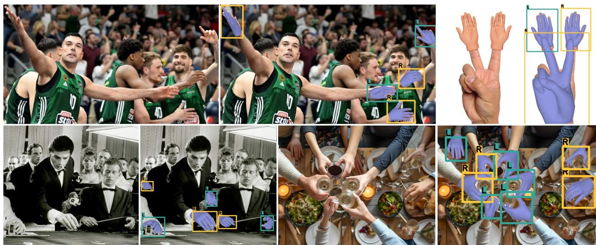
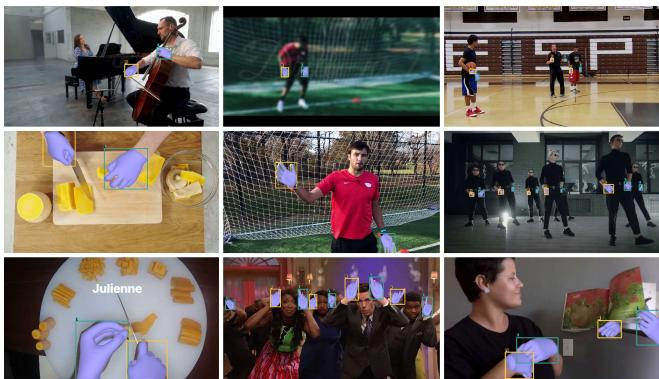
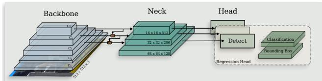
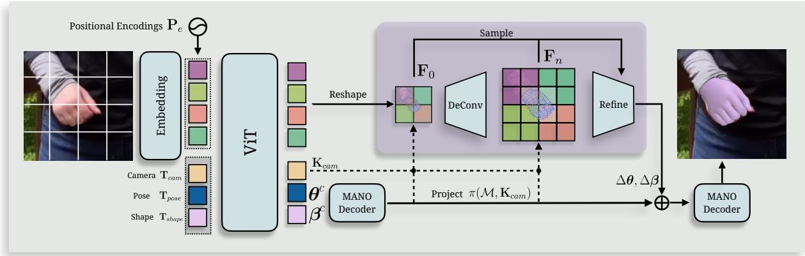
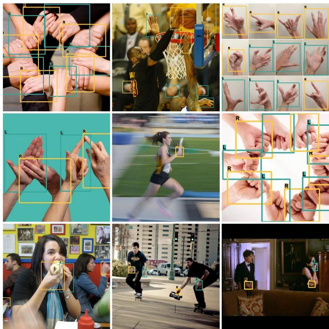
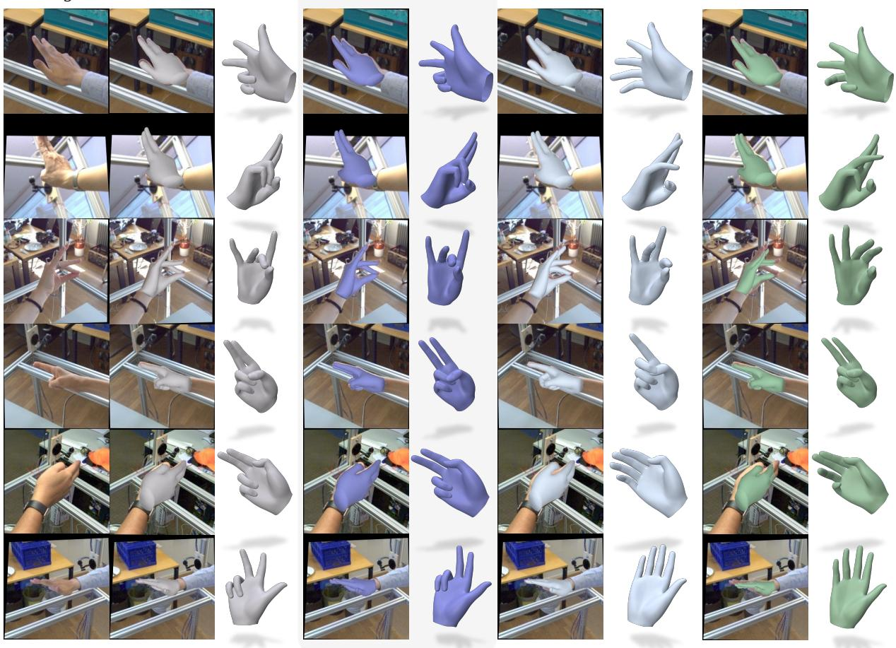
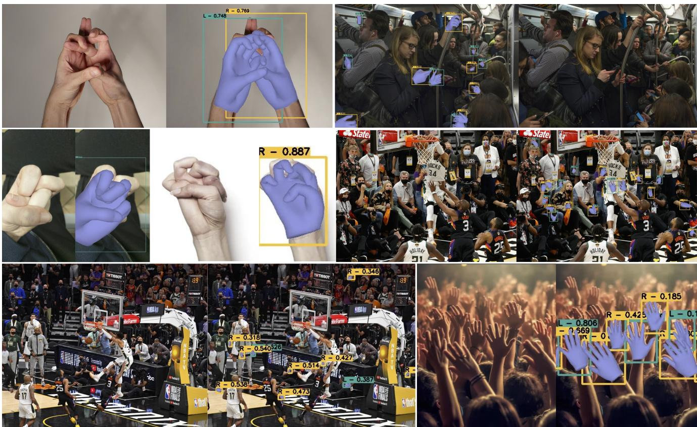

# WiLoR: End-to-end 3D Hand Localization and Reconstruction in-the-wild

Rolandos Alexandros Potamias1, Jinglei Zhang2, Jiankang Deng1, Stefanos Zafeiriou1 1Imperial College London, 2Shanghai Jiao Tong University

  
Figure 1. We propose WiLoR, a full-stack in-the-Wild Localization and 3D hand Reconstruction method. WiLoR first localizes and defines the handedness of the detected hands which are then lifted to 3D using a transformer-based hand pose estimation module. To aid high-fidelity reconstructions and facilitate image-alignment, we introduce a refinement module that extracts localized features to correct misaligned poses. WiLoR achieves state-of-the-art performance under different benchmark datasets while boosting the temporal coherence of image-based 3D hand pose estimation methods.

## Abstract

In recent years, 3D hand pose estimation methods have garnered significant attention due to their extensive applications in human-computer interaction, virtual reality, and robotics. In contrast, there has been a notable gap in hand detection pipelines, posing significant challenges in constructing effective real-world multi-hand reconstruction systems. In this work, we present a data-driven pipeline for efficient multi-hand reconstruction in the wild. The proposed pipeline is composed of two components: a real-time fully convolutional hand localization and a high-fidelity transformer-based 3D hand reconstruction model. To tackle the limitations of previous methods and build a robust and stable detection network, we introduce a large-scale dataset with over than 2M in-the-wild hand images with diverse lighting, illumination, and occlusion conditions. Our approach outperforms previous methods in both efficiency and accuracy on popular 2D and 3D benchmarks. Finally, we

showcase the effectiveness of our pipeline to achieve smooth 3D hand tracking from monocular videos, without utilizing any temporal components. Code, models, and dataset are available on our project page.

## 1. Introduction

Hand detection and reconstruction has been a long-studied problem due to its numerous applications, ranging from virtual reality [23] to sign language [2, 31, 108] and human behaviour recognition [68]. Given the large variations in hand appearance and articulation [67] along with heavy occlusions and motion blur [25, 27] that are usually present in hand interactions, the task of hand pose estimation is considerably challenging. Over the years, several methods have been proposed to tackle 3D hand pose estimation [12, 44, 51, 63]. However, despite producing credible results, these methods primarily focus on images containing a fixed number of hands and hence cannot generalize to in-the-wild images.

In the closely related fields of 3D human body and face reconstruction, state-of-the-art methods [8, 18, 22, 24] employ bottom-up pipelines founded on top of highperformance detection models that initially localize human body and face within the image, enabling their generalization to in-the-wild images. Despite the numerous methods that have been proposed to solve the task of human body and face detection, there has been a notable lack in realtime hand detection methods. The importance of hand detectors is further emphasized considering that current 3D hand pose estimation frameworks operate on tight crops around the hand regions [11, 103]. Consequently, hand detectors are essential for the generalisation of such methods in in-the-wild scenarios. Popular hand detection and localisation methods [8, 97] fail significantly to detect multiple hands and challenging poses, while more recent methods [41, 54, 55] albeit producing reasonable results struggle to operate in real-time. Motivated by the lack of accurate hand detection frameworks, we propose a robust singlestate anchor-free detector that can operate in over than 100 frames-per-second (fps). As we experimentally show, robust detections can enforce more stable 4D reconstructions and overcome jittering artifacts which is currently one of the main limitations of 3D frame-based pose estimation methods.

In contrast to the relatively unexplored hand detection and localization problem, 3D hand pose estimation has received significantly more attention. Initial 3D pose reconstruction methods have focused on traditional convolution based backbones to process and extract image features [5, 12, 38, 51]. Following the success of transformers and their ability to consume large amounts of data [15, 39, 73, 86, 88, 99], several methods have paved the way of util ising transformer architectures scaling up the 3D human body and hand recovery [43, 44, 63]. Recently, Pavlakos et al. [63] showcased the effectiveness of vision transformers (ViT) using a simple yet powerful framework trained on a large-scale dataset. The key to the success of this method lies in the scale of its architecture, composed of more than 0.5 billion parameters, enabling effective consumption of large amount of data. However, as shown in the literature [42, 57, 82, 98], regressing the hand parameters from a single image results in poor alignment and incorrect poses. Currently, methods that aim to achieve better image alignment rely on sub-optimal solutions, such as intermediate heatmap representations [11, 36, 103]. To tackle this, we propose a high-fidelity 3D pose estimation method that decomposes 3D hand reconstruction into two stages. In particular, the decoder first predicts a rough hand estimation that is used to extract multi-scale image-aligned features from our refinement module. By leveraging the rough hand estimation, we can extract meaningful spatia features that lead to better image alignment and state-of-theart performance on FreiHand [107] and HO3D [25] benchmark datasets. Additionally, in contrast to vertex regression methods [38, 43, 44] that directly regress 3D vertices, our method predicts MANO parameters [74], ensuring both explainable and plausible hand poses.

In this paper, we propose a high fidelity full stack method that can reconstruct 3D hands in real-time. Specifically:

• Based on the limitations of current hand detection benchmark datasets, we collect a large-scale dataset of in-thewild images that contain multiple hands and introduce a challenging benchmark for hand detection. We make the dataset, along with the corresponding 2D and 3D annotations, publicly available.

• We propose a real-time hand detection method trained on the collected large-scale dataset that outperforms previous hand detection methods by a large margin in both accuracy and efficiency.

• We propose a transformer-based method that facilitates high fidelity 3D reconstructions and tackles the architectural limitations of previous methods using a novel refinement module. The proposed method, apart from highly efficient, achieves state-of-the-art performance in both Freihand and HO3D benchmark datasets.

## 2. Related Work

Hand Detection and Tracking. Object detection has been extensively studied in the literature achieving remarkable advancements [46, 49, 70] and setting the foundations for human body [18, 20, 60, 65, 83, 94] and face detection [13, 105] pipelines. In contrast, despite two decades of research efforts [72], hand detection has not yet achieved comparable breakthroughs. Initial approaches used controlled conditions and depth cameras [80, 81, 90, 91, 104] to detect and track human hands. Several efforts have been made to boost hand detection under different skin tones and backgrounds using multi-stage frameworks [50, 64], however, they fail to generalize in challenging environments. Following the success in object detection, several methods have adopted fully convolutional architectures for hand detection [14, 30, 75, 76, 97]. Simon et al. [78] introduced a multi-view bootstrapping procedure to annotate in-the-wild data and train a real-time convolutional detector network. Recently, Narasimhaswamy et al. [54] proposed an extension of MaskRCNN [29] network to detect in-the-wild hands and identifying their corresponding contact points [55] and body associations [56]. Nevertheless, despite the extensive efforts in the literature, most methods rely on slow backbones and struggle with challenging images. The primary issue is the lack of large-scale training data featuring multiple levels of occlusions and motion blur from in-the-wild scenes. To tackle such limitation, we propose a lightweight hand detector that is $4 5 ~ \times$ faster compared to previous state-of-the-art detectors, trained on 2M in-the-wild images with diverse environments and occlusion.

3D Hand Pose Estimation. Similar to hand detection, initial approaches for hand pose estimation relied on depth cameras [19, 59, 84] to reconstruct 3D hands. Boukhayma et al. [5] introduced the first fully learnable pipeline that directly regresses the parameters of the MANO hand model [74] from RGB images. In a similar manner, several follow-up works used heatmaps [100] and iterative refinement [1] to enforce 2D alignment. Kulon et al. [37, 38] introduced an alternative regression method that directly regresses 3D vertices using spiral graph neural networks [6, 66], which significantly outperformed previous methods. Various approaches have been proposed to improve taskspecific challenges of 3D pose estimation, including robustness to occlusions [61] and motion blur [58] and reducing inference speed [11, 103]. Recently, Pavlakos et al. [63] highlighted the importance of scaling up both the training data and the capacity of the model. Specifically, building on the success of the Vision Transformer (ViT) backbones for body pose estimation [7, 21, 42], they demonstrated that using a simple yet effective large-scale transformer architecture can achieve state-of-the-art performance when trained on a diverse collection of datasets. However, directly regressing MANO parameters from the image in one go may introduce misalignments and incorrect poses. To tackle this, we propose a novel refinement layer that deforms hand pose using mesh-aligned multi-scale features.

## 3. WHIM Dataset

A vital cause behind the lack of high-fidelity hand detection systems lies in the limited amount of in-the-wild datasets with multiple hand annotations. To build a robust hand detection framework, we collected a large-scale dataset with millions of in-the-wild hands (WHIM) with diverse poses, illuminations, occlusions, and skin tones.

To collect the proposed dataset, we devised a pipeline to automatically annotate YouTube videos from diverse and challenging in-the-wild scenarios. In particular, we selected more than 1,400 YouTube videos containing hand activities including sign language, cooking, everyday activities, sports, and games with ego- and exo-centric viewpoints, motion blur, different hand scales, and interactions. To accurately detect and annotate the hands on each frame we used a combination of ensemble networks. First, we used VitPose [94] and AlphaPose [18] to detect all humans in the frame and selected the bounding boxes with confidence bigger than 0.65. We then cropped the bounding boxes and fed them to an ensemble hand detection pipeline that consists of MediaPipe [97], OpenPose [8] and ContactHands [54] models. To localize the hand, we used a weighted average between the bounding box positions $\mathbf { b } _ { i }$ of the three detectors $d _ { i } ,$ scaled from their corresponding confidence $P ( \mathbf { b } _ { i } | d _ { i } )$

$$
\hat { y } = \frac { \sum _ { i } P ( \mathbf { b } _ { i } | d _ { i } ) \mathbf { b } _ { i } } { \sum _ { i } P ( \mathbf { b } _ { i } | d _ { i } ) }\tag{1}
$$

where $\mathbf { b } _ { i }$ denotes the estimated hand bounding box.

In addition to the bounding box, we used the estimated 2D landmarks [8, 97], to fit a 3D parametric hand model M [74]. More specifically, we optimized shape $\beta$ and pose θ parameters to minimize the re-projection loss $\mathcal { L } _ { p r o j }$ between the regressed $\mathbf { J } _ { \mathcal { M } }$ and the estimated landmarks $\hat { \mathbf { J } } _ { \mathbf { s } } \mathrm { : }$

$$
\mathcal { L } _ { p r o j } = | | \mathbf { J } _ { \mathcal { M } } - \pi ( \hat { \mathbf { J } } _ { \mathbf { s } } , K ) | | _ { 1 } ,\tag{2}
$$

where $\pi ( \cdot )$ denotes the weak perspective projection transform and K the estimated intrinsic camera matrix.

Given the degrees of freedom of the human hand, optimizing the hand model using joint terms usually results in unnatural poses. To tackle the ambiguities during the optimization process, we followed [79] and included biomechanical losses to constrain the optimization. In particular, apart from the re-projection error, we enhanced the fitting process using loss functions that constrain the bone lengths and the angle rotations to feasible ranges, as defined in [79]:

$$
\mathcal { L } _ { B M C } = \mathcal { L } _ { B L } + \mathcal { L } _ { A }\tag{3}
$$

where $\mathcal { L } _ { B L }$ and $\mathcal { L } _ { A }$ denote bone length and joint angle loss terms, respectively. For additional details of the biomechanical constraints we refer the reader to [79].

Finally, given that the bio-mechanical prior acts mainly on the joint space, we followed [2] and trained a PCA model on ARCTIC dataset [17] acting as a 3D prior, modeling the distribution of feasible hand poses. We formulated the prior loss as the reconstruction error of the 3D mesh X projected and reconstructed from the PCA space U, as:

$$
\mathcal { L } _ { p r i o r } = | | \mathbf { X } - [ ( \mathbf { X } - \pmb { \mu } ) \mathbf { U } ^ { T } ] \mathbf { U } + \pmb { \mu } | | _ { 2 } ,\tag{4}
$$

where $\mathbf { U } \in \mathbb { R } ^ { d \times N \cdot 3 }$ denotes the eigenvector basis of d components and $\pmb { \mu }$ the mean mesh. Fig. 2 includes several examples of the proposed WHIM dataset.

## 4. Method

## 4.1. Hand Detection and Localization

Over the past years, fully convolutional networks (FCNs) have shown remarkable efficiency in human detection [89] and object detection [71]. Building on their success, we employ an FCN architecture to achieve both accurate and realtime hand localization. Similar to object detection frameworks, given an image $\mathbf { I } \in \mathbb { R } ^ { H \times W \times 3 }$ our goal is to detect the bounding boxes $\mathbf { B } ~ = ~ \{ \mathbf { b } _ { j } ~ \in ~ \mathbb { R } ^ { 4 } ~ : ~ 0 ~ \leq ~ j ~ \leq$ n} of the n hands present in the image along with their hand side label $\mathbf { y } _ { j }$ . We follow the commonly used onestage backbone-neck-head formulation and we built upon the powerful and efficient DarkNet backbone [70]. We extract the last three feature maps {C3, C4, C5} of the backbone to generate a multi-scale feature pyramid in the neck module. To enable our model to effectively capture multiscale features using both top-down and bottom-up pathways across different feature maps, we utilized Path Aggregation Network (PANet) [47], an extension of Feature Pyramid Network [45] that facilitates fine-grained information flow using a bottom-up path augmentation. Finally, we use three detection heads to predict the bounding boxes $\mathbf { b } _ { j }$ and hand side labels $\mathbf { y } _ { j }$ at different anchor resolutions. Following [16], we adopt an anchor-free design to enhance the flexibility of our localization method and directly predict bounding box coordinates without relying on predefined anchor boxes. An overview of the proposed detection network is visualized in Fig. 3. Similar to [13], we observed that joint keypoint supervision significantly improved the performance and the robustness of the detector. The full training objective can be defined as:

  
Figure 2. Example of the proposed WHIM in-the-wild dataset.

$$
\mathcal { L } = \lambda _ { 0 } \mathcal { L } _ { B C E } + \lambda _ { 1 } \mathcal { L } _ { D F L } + \lambda _ { 2 } \mathcal { L } _ { C I o U } + \lambda _ { 3 } \mathcal { L } _ { k p t s }\tag{5}
$$

where $\mathcal { L } _ { B C E }$ is the binary cross entropy loss between the predicted and the ground truth box labels, $\mathcal { L } _ { D F L }$ denotes the distributional focal loss [40] which measures the difference between the predicted and the ground truth bounding box distributions, $\mathcal { L } _ { C I o U }$ measures the discrepancy between the predicted and the ground truth bounding box [101], $\mathcal { L } _ { k p t s }$ denotes an L2 loss on the and $\lambda _ { 0 } , \lambda _ { 1 } , \lambda _ { 2 } , \lambda _ { 3 }$ are weights that balance the losses.

## 4.2. Hand Reconstruction

Given an image $\mathbf { I _ { h } } ~ \in ~ \mathbb { R } ^ { H \times W \times 3 }$ that contains a human hand, tightly cropped around the hand detectors bounding box, the proposed 3D hand reconstruction method estimates the corresponding hand pose $\theta \in \mathbb { R } ^ { 4 8 }$ and shape $\beta \in \mathbb { R } ^ { 1 0 }$ MANO [74] parameters along with the camera parameters $\mathbf { K } _ { c a m } = \{ \mathbf { t } _ { c a m } , \mathbf { s } _ { c a m } \}$ to obtain a 3D hand.

  
Figure 3. Detection overview: The proposed fully convolutional one-stage hand detection method receives an image and extracts multi-resolution feature maps that are then processed by the Path Aggregation Network (PANet). The corresponding features are then fed to three detection heads that predict the hand side, bounding box, and hand joints at different resolutions. We train the network with a multi-task loss for each anchor.

To build a powerful 3D pose estimation network that can scale on large amounts of data, we follow [7, 42, 63], and built our backbone using a pre-trained ViT encoder [88, 94]. The image $\mathbf { I _ { h } }$ is first split into M -size patches $\mathrm { ~ \bf ~ P ~ } \in { \mathrm { ~ \bf ~ \Lambda ~ } }$ $\begin{array} { r } { \mathbb { R } \frac { H W } { M ^ { 2 } } \times ( \Breve { M } ^ { 2 } \times 3 ) } \end{array}$ and then embedded to high dimensional tokens $\mathbf { T } _ { i m g } ~ \in ~ \mathbb { R } ^ { \frac { H W } { M ^ { 2 } } \times C }$ To uniquely encode their spatial location, positional embeddings ${ \bf P } _ { e }$ are added to the image tokens $\mathbf { T } _ { i m g }$ [88]. In addition to the image tokens, we explicitly model hand pose, shape, and camera parameters with three distinct tokens $\mathbf { T } _ { p o s e } , \mathbf { T } _ { s h a p e } , \mathbf { T } _ { c a m }$ We then feed the concatenated tokens to the ViT transformer encoder to obtain a set of updated feature tokens $\mathbf { T ^ { \prime } } _ { i m g } , \mathbf { T ^ { \prime } } _ { p o s e } , \mathbf { T ^ { \prime } } _ { s h a p e } , \mathbf { T ^ { \prime } } _ { c a m }$ . Using a set of MLP layers we regress a rough estimation of pose $\theta ^ { c }$ and shape $\beta ^ { c }$ parameters of the MANO model, which will serve as a prior for the refinement network. Similarly, we regress the camera translation and scale parameters $\mathbf { K } _ { c a m } = \{ \mathbf { t } _ { c a m } , \mathbf { s } _ { c a m } \}$ from the camera token features.

Multi-Scale Pose Refinement Module. In order to get better image alignment and more accurate hand pose, we introduce a fully differentiable refinement module that predicts pose and shape residuals of the rough hand estimation. To achieve this, we utilize image features extracted from the ViT backbone as 2D feature cues within our refinement module. In particular, we reshape image feature tokens $\mathbf { T } ^ { \prime } { _ { i m q } }$ to form a low resolution feature map $\mathbf { F } _ { 0 } ~ \in ~ \mathbb { R } ^ { \frac { H } { M } \times \frac { W } { M } \times \check { C } }$ and project the rough hand estimation $\mathcal { M } _ { l }$ to feature map using the estimated $\mathbf { t } _ { c a m } , \mathbf { s } _ { c a m }$ camera parameters. Then, using bilinear interpolation we sample from $\mathbf { F } _ { 0 }$ a feature vector $\mathbf { f } _ { 0 } ^ { \mathbf { v } }$ for each projected vertex v:

$$
\mathbf { f } _ { 0 } ^ { \mathbf { v } } = \pi ( \mathbf { v } , \mathbf { K } _ { c a m } )\tag{6}
$$

where $\pi ( \cdot )$ denotes the weak perspective projection.

Note that we project the whole hand mesh $\mathcal { M } _ { l }$ to the feature map, instead of just the hand joints, as we aim to acquire better shape and pose image alignment. The imagealigned vertex features are then aggregated to form a global feature vector that is used to regress pose and shape residu-

  
Figure 4. Overview of the proposed 3D hand pose estimation method: Given an image ${ \mathbf I } _ { h }$ represented as a series of feature tokens $\mathbf { T } _ { i m g }$ along with a set of learnable camera $\mathbf { T } _ { c a m } ,$ pose $\mathbf { T } _ { p o s e }$ and shape $\mathbf { T } _ { s h a p e }$ tokens, we initially predict a rough estimation of the MANO [74] and camera ${ \bf K } _ { c a m }$ parameters using a ViT backbone (light blue). The updated image tokens are then reshaped and upsampled through a series of deconvolutional layers to form a set of multi-resolution feature maps $\big \{ \mathbf { F } _ { 0 } , . . . , \mathbf { F } _ { 0 } \big \}$ . We then project the estimated 3D hand to the generated feature maps and sample image-aligned multi-scale features through a novel refinement module (purple). The sampled features are used to predict pose and shape residuals $\Delta \theta , \Delta \beta$ that refine the coarse hand estimation. Using this coarse-to-fine pose estimation strategy we facilitate image alignment and achieve better reconstruction performance.

als:

$$
\begin{array} { l } { \Delta \beta = M L P _ { \beta } ( \bigtriangledown _ { \mathbf { v } \in \mathcal { M } _ { l } } \mathbf { f } _ { 0 } ^ { \mathbf { v } } ) } \\ { \Delta \theta = M L P _ { \theta } ( \bigtriangledown _ { \mathbf { v } \in \mathcal { M } _ { l } } \mathbf { f } _ { 0 } ^ { \mathbf { v } } ) } \end{array}\tag{7}
$$

where □ denotes the aggregation function, e.g., mean, max, sum.

Given that the initial feature map is very lowdimensional, we use a set of deconvolutional layers to upsample ${ \bf F } _ { 0 }$ to multiple higher resolution feature maps $\mathbf { F } _ { 0 } , \mathbf { F } _ { 1 } , . . . , \mathbf { F } _ { n }$ that will serve as multi-scale features for the proposed refinement module. Intuitively, low-dimensional feature maps will provide global and structural residuals of the hand shape while more high-resolution features provide finer details of the hand pose.

Loss function. The proposed model is trained with supervision for 3D vertices $\hat { \mathbf { V } } _ { 3 D }$ , 2D joints $\hat { \bf J } _ { 2 D }$ as well as MANO parameters ${ \hat { \theta } } , { \hat { \beta } } .$ , when available. Additionally, following [35, 63], we utilize a discriminator network D to enforce plausible hand poses and shapes and penalize irregular articulations. The full loss function can be defined as:

$$
\begin{array} { r l } & { \mathcal { L } = \mathcal { L } _ { 3 D } + \mathcal { L } _ { 2 D } + \mathcal { L } _ { m a n o } + \mathcal { L } _ { a d v } , } \\ & { \mathcal { L } _ { 3 D } = | | \mathbf { V } _ { 3 D } - \hat { \mathbf { V } } _ { 3 D } | | _ { 1 } , } \\ & { \mathcal { L } _ { 2 D } = | | \pi ( \mathbf { J } _ { 3 D } , \mathbf { K } _ { c a m } ) - \hat { \mathbf { J } } _ { 2 D } | | _ { 1 } } \\ & { \mathcal { L } _ { m a n o } = | | \theta - \hat { \theta } | | _ { 2 } ^ { 2 } + | | \beta - \hat { \beta } | | _ { 2 } ^ { 2 } , } \\ & { \mathcal { L } _ { \mathrm { a d v } } = | | D ( \theta , \beta ) - 1 | | _ { 2 } . } \end{array}\tag{8}
$$

## 5. Experiments

In this section we first evaluate the proposed hand detection network using established benchmarks to assess its performance. Next, we conduct an extensive qualitative and quantitative analysis of the proposed 3D hand pose estimation method. Finally, we demonstrate the critical role of precise hand localization in the accuracy of 4D hand reconstruction.

## 5.1. Evaluation of Hand Detection and Localization

Training. We train the proposed hand detection network using the curated WHIM dataset that consists of over 2M in-the-wild images of multiple hands and scales. To further boost the generalization and robustness of our network, we follow several data augmentations during training. Particularly, we introduce random rotations in the range of $[ - 6 0 ^ { \circ } , 6 0 ^ { \circ } ]$ and translations in the range of [−0.1, 0.1] along with random masking and cropping of the image. Additionally, in each training batch, we follow mosaic and mixup augmentation, which significantly affects the robustness to diverse hand scales.

Evaluation. To compare our network, we employ popular baselines such as OpenPose [8] and Mediapipe [97], which are widely used across the community [67, 69], along with more recent hand detection pipelines such as ContactHands [54] and ViTDet [41]. All methods are evaluated under three criteria: i) the inference speed in terms of frames per second (FPS), ii) the detection performance in terms of average precision (AP) at IoU = 0.5 and mean AP at different IoU=0.5:0.05:0.95 thresholds and iii) the model size measured in Mb. An optimal hand detection system should be lightweight to ensure compatibility with mobile devices, operate in real-time to avoid impacting the runtime of a 3D pose estimation pipeline while achieving precise detections. In Tab. 1, we evaluate the proposed and the baseline methods on three datasets: the proposed WHIM dataset along with the benchmark Coco-WholeBody [33] and Oxford-Hands [50] dataset. All experiments were conducted on a NVIDIA RTX 4090 GPU. As can be easily seen, the proposed medium size detector, Proposed-M, can run at more than 130 FPS while the small version, Proposed-S, can achieve up to 175 FPS, improving the mAP metric, on average, by 26% compared to previous state-of-the-art model. In addition, compared to previous state-of-the-art model, ContactHands [54], the proposed detector is 45× faster and has 32× reduced model size which enables the utilization of the proposed detector in mobile applications and heavy pipelines without posing any significant overhead. It is important to note that despite the varying resolutions and hand scales across the three datasets, the proposed model consistently outperforms the baseline methods. This is particularly evident on the COCO-WholeBody dataset [33], an extension of the COCO dataset that includes full-body images, where the hands are relatively small compared to the overall image size.

  
Figure 5. Qualitative Evaluation of the proposed hand detection network on in-the-wild images. The proposed model demonstrates robustness across various lighting conditions, resolutions, hand scales, and even in the presence of motion blur.

Ablation. The efficiency and accuracy of the proposed hand detection method are mainly attributed to the selection of the backbone architecture and the utilization of a large-scale training dataset. We further evaluate the contribution of each component using an ablation study on OxfordHands [50] and WHIM datasets where we utilized different backbone networks and training datasets. As can be observed from Tab. 2, training the detection network with different backbones, apart from achieving similar detection performance, significantly degrades the inference speed of the network. The importance of the proposed large-scale inthe-wild WHIM dataset is also validated in Tab. 2, where we can observe a significant performance drop when the model was trained with significantly less data, e.g., Proposed w. 0.25M, Proposed w. 0.5M, Proposed w. 1M. An interesting observation highlighting the versatility of the WHIM dataset is that the proposed model achieves better performance when trained on WHIM compared to the Oxford-Hands dataset. Finally, we evaluate the contribution of the proposed augmentation strategy and the use of landmark regression loss. The augmentation strategy significantly contributes to cross-dataset generalization, achieving 14% increase on mAP. Similarly, we can observe that incorporating landmark regression loss enhances the detector’s precision, leading to more robust detections.

<table><tr><td colspan="3"></td><td colspan="2">Coco-Whole</td><td colspan="2">Oxford-Hands</td><td colspan="2">WHIM</td></tr><tr><td>Method</td><td>Size (Mb)↓</td><td>FPS ↑</td><td>AP0.5↑</td><td>mAP↑</td><td>AP0.5↑</td><td>mAP↑</td><td>AP0.5 ↑</td><td>mAP↑</td></tr><tr><td>MediaPipe [97]</td><td>25</td><td>25</td><td>15.43</td><td>3.72</td><td>8.72</td><td>1.80</td><td>53.09</td><td>12.01</td></tr><tr><td>OpenPose [8]</td><td>141</td><td>29</td><td>37.05</td><td>9.06</td><td>20.74</td><td>4.41</td><td>76.8</td><td>34.25</td></tr><tr><td>ContactHands [55]</td><td>819</td><td>3</td><td>50.29</td><td>16.67</td><td>70.02</td><td>36.41</td><td>93.42</td><td>49.44</td></tr><tr><td>ViTDet [[41]</td><td>1400</td><td>1</td><td>41.64</td><td>13.21</td><td>67.56</td><td>29.77</td><td>84.76</td><td>35.42</td></tr><tr><td>Proposed-S</td><td>7(×3.5 ↓)</td><td>175(×6 ↑)</td><td>46.96</td><td>18.56</td><td>75.21</td><td>38.16</td><td>91.80</td><td>46.50</td></tr><tr><td>Prooposed-M</td><td>25</td><td>138</td><td>62.48</td><td>25.97</td><td>82.64</td><td>48.98</td><td>96.06</td><td>53.79</td></tr></table>

Table 1. Comparison with the state-of-the-art hand detection methods on COCO-Whole [33], Oxford-Hands [50] and the proposed WHIM dataset. For each method we report the average precision (AP) at IoU=0.5 along with the mean average precision (mAP). We also compare the performance of each method in terms of model size, measured in Mb, and speed, measured in frames per second (FPS).
<table><tr><td colspan="4"></td><td colspan="2">OxfordHands WHIM</td></tr><tr><td>Method</td><td>Size (Mb) ↓</td><td>FPS ↑</td><td>|AP0.5 ↑ mAP ↑|AP0.5 ↑ mAP ↑</td><td></td><td></td></tr><tr><td>Proposed-w. 0.25M</td><td></td><td>-</td><td>49.15 26.69</td><td>75.75</td><td>38.48</td></tr><tr><td>Proposed-w. 0.5M</td><td></td><td>-</td><td>58.32 35.15</td><td>83.03</td><td>42.11</td></tr><tr><td>Proposed-w. 1M</td><td></td><td></td><td>69.21</td><td>43.04 88.37</td><td>47.92</td></tr><tr><td>Proposed-w.OxfordHands</td><td></td><td></td><td>68.15</td><td>40.34 70.14</td><td>35.29</td></tr><tr><td>Proposed-w. ResNet50</td><td>118</td><td>34</td><td>74.13</td><td>47.34 95.43</td><td>51.85</td></tr><tr><td>Proposed-w. HRNet</td><td>132</td><td>30</td><td>84.8249.83</td><td></td><td>97.23 54.12</td></tr><tr><td>Proposed-w/o Augmentations</td><td></td><td></td><td>70.76</td><td>42.17</td><td>91.13 49.93</td></tr><tr><td>Proposed-w/o Landmark Loss</td><td></td><td></td><td>72.57</td><td>45.96</td><td>92.43 51.44</td></tr><tr><td>Proposed-M</td><td>25 (↓5×)138 (↑4×)</td><td></td><td>82.64</td><td>48.98</td><td>96.06 53.79</td></tr></table>

Table 2. Ablation study: Evaluation of individual components in the proposed detection pipeline on OxfordHands and WHIM datasets. We use − to denote identical network architecture and performance.

## 5.2. Evaluation of 3D Hand Pose Estimation

Training. Following [7, 42, 63], we trained the proposed hand regressor using a combination of datasets to improve robustness to diverse poses, illuminations and occlusions. Particularly, we utilized a set of datasets containing both 2D and 3D annotations namely FreiHAND [107], HO3D [25], MTC [92], RHD [106], InterHand2.6M [52], H2O3D [25], DEX YCB [9], COCO WholeBody [33], Halpe [18] MPII

<table><tr><td colspan="4">Method PA-MPJPE ↓PA-MPVPE ↓F@5 ↑ F@15 ↑</td></tr><tr><td>I2L-MeshNet [51]</td><td>7.4</td><td>7.6</td><td>0.681 0.973</td></tr><tr><td>Pose2Mesh [12]</td><td>7.7</td><td>7.8</td><td>0.674 1 0.969</td></tr><tr><td>I2UV-HandNet [10]</td><td>6.7</td><td>6.9</td><td>0.707 0.977</td></tr><tr><td>METRO [43]</td><td>6.5</td><td>6.3</td><td>0.731 0.984</td></tr><tr><td>Tang et al. [85]</td><td>6.7</td><td>6.7</td><td>0.724 0.981</td></tr><tr><td>Mesh Graphormer [44]</td><td>5.9</td><td>6.0</td><td>0.764 0.986</td></tr><tr><td>MobRecon [11]</td><td>5.7</td><td>5.8</td><td>0.784 0.986</td></tr><tr><td>AMVUR [32]</td><td>6.2</td><td>6.1</td><td>0.767 0.987</td></tr><tr><td>HaMeR [63]</td><td>6.0</td><td>5.7</td><td>0.785 0.990</td></tr><tr><td>Proposed</td><td>5.5</td><td>5.1</td><td>0.825 0.993</td></tr></table>

Table 3. Comparison with the state-of-the-art on the Frei-HAND dataset [107]. We use the standard protocol and report metrics for evaluation of 3D joint and 3D mesh accuracy. PA-MPVPE and PA-MPJPE numbers are in mm.

NZSL [78], BEDLAM [4], ARCTIC [17], Re:InterHand [53] and Hot3D [3]. In total we utilized 4.2M images, 55% more than previous state-of-the-art.

Evaluation. To compare the proposed method we employ with state-of-the-art methods including METRO [43], Mesh Graphormer [44], AMVUR [32], MobRecon [11], HaMeR [63] and SimpleHand [103]. In Tab. 3 and Tab. 4 we report the reconstruction results the popular benchmark FreiHAND [107] and HO3Dv2 [25] datasets. Following the common protocol [107], we measure the reconstruction performance in terms of Procrustes Aligned Mean per Joint and Vertex Error (PA-MPJPE, PA-MPVPE) along with the fraction of poses with less than 5mm and 15mm error (F@5, F@15). Additionally, we report Area Under the Curve for 3D joints and vertices $( \mathsf { A U C } _ { \mathrm { J } } , \mathsf { A U C } _ { \mathrm { v } } )$ for HO3D dataset. The proposed method achieves state-of-the-art performance and outperforms previous methods under all metrics on both benchmark datasets, which can be further validated qualitatively in Fig. 6. Leveraging the image-aligned features of the refinement module, WiLoR achieves high fidelity reconstructions even in challenging articulations.

Ablation. To further investigate the contributions of each component of the proposed method we conducted an ablation study. In Tab. 5, we assess the contribution of the backbone architecture, the training datasets used along with the refinement module. As can be observed, swapping the ViT backbone with the recent efficient FastViT [87] architecture (Proposed w. FastViT) results in significant degradation of performance despite the runtime efficiency. Similarly, training the backbone from scratch without using the pre-trained weights of ViTPose [94] (Proposed w/o ViTPose) also results in a performance drop. To evaluate the effect of the proposed refinement module we trained a model that directly regresses the MANO and camera parameters from the ViT output tokens without using any refinement module (Proposed w/o Refinement). Additionally, we trained a model with a single-scale refinement module that samples features from a single feature map (Proposed w. Single-Scale). Both architectural choices deteriorate the reconstruction performance of the proposed model which highlights the effect of the proposed multi-scale refinement module. Finally, we examine the effect of the large-scale training set by training two derivatives of the proposed model using only the FreiHAND dataset [107] (Proposed w. FreiHAND [107]), similar to [11, 43, 44, 103] and a model trained on the datasets used in [63] (Proposed w. Datasets [63]).

<table><tr><td colspan="8">Method AUCJ ↑ PA-MPJPE ↓ AUCv ↑ PA-MPVPE ↓ F@5 ↑ F@15 ↑</td></tr><tr><td>Liu et al. [48]</td><td>0.803</td><td>9.9</td><td>0.810</td><td>9.5</td><td>0.528</td><td></td><td>0.956</td></tr><tr><td>HandOccNet [62]</td><td>0.819</td><td>9.1</td><td>0.819</td><td></td><td>8.8</td><td>0.564</td><td>0.963</td></tr><tr><td>I2UV-HandNet [10]</td><td>0.804</td><td>9.9</td><td>0.799</td><td></td><td>10.1</td><td>0.500</td><td>0.943</td></tr><tr><td>Hampali et al. [25]</td><td>0.788</td><td>10.7</td><td>0.790</td><td></td><td>10.6</td><td>0.506</td><td>0.942</td></tr><tr><td>Hasson et al. [28]</td><td>0.780</td><td>11.0</td><td></td><td>0.777</td><td>11.2</td><td>0.464</td><td>0.939</td></tr><tr><td>ArtiBoost [95]</td><td>0.773</td><td>11.4</td><td></td><td>0.782</td><td>10.9</td><td>0.488</td><td>0.944</td></tr><tr><td>Pose2Mesh [12]</td><td>0.754</td><td>12.5</td><td></td><td>0.749</td><td>12.7</td><td>0.441</td><td>0.909</td></tr><tr><td>I2L-MeshNet [51]</td><td>0.775</td><td>11.2</td><td></td><td>0.722</td><td>13.9</td><td>0.409</td><td>0.932</td></tr><tr><td>METRO [43]</td><td>0.792</td><td>10.4</td><td></td><td>0.779</td><td>11.1</td><td>0.484</td><td>0.946</td></tr><tr><td>MobRecon[11]</td><td>-</td><td>9.2</td><td></td><td>-</td><td>9.4</td><td>0.538</td><td>0.957</td></tr><tr><td>Keypoint Trans [26]</td><td>0.786</td><td>10.8</td><td>-</td><td></td><td></td><td></td><td></td></tr><tr><td>AMVUR [32]</td><td>0.835</td><td>8.3</td><td></td><td>0.836</td><td>8.2</td><td>0.608</td><td>0.965</td></tr><tr><td>HaMeR</td><td>0.846</td><td>7.7</td><td></td><td>0.841</td><td>7.9</td><td>0.635</td><td>0.980</td></tr><tr><td>Proposed</td><td>0.851</td><td>7.5</td><td></td><td>0.846</td><td>7.7</td><td>0.646 0.983</td><td></td></tr></table>

Table 4. Comparison with the state-of-the-art on the HO3D dataset [25]. We use the HO3Dv2 protocol and report metrics that evaluate accuracy of the estimated 3D joints and 3D mesh. PA-MPVPE and PA-MPJPE numbers are in mm.

<table><tr><td>Method</td><td>PA-MPJPE ↓PA-MPVPE ↓F@5 ↑ F@15 ↑</td><td></td><td></td><td></td></tr><tr><td>Proposed w. FastViT</td><td>6.5</td><td>6.3</td><td>0.741</td><td>0.967</td></tr><tr><td>Proposed w/o ViTPose</td><td>5.9</td><td>5.7</td><td>0.795</td><td>0.989</td></tr><tr><td>Proposed w. Single-Scale</td><td>6.0</td><td>5.9</td><td>0.793</td><td>0.991</td></tr><tr><td>Proposed w/o Refinement</td><td>6.1</td><td>5.8</td><td>0.795</td><td>0.991</td></tr><tr><td>Proposed w. FreiHAND [107]</td><td>6.1</td><td>5.8</td><td>0.793</td><td>0.990</td></tr><tr><td>Proposed w. Datasets [63]</td><td>5.9</td><td>5.7</td><td>0.805</td><td>0.992</td></tr><tr><td>Proposed Full</td><td>5.5</td><td>5.1</td><td>0.825</td><td>0.993</td></tr></table>

Table 5. Ablation study on the FreiHAND dataset [107]. We report ablations on the backbone and the training data used along with the novel refinement module.

## 5.3. Evaluation of Dynamic Reconstruction

A key challenge for 3D pose estimation methods is to achieve stable and robust 4D reconstructions without being trained using a dynamic setting [77]. Traditionally, methods for 3D pose estimation from single image suffer from low temporal coherence and jittering effects across frames, setting a huge burden on their generalization to real-world video reconstruction. To effectively evaluate the temporal coherence of the proposed method, we reconstructed frame-wise a 4D sequence and measure the jittering between frames. In particular, we calculate the mean per frame Euclidean distance of the 3D vertices (MPFVE) and joints (MPFJE) between consecutive frames. Additionally,

Proposed

Image

Ground Truth

HaMeR  
SimpleHand  
  
Figure 6. Qualitative Evaluation of proposed and the baseline methods on FreiHAND dataset [107]. WiLoR demonstrates robustness across challenging poses with heavy occlusions, while maintaining precise image alignment.

<table><tr><td>Method</td><td>MPFVE (× 100) ↓ MPFJE (× 100) ↓ Jitter ↓ RTE ↓</td><td></td></tr><tr><td>MeshGraphormer [44]</td><td>21.86 4.99</td><td>41.16 7.92</td></tr><tr><td>MobRecon [11]</td><td>22.18 6.09</td><td>40.25 8.03</td></tr><tr><td>SimpleHand [103]</td><td>19.72 5.12</td><td>38.53 6.04</td></tr><tr><td>HaMeR [63]</td><td>10.60 1.768</td><td>20.43 2.92</td></tr><tr><td>Proposed</td><td>4.43 0.762</td><td>5.92 0.07</td></tr></table>

Table 6. Reconstruction of dynamic 3D Hands. We evaluate the temporal coherence and the jittering of the reconstruction for the proposed and the baseline methods on the HO3D dataset.

similar to [77], we measure the jerk (Jitter) of the 3D hand joints motion along with the global Root Translation Error (RTE) that measures the displacement of the wrist across frames. In Tab. 6, we report the reconstruction results for the best performing methods on HO3D [25] dataset. WiLoR outperforms baseline methods in temporal coherence without relying on any temporal module based on the robust stability of the detections. We refer the reader to the supplementary material for qualitative video results.

## 6. Conclusion

In this work, we present WiLoR, the first full-stack hand detection and 3D pose estimation framework. Using a largescale in-the-wild dataset we train a light-weight yet highly accurate hand detector model that can robustly detect hands under different occlusions and illuminations at over 130 FPS. Additionally, we propose a high fidelity 3D hand pose estimation model built on top of our novel refinement module, that overcomes the limitations of previous methods and mitigates the alignment issues of previous methods. Under a series of experiments, we showcase that WiLoR outperforms previous state-of-the-art methods on two benchmark datasets and show robust performance on challenging cases. WiLoR establishes a comprehensive solution for multi-hand detection, localization and 3D reconstruction.

Acknowledgements S. Zafeiriou was supported by Turing AI Fellowship (EP/Z534699/1) and GNOMON (EP/X011364). R.A. Potamias was supported by EPSRC Project GNOMON (EP/X011364).

## References

[1] Seungryul Baek, Kwang In Kim, and Tae-Kyun Kim. Pushing the envelope for rgb-based dense 3d hand pose estimation via neural rendering. In Proceedings of the IEEE/CVF Conference on Computer Vision and Pattern Recognition, pages 1067–1076, 2019. 3

[2] Vasileios Baltatzis, Rolandos Alexandros Potamias, Evangelos Ververas, Guanxiong Sun, Jiankang Deng, and Stefanos Zafeiriou. Neural sign actors: A diffusion model for 3d sign language production from text. In Proceedings of the IEEE/CVF Conference on Computer Vision and Pattern Recognition (CVPR), pages 1985–1995, 2024. 1, 3

[3] Prithviraj Banerjee, Sindi Shkodrani, Pierre Moulon, Shreyas Hampali, Fan Zhang, Jade Fountain, Edward Miller, Selen Basol, Richard Newcombe, Robert Wang, et al. Introducing hot3d: An egocentric dataset for 3d hand and object tracking. arXiv preprint arXiv:2406.09598, 2024. 7, 2

[4] Michael J Black, Priyanka Patel, Joachim Tesch, and Jinlong Yang. Bedlam: A synthetic dataset of bodies exhibiting detailed lifelike animated motion. In Proceedings of the IEEE/CVF Conference on Computer Vision and Pattern Recognition, pages 8726–8737, 2023. 7, 3

[5] Adnane Boukhayma, Rodrigo de Bem, and Philip HS Torr. 3d hand shape and pose from images in the wild. In Proceedings of the IEEE/CVF Conference on Computer Vision and Pattern Recognition, pages 10843–10852, 2019. 2, 3

[6] Giorgos Bouritsas, Sergiy Bokhnyak, Stylianos Ploumpis, Michael Bronstein, and Stefanos Zafeiriou. Neural 3d morphable models: Spiral convolutional networks for 3d shape representation learning and generation. In Proceedings of the IEEE/CVF international conference on computer vision, pages 7213–7222, 2019. 3

[7] Zhongang Cai, Wanqi Yin, Ailing Zeng, Chen Wei, Qingping Sun, Wang Yanjun, Hui En Pang, Haiyi Mei, Mingyuan Zhang, Lei Zhang, et al. Smpler-x: Scaling up expressive human pose and shape estimation. Advances in Neural Information Processing Systems, 36, 2024. 3, 4, 6

[8] Zhe Cao, Tomas Simon, Shih-En Wei, and Yaser Sheikh. Realtime multi-person 2d pose estimation using part affinity fields. In Proceedings of the IEEE/CVF Conference on Computer Vision and Pattern Recognition, pages 7291– 7299, 2017. 2, 3, 5, 6

[9] Yu-Wei Chao, Wei Yang, Yu Xiang, Pavlo Molchanov, Ankur Handa, Jonathan Tremblay, Yashraj S Narang, Karl Van Wyk, Umar Iqbal, Stan Birchfield, et al. Dexycb: A benchmark for capturing hand grasping of objects. In Proceedings of the IEEE/CVF Conference on Computer Vision and Pattern Recognition, pages 9044–9053, 2021. 6, 2

[10] Ping Chen, Yujin Chen, Dong Yang, Fangyin Wu, Qin Li, Qingpei Xia, and Yong Tan. I2uv-handnet: Image-to-uv prediction network for accurate and high-fidelity 3d hand mesh modeling. In Proceedings of the IEEE/CVF international conference on computer vision, pages 12929–12938, 2021. 7

[11] Xingyu Chen, Yufeng Liu, Yajiao Dong, Xiong Zhang, Chongyang Ma, Yanmin Xiong, Yuan Zhang, and Xiaoyan Guo. Mobrecon: Mobile-friendly hand mesh reconstruction from monocular image. In Proceedings of the IEEE/CVF Conference on Computer Vision and Pattern Recognition, pages 20544–20554, 2022. 2, 3, 7, 8

[12] Hongsuk Choi, Gyeongsik Moon, and Kyoung Mu Lee. Pose2mesh: Graph convolutional network for 3d human pose and mesh recovery from a 2d human pose. In Computer Vision–ECCV 2020: 16th European Conference, Glasgow, UK, August 23–28, 2020, Proceedings, Part VII 16, pages 769–787. Springer, 2020. 1, 2, 7

[13] Jiankang Deng, Jia Guo, Evangelos Ververas, Irene Kotsia, and Stefanos Zafeiriou. Retinaface: Single-shot multilevel face localisation in the wild. In Proceedings of the IEEE/CVF conference on computer vision and pattern recognition, pages 5203–5212, 2020. 2, 4

[14] Xiaoming Deng, Yinda Zhang, Shuo Yang, Ping Tan, Liang Chang, Ye Yuan, and Hongan Wang. Joint hand detection and rotation estimation using cnn. IEEE transactions on image processing, 27(4):1888–1900, 2017. 2

[15] Jacob Devlin, Ming-Wei Chang, Kenton Lee, and Kristina Toutanova. Bert: Pre-training of deep bidirectional transformers for language understanding. In North American Chapter of the Association for Computational Linguistics, 2019. 2

[16] Kaiwen Duan, Song Bai, Lingxi Xie, Honggang Qi, Qingming Huang, and Qi Tian. Centernet: Keypoint triplets fo object detection. In Proceedings of the IEEE/CVF international conference on computer vision, pages 6569–6578, 2019. 4

[17] Zicong Fan, Omid Taheri, Dimitrios Tzionas, Muhammed Kocabas, Manuel Kaufmann, Michael J. Black, and Otmar Hilliges. ARCTIC: A dataset for dexterous bimanual hand object manipulation. In Proceedings of the IEEE/CVF Conference on Computer Vision and Pattern Recognition, 2023. 3, 7, 2

[18] Hao-Shu Fang, Jiefeng Li, Hongyang Tang, Chao Xu, Haoyi Zhu, Yuliang Xiu, Yong-Lu Li, and Cewu Lu. Alphapose: Whole-body regional multi-person pose estimation and tracking in real-time. IEEE Transactions on Pattern Analysis and Machine Intelligence, 2022. 2, 3, 6

[19] Liuhao Ge, Hui Liang, Junsong Yuan, and Daniel Thalmann. Robust 3d hand pose estimation in single depth im ages: from single-view cnn to multi-view cnns. In Proceedings of the IEEE/CVF Conference on Computer Vision and Pattern Recognition, pages 3593–3601, 2016. 3

[20] Georgia Gkioxari, Bharath Hariharan, Ross Girshick, and Jitendra Malik. Using k-poselets for detecting people and localizing their keypoints. In Proceedings of the IEEE/CVF Conference on Computer Vision and Pattern Recognition, pages 3582–3589, 2014. 2

[21] Shubham Goel, Georgios Pavlakos, Jathushan Rajasegaran, Angjoo Kanazawa\*, and Jitendra Malik\*. Humans in 4D: Reconstructing and tracking humans with transformers. In International Conference on Computer Vision (ICCV), 2023. 3

[22] Shubham Goel, Georgios Pavlakos, Jathushan Rajasegaran, Angjoo Kanazawa\*, and Jitendra Malik\*. Humans in 4D: Reconstructing and tracking humans with transformers. In International Conference on Computer Vision (ICCV), 2023. 2

[23] Kristen Grauman, Andrew Westbury, Eugene Byrne, Zachary Chavis, Antonino Furnari, Rohit Girdhar, Jackson Hamburger, Hao Jiang, Miao Liu, Xingyu Liu, et al. Ego4d: Around the world in 3,000 hours of egocentric video. In Proceedings of the IEEE/CVF Conference on Computer Vision and Pattern Recognition, pages 18995–19012, 2022.

[24] Jianzhu Guo, Xiangyu Zhu, Yang Yang, Fan Yang, Zhen Lei, and Stan Z Li. Towards fast, accurate and stable 3d dense face alignment. In European Conference on Computer Vision, pages 152–168. Springer, 2020. 2

[25] Shreyas Hampali, Mahdi Rad, Markus Oberweger, and Vincent Lepetit. Honnotate: A method for 3d annotation of hand and object poses. In CVPR, 2020. 1, 2, 6, 7, 8

[26] Shreyas Hampali, Sayan Deb Sarkar, Mahdi Rad, and Vincent Lepetit. Keypoint transformer: Solving joint identification in challenging hands and object interactions for accurate 3d pose estimation. In Proceedings of the IEEE/CVF Conference on Computer Vision and Pattern Recognition, pages 11090–11100, 2022. 7

[27] Shreyas Hampali, Sayan Deb Sarkar, Mahdi Rad, and Vincent Lepetit. Keypoint transformer: Solving joint identification in challenging hands and object interactions for accurate 3d pose estimation. In CVPR, 2022. 1

[28] Yana Hasson, Gul Varol, Dimitrios Tzionas, Igor Kalevatykh, Michael J Black, Ivan Laptev, and Cordelia Schmid. Learning joint reconstruction of hands and manipulated objects. In Proceedings of the IEEE/CVF conference on computer vision and pattern recognition, pages 11807– 11816, 2019. 7

[29] Kaiming He, Georgia Gkioxari, Piotr Dollar, and Ross Gir-´ shick. Mask r-cnn. In Proceedings of the IEEE international conference on computer vision, pages 2961–2969, 2017. 2

[30] T Hoang Ngan Le, Yutong Zheng, Chenchen Zhu, Khoa Luu, and Marios Savvides. Multiple scale faster-rcnn approach to driver’s cell-phone usage and hands on steering wheel detection. In Proceedings of the IEEE/CVF Conference on Computer Vision and Pattern Recognition workshops, pages 46–53, 2016. 2

[31] Hezhen Hu, Weichao Zhao, Wengang Zhou, Yuechen Wang, and Houqiang Li. Signbert: pre-training of handmodel-aware representation for sign language recognition. In Proceedings of the IEEE/CVF international conference on computer vision, pages 11087–11096, 2021. 1

[32] Zheheng Jiang, Hossein Rahmani, Sue Black, and Bryan M Williams. A probabilistic attention model with occlusionaware texture regression for 3d hand reconstruction from a single rgb image. In Proceedings of the IEEE/CVF Conference on Computer Vision and Pattern Recognition, pages 758–767, 2023. 7

[33] Sheng Jin, Lumin Xu, Jin Xu, Can Wang, Wentao Liu, Chen Qian, Wanli Ouyang, and Ping Luo. Whole-body

human pose estimation in the wild. In Computer Vision– ECCV 2020: 16th European Conference, Glasgow, UK, Au gust 23–28, 2020, Proceedings, Part IX 16, pages 196–214. Springer, 2020. 6, 3

[34] Hanbyul Joo, Tomas Simon, Xulong Li, Hao Liu, Lei Tan, Lin Gui, Sean Banerjee, Timothy Scott Godisart, Bart Nabbe, Iain Matthews, Takeo Kanade, Shohei Nobuhara, and Yaser Sheikh. Panoptic studio: A massively multiview system for social interaction capture. IEEE Transactions on Pattern Analysis and Machine Intelligence, 2017. 2

[35] Angjoo Kanazawa, Michael J Black, David W Jacobs, and Jitendra Malik. End-to-end recovery of human shape and pose. In Proceedings of the IEEE conference on computer vision and pattern recognition, pages 7122–7131, 2018. 5

[36] Jeonghwan Kim, Mi-Gyeong Gwon, Hyunwoo Park, Hyukmin Kwon, Gi-Mun Um, and Wonjun Kim. Sampling is Matter: Point-guided 3d human mesh reconstruction. In CVPR, 2023. 2

[37] Dominik Kulon, Haoyang Wang, Riza Alp Guler,¨ Michael M. Bronstein, and Stefanos Zafeiriou. Single image 3d hand reconstruction with mesh convolutions. In Proceedings of the British Machine Vision Conference (BMVC), 2019. 3

[38] Dominik Kulon, Riza Alp Guler, Iasonas Kokkinos, Michael M Bronstein, and Stefanos Zafeiriou. Weaklysupervised mesh-convolutional hand reconstruction in the wild. In Proceedings of the IEEE/CVF conference on computer vision and pattern recognition, pages 4990–5000, 2020. 2, 3

[39] Kwonjoon Lee, Huiwen Chang, Lu Jiang, Han Zhang, Zhuowen Tu, and Ce Liu. Vitgan: Training gans with vision transformers. In ICLR, 2022. 2

[40] Xiang Li, Wenhai Wang, Lijun Wu, Shuo Chen, Xiaolin Hu, Jun Li, Jinhui Tang, and Jian Yang. Generalized focal loss: Learning qualified and distributed bounding boxes for dense object detection. Advances in Neural Information Processing Systems, 33:21002–21012, 2020. 4

[41] Yanghao Li, Hanzi Mao, Ross Girshick, and Kaiming He. Exploring plain vision transformer backbones for object de tection. In European conference on computer vision, pages 280–296. Springer, 2022. 2, 5, 6

[42] Jing Lin, Ailing Zeng, Haoqian Wang, Lei Zhang, and Yu Li. One-stage 3d whole-body mesh recovery with compo nent aware transformer. In Proceedings of the IEEE/CVF Conference on Computer Vision and Pattern Recognition, pages 21159–21168, 2023. 2, 3, 4, 6

[43] Kevin Lin, Lijuan Wang, and Zicheng Liu. End-to-end human pose and mesh reconstruction with transformers. In Proceedings of the IEEE/CVF conference on computer vision and pattern recognition, pages 1954–1963, 2021. 2,

[44] Kevin Lin, Lijuan Wang, and Zicheng Liu. Mesh graphormer. In Proceedings of the IEEE/CVF international conference on computer vision, pages 12939–12948, 2021. 1, 2, 7, 8

[45] Tsung-Yi Lin, Piotr Dollar, Ross Girshick, Kaiming He,´ Bharath Hariharan, and Serge Belongie. Feature pyramid networks for object detection. In Proceedings of the

IEEE conference on computer vision and pattern recognition, pages 2117–2125, 2017. 4

[46] Tsung-Yi Lin, Priya Goyal, Ross Girshick, Kaiming He, and Piotr Dollar. Focal loss for dense object detection. In´ Proceedings of the IEEE international conference on computer vision, pages 2980–2988, 2017. 2

[47] Shu Liu, Lu Qi, Haifang Qin, Jianping Shi, and Jiaya Jia. Path aggregation network for instance segmentation. In Proceedings of the IEEE/CVF Conference on Computer Vision and Pattern Recognition, pages 8759–8768, 2018. 4

[48] Shaowei Liu, Hanwen Jiang, Jiarui Xu, Sifei Liu, and Xiaolong Wang. Semi-supervised 3d hand-object poses estimation with interactions in time. In Proceedings of the IEEE/CVF Conference on Computer Vision and Pattern Recognition, 2021. 7

[49] Wei Liu, Dragomir Anguelov, Dumitru Erhan, Christian Szegedy, Scott Reed, Cheng-Yang Fu, and Alexander C Berg. Ssd: Single shot multibox detector. In Computer Vision–ECCV 2016: 14th European Conference, Amsterdam, The Netherlands, October 11–14, 2016, Proceedings, Part I 14, pages 21–37. Springer, 2016. 2

[50] Arpit Mittal, Andrew Zisserman, and Philip HS Torr. Hand detection using multiple proposals. In Bmvc, page 5. Citeseer, 2011. 2, 6

[51] Gyeongsik Moon and Kyoung Mu Lee. I2l-meshnet: Image-to-lixel prediction network for accurate 3d human pose and mesh estimation from a single rgb image. In Computer Vision–ECCV 2020: 16th European Conference, Glasgow, UK, August 23–28, 2020, Proceedings, Part VII 16, pages 752–768. Springer, 2020. 1, 2, 7

[52] Gyeongsik Moon, Shoou-I Yu, He Wen, Takaaki Shiratori, and Kyoung Mu Lee. Interhand2.6m: A dataset and baseline for 3d interacting hand pose estimation from a single rgb image. In European Conference on Computer Vision (ECCV), 2020. 6, 2

[53] Gyeongsik Moon, Shunsuke Saito, Weipeng Xu, Rohan Joshi, Julia Buffalini, Harley Bellan, Nicholas Rosen, Jesse Richardson, Mize Mallorie, Philippe Bree, Tomas Simon, Bo Peng, Shubham Garg, Kevyn McPhail, and Takaaki Shiratori. A dataset of relighted 3D interacting hands. In NeurIPS Track on Datasets and Benchmarks, 2023. 7, 3

[54] Supreeth Narasimhaswamy, Zhengwei Wei, Yang Wang, Justin Zhang, and Minh Hoai. Contextual attention for hand detection in the wild. In Proceedings of the IEEE/CVF international conference on computer vision, pages 9567– 9576, 2019. 2, 3, 5, 6

[55] Supreeth Narasimhaswamy, Trung Nguyen, and Minh Hoai Nguyen. Detecting hands and recognizing physical contact in the wild. Advances in neural information processing systems, 33:7841–7851, 2020. 2, 6

[56] Supreeth Narasimhaswamy, Thanh Nguyen, Mingzhen Huang, and Minh Hoai. Whose hands are these? hand detection and hand-body association in the wild. In Proceedings of the IEEE/CVF Conference on Computer Vision and Pattern Recognition, pages 4889–4899, 2022. 2

[57] Alejandro Newell, Kaiyu Yang, and Jia Deng. Stacked hourglass networks for human pose estimation. In Com-

puter Vision – ECCV 2016, pages 483–499, Cham, 2016. Springer International Publishing. 2

[58] Yeounguk Oh, JoonKyu Park, Jaeha Kim, Gyeongsik Moon, and Kyoung Mu Lee. Recovering 3d hand mesh sequence from a single blurry image: A new dataset and temporal unfolding. In Proceedings of the IEEE/CVF Conference on Computer Vision and Pattern Recognition, 2023. 3

[59] Iason Oikonomidis, Nikolaos Kyriazis, Antonis A Argyros, et al. Efficient model-based 3d tracking of hand articula tions using kinect. In BmVC, page 3, 2011. 3

[60] George Papandreou, Tyler Zhu, Nori Kanazawa, Alexander Toshev, Jonathan Tompson, Chris Bregler, and Kevin Murphy. Towards accurate multi-person pose estimation in the wild. In Proceedings of the IEEE/CVF Conference on Computer Vision and Pattern Recognition, pages 4903– 4911, 2017. 2

[61] JoonKyu Park, Yeonguk Oh, Gyeongsik Moon, Hongsuk Choi, and Kyoung Mu Lee. Handoccnet: Occlusion-robust 3d hand mesh estimation network. In Proceedings of the IEEE/CVF Conference on Computer Vision and Pattern Recognition, 2022. 3

[62] JoonKyu Park, Yeonguk Oh, Gyeongsik Moon, Hongsuk Choi, and Kyoung Mu Lee. Handoccnet: Occlusionrobust 3d hand mesh estimation network. In Proceedings of the IEEE/CVF conference on computer vision and pattern recognition, pages 1496–1505, 2022. 7

[63] Georgios Pavlakos, Dandan Shan, Ilija Radosavovic, Angjoo Kanazawa, David Fouhey, and Jitendra Malik. Reconstructing hands in 3D with transformers. In CVPR, 2024. 1, 2, 3, 4, 5, 6, 7, 8

[64] Pramod Kumar Pisharady, Prahlad Vadakkepat, and Ai Poh Loh. Attention based detection and recognition of hand postures against complex backgrounds. International Journal of Computer Vision, 101:403–419, 2013. 2

[65] Leonid Pishchulin, Arjun Jain, Mykhaylo Andriluka, Thorsten Thormahlen, and Bernt Schiele. Articulated peo-¨ ple detection and pose estimation: Reshaping the future. In Proceedings of the IEEE/CVF Conference on Computer Vision and Pattern Recognition, pages 3178–3185. IEEE, 2012. 2

[66] Rolandos Alexandros Potamias, Alexandros Neofytou, Kyriaki Margarita Bintsi, and Stefanos Zafeiriou. Graphwalks: efficient shape agnostic geodesic shortest path estimation. In Proceedings of the IEEE/CVF Conference on Computer Vision and Pattern Recognition, pages 2968– 2977, 2022. 3

[67] Rolandos Alexandros Potamias, Stylianos Ploumpis, Stylianos Moschoglou, Vasileios Triantafyllou, and Stefanos Zafeiriou. Handy: Towards a high fidelity 3d hand shape and appearance model. In Proceedings of the IEEE/CVF Conference on Computer Vision and Pattern Recognition (CVPR), pages 4670–4680, 2023. 1, 5

[68] Jing Qi, Li Ma, Zhenchao Cui, and Yushu Yu. Computer vision-based hand gesture recognition for human-robot in teraction: a review. Complex & Intelligent Systems, 10(1): 1581–1606, 2024. 1

[69] Neng Qian, Jiayi Wang, Franziska Mueller, Florian Bernard, Vladislav Golyanik, and Christian Theobalt. Html: A parametric hand texture model for 3d hand reconstruction and personalization. In Computer Vision– ECCV 2020: 16th European Conference, Glasgow, UK, August 23–28, 2020, Proceedings, Part XI 16, pages 54– 71. Springer, 2020. 5

[70] Joseph Redmon and Ali Farhadi. Yolov3: An incremental improvement. arXiv preprint arXiv:1804.02767, 2018. 2, 4

[71] Joseph Redmon, Santosh Divvala, Ross Girshick, and Ali Farhadi. You only look once: Unified, real-time object detection. In Proceedings of the IEEE/CVF Conference on Computer Vision and Pattern Recognition, pages 779–788, 2016. 3

[72] James M Rehg and Takeo Kanade. Digiteyes: Vision-based hand tracking for human-computer interaction. In Proceedings of 1994 IEEE workshop on motion of non-rigid and articulated objects, pages 16–22. IEEE, 1994. 2

[73] Robin Rombach, Andreas Blattmann, Dominik Lorenz, Patrick Esser, and Bjorn Ommer. High-resolution image¨ synthesis with latent diffusion models, 2021. 2

[74] Javier Romero, Dimitrios Tzionas, and Michael J Black. Embodied hands: Modeling and capturing hands and bodies together. arXiv preprint arXiv:2201.02610, 2022. 2, 3, 4, 5

[75] Kankana Roy, Aparna Mohanty, and Rajiv R Sahay. Deep learning based hand detection in cluttered environment using skin segmentation. In Proceedings of the IEEE international conference on computer vision workshops, pages 640–649, 2017. 2

[76] Dandan Shan, Jiaqi Geng, Michelle Shu, and David F Fouhey. Understanding human hands in contact at internet scale. In Proceedings of the IEEE/CVF conference on computer vision and pattern recognition, pages 9869–9878, 2020. 2

[77] Soyong Shin, Juyong Kim, Eni Halilaj, and Michael J Black. Wham: Reconstructing world-grounded humans with accurate 3d motion. In Proceedings of the IEEE/CVF Conference on Computer Vision and Pattern Recognition, pages 2070–2080, 2024. 7, 8

[78] Tomas Simon, Hanbyul Joo, Iain Matthews, and Yaser Sheikh. Hand keypoint detection in single images using multiview bootstrapping. In Proceedings of the IEEE/CVF Conference on Computer Vision and Pattern Recognition, pages 1145–1153, 2017. 2, 7, 3

[79] Adrian Spurr, Umar Iqbal, Pavlo Molchanov, Otmar Hilliges, and Jan Kautz. Weakly supervised 3d hand pose estimation via biomechanical constraints. In European conference on computer vision, pages 211–228. Springer, 2020. 3

[80] Srinath Sridhar, Antti Oulasvirta, and Christian Theobalt. Interactive markerless articulated hand motion tracking using rgb and depth data. In Proceedings of the IEEE international conference on computer vision, pages 2456–2463, 2013. 2

[81] Bjorn Stenger, Arasanathan Thayananthan, Philip HS Torr, ¨ and Roberto Cipolla. Model-based hand tracking using a

hierarchical bayesian filter. IEEE transactions on pattern analysis and machine intelligence, 28(9):1372–1384, 2006. 2

[82] Ke Sun, Bin Xiao, Dong Liu, and Jingdong Wang. Deep high-resolution representation learning for human pose estimation. In Proceedings of the IEEE/CVF conference on computer vision and pattern recognition, pages 5693–5703, 2019. 2

[83] Min Sun and Silvio Savarese. Articulated part-based model for joint object detection and pose estimation. In 2011 International Conference on Computer Vision, pages 723– 730. IEEE, 2011. 2

[84] Andrea Tagliasacchi, Matthias Schroder, Anastasia Tkach,¨ Sofien Bouaziz, Mario Botsch, and Mark Pauly. Robust articulated-icp for real-time hand tracking. In Computer graphics forum, pages 101–114. Wiley Online Library, 2015. 3

[85] Xiao Tang, Tianyu Wang, and Chi-Wing Fu. Towards accurate alignment in real-time 3d hand-mesh reconstruction. In Proceedings of the IEEE/CVF International Conference on Computer Vision, pages 11698–11707, 2021. 7

[86] Michail Tarasiou, Rolandos Alexandros Potamias, Eimear O’Sullivan, Stylianos Ploumpis, and Stefanos Zafeiriou. Locally adaptive neural 3d morphable models. In Proceed ings of the IEEE/CVF Conference on Computer Vision and Pattern Recognition, pages 1867–1876, 2024. 2

[87] Pavan Kumar Anasosalu Vasu, James Gabriel, Jeff Zhu, Oncel Tuzel, and Anurag Ranjan. Fastvit: A fast hybrid vision transformer using structural reparameterization. In Proceedings of the IEEE/CVF International Conference on Computer Vision, pages 5785–5795, 2023. 7

[88] Ashish Vaswani, Noam Shazeer, Niki Parmar, Jakob Uszkoreit, Llion Jones, Aidan N Gomez, Łukasz Kaiser, and Illia Polosukhin. Attention is all you need. Advances in neural information processing systems, 30, 2017. 2, 4

[89] Jingdong Wang, Ke Sun, Tianheng Cheng, Borui Jiang, Chaorui Deng, Yang Zhao, Dong Liu, Yadong Mu, Mingku Tan, Xinggang Wang, et al. Deep high-resolution represen tation learning for visual recognition. IEEE transactions on pattern analysis and machine intelligence, 43(10):3349– 3364, 2020. 3

[90] Robert Y Wang and Jovan Popovic. Real-time hand-´ tracking with a color glove. ACM transactions on graphics (TOG), 28(3):1–8, 2009. 2

[91] Ying Wu, Qiong Liu, and Thomas S Huang. An adaptive self-organizing color segmentation algorithm with applica tion to robust real-time human hand localization. In Pro ceedings of Asian Conference on Computer Vision, pages 1106–1111, 2000. 2

[92] Donglai Xiang, Hanbyul Joo, and Yaser Sheikh. Monocular total capture: Posing face, body, and hands in the wild. In Proceedings of the IEEE/CVF conference on computer vision and pattern recognition, pages 10965–10974, 2019. 6, 2

[93] Pengfei Xie, Wenqiang Xu, Tutian Tang, Zhenjun Yu, and Cewu Lu. Ms-mano: Enabling hand pose tracking with biomechanical constraints. In Proceedings of the

IEEE/CVF Conference on Computer Vision and Pattern Recognition, pages 2382–2392, 2024. 1

[94] Yufei Xu, Jing Zhang, Qiming Zhang, and Dacheng Tao. ViTPose: Simple vision transformer baselines for human pose estimation. In Advances in Neural Information Processing Systems, 2022. 2, 3, 4, 7, 1

[95] Lixin Yang, Kailin Li, Xinyu Zhan, Jun Lv, Wenqiang Xu, Jiefeng Li, and Cewu Lu. Artiboost: Boosting articulated 3d hand-object pose estimation via online exploration and synthesis. In Proceedings of the IEEE/CVF conference on computer vision and pattern recognition, pages 2750–2760, 2022. 7

[96] Wei Yin, Chi Zhang, Hao Chen, Zhipeng Cai, Gang Yu, Kaixuan Wang, Xiaozhi Chen, and Chunhua Shen. Metric3d: Towards zero-shot metric 3d prediction from a single image. In Proceedings of the IEEE/CVF International Conference on Computer Vision, pages 9043–9053, 2023.

[97] Fan Zhang, Valentin Bazarevsky, Andrey Vakunov, Andrei Tkachenka, George Sung, Chuo-Ling Chang, and Matthias Grundmann. Mediapipe hands: On-device real-time hand tracking. arXiv preprint arXiv:2006.10214, 2020. 2, 3, 5, 6

[98] Hongwen Zhang, Yating Tian, Yuxiang Zhang, Mengcheng Li, Liang An, Zhenan Sun, and Yebin Liu. Pymafx: Towards well-aligned full-body model regression from monocular images. IEEE Transactions on Pattern Analysis and Machine Intelligence, 45(10):12287–12303, 2023. 2

[99] Jinglei Zhang, Jiankang Deng, Chao Ma, and Rolandos Alexandros Potamias. Hawor: World-space hand motion reconstruction from egocentric videos. arXiv preprint arXiv:2501.02973, 2025. 2, 1

[100] Xiong Zhang, Qiang Li, Hong Mo, Wenbo Zhang, and Wen Zheng. End-to-end hand mesh recovery from a monocular rgb image. In Proceedings of the IEEE/CVF International Conference on Computer Vision, pages 2354–2364, 2019. 3

[101] Zhaohui Zheng, Ping Wang, Dongwei Ren, Wei Liu, Rongguang Ye, Qinghua Hu, and Wangmeng Zuo. Enhancing geometric factors in model learning and inference for object detection and instance segmentation. IEEE transactions on cybernetics, 52(8):8574–8586, 2021. 4

[102] Yi Zhou, Connelly Barnes, Jingwan Lu, Jimei Yang, and Hao Li. On the continuity of rotation representations in neural networks. In Proceedings of the IEEE/CVF conference on computer vision and pattern recognition, pages 5745– 5753, 2019. 1

[103] Zhishan Zhou, Shihao Zhou, Zhi Lv, Minqiang Zou, Yao Tang, and Jiajun Liang. A simple baseline for efficient hand mesh reconstruction. In Proceedings of the IEEE/CVF Conference on Computer Vision and Pattern Recognition, pages 1367–1376, 2024. 2, 3, 7, 8

[104] Xiaojin Zhu, Jie Yang, and Alex Waibel. Segmenting hands of arbitrary color. In Proceedings Fourth IEEE International Conference on Automatic Face and Gesture Recognition, pages 446–453. IEEE, 2000. 2

[105] Yanjia Zhu, Hongxiang Cai, Shuhan Zhang, Chenhao Wang, and Yichao Xiong. Tinaface: Strong but

simple baseline for face detection. arXiv preprint arXiv:2011.13183, 2020. 2

[106] Christian Zimmermann and Thomas Brox. Learning to esti mate 3d hand pose from single rgb images. In Proceedings of the IEEE international conference on computer vision, pages 4903–4911, 2017. 6, 3

[107] Christian Zimmermann, Duygu Ceylan, Jimei Yang, Bryan Russell, Max Argus, and Thomas Brox. Freihand: A dataset for markerless capture of hand pose and shape from single rgb images. In Proceedings of the IEEE/CVF International Conference on Computer Vision, pages 813–822, 2019. 2, 6, 7, 8

[108] Ronglai Zuo, Rolandos Alexandros Potamias, Evangelos Ververas, Jiankang Deng, and Stefanos Zafeiriou. Signs as tokens: An autoregressive multilingual sign language generator. arXiv preprint arXiv:2411.17799, 2024. 1

# WiLoR: End-to-end 3D Hand Localization and Reconstruction in-the-wild

Supplementary Material

## 7. Implementation Details

In this section we report the training details of the hand detection and the hand pose estimation models.

## 7.1. Hand Detection and Localization

To train the detector model we use WHIM dataset that comprises of over 2M in the wild images from daily activities. We train WiLoR detector with Adam optimizer for 200 epochs with early stopping if there is no loss decrease for over 30 epochs. Initiate the training with a learning rate of 0.01 and linearly decrease to 1e−6 for the last 30 epochs of the training. We trained the model for three weeks using two NVIDIA RTX 4090 and a batch size of 256. To weight the different losses we set $\lambda _ { 0 } ~ = ~ 0 . 5$ for the classification loss, $\lambda _ { 1 } = 1 . !$ 5 for the distribution focal length loss, $\lambda _ { 2 } = 1 5$ for the bounding box loss, $\lambda _ { 3 } = 1 0$ for the keypoints loss. We use random mosaic augmentations with probability 0.7, random rotations between $[ - 6 0 ^ { o } , 6 0 ^ { o } ]$ and random image scaling between [0.5, 1].

## 7.2. Hand Pose Estimation

We build our hand pose estimation method on top of a ViT-Large backbone with pre-trained weights from ViT-Pose [94], with a hidden dimension of 1280. Apart from the image patches, we use three additional learnable tokens that correspond to hand pose, shape and camera translation and scale. We initialize the tokens with the mean pose, shape and camera parameters from the training set. Using a set of fully-connected layers, we map the output tokens to 96 MANO pose parameters (15 joint rotations + 1 global orientation represented in 6d rotation format [102]), 10 MANO shape parameters and a 3D camera translation. We then reshape the output image tokens to a 16 × 12 image form, and perform two sets of upsamplings using deconvolutions. At each upsampling step we reduce the feature by 2 times. Using the initially estimated camera parameters we project the rough MANO estimation to the feature maps and sample a set of multi-scale per-vertex image-aligned features. The concatenated set of features is then aggregated and regressed from a set of fully-connected layers that predict the pose, shape and camera residuals. We train the model for 1000 epochs using Adam optimizer with an initial learning rate of 1e-5 and a weight decay of 1e-4. Similar to the hand detector, we apply random scaling, rotations and color jitter during training. Similar to [63], to balance the losses we set $\lambda _ { 3 D } = 0 . 0 5 , \lambda _ { 2 D } = 0 . 0 1 , \lambda _ { p o s e } = 0 . 0 0 1 , \lambda _ { s h a p e } = 0 . 0 0 0 5$ and $\lambda _ { a d v } = 0 . 0 0 0 5$

## 8. Comparison with existing datasets

In contrast to 3D hand pose estimation methods that utilizes images of tightly cropped hands, to train a powerful hand detector network, it is required to create a dataset that contains images with multiple hands under different occlusions, views, illuminations and skin tones. Bellow we compare WHIM with such available datasets. WHIM is 100× larger than previous in-the-wild multi-hand datasets.

<table><tr><td>Dataset #Img</td><td colspan="6">Annotations Egocentric Third-Person Objects Real 3D</td></tr><tr><td>OxfordHands</td><td>13K</td><td>Manual</td><td>×</td><td>JJ</td><td>X</td><td></td><td>×</td></tr><tr><td>MPI-HP</td><td>25K</td><td>Manual</td><td>X</td><td></td><td>X</td><td>J</td><td>x</td></tr><tr><td>Coco-Whole</td><td>200K</td><td>Manual</td><td>×</td><td>v</td><td>X</td><td>v</td><td>x</td></tr><tr><td>BEDLAM</td><td>380K</td><td>GT</td><td>×</td><td>v</td><td>×</td><td>×</td><td>v</td></tr><tr><td>AGORA</td><td>18K</td><td>GT</td><td>x</td><td>v</td><td>x</td><td>x</td><td>v</td></tr><tr><td>ContactHands</td><td>21K</td><td>Manual</td><td>×</td><td>v</td><td>v</td><td>v</td><td>x</td></tr><tr><td>CocoHands</td><td>25K</td><td>Manual</td><td>X</td><td>v</td><td>v</td><td>v</td><td>x</td></tr><tr><td>BodyHands</td><td>20K</td><td>Manual</td><td>×</td><td>v</td><td>×</td><td>v</td><td>×</td></tr><tr><td>WHIM</td><td>2M</td><td>Auto</td><td>v</td><td>√</td><td>V</td><td>√</td><td>√</td></tr></table>

Table 7. Comparison with existing hand datasets. WHIM is 100× larger than previous multi-hand dataset.s

## 9. Limitations

Although achieving state-of-the-art performance on both 3D hand pose estimation and hand detection tasks, WiLoR still fails to recover challenging cases. Despite being trained on a large-scale dataset, the data distribution is still limited to ‘common’ hand poses and appearances, failing to generalize to samples far from the trained distribution. As can be seen in Fig. 7 WiLoR can fail under extreme finger poses and can also fail to detect hands in crowded environments. Creating a synthetic dataset with diverse hand poses and photorealistic hands could help mitigate these issues [67]. Additionally, since WiLoR employs a bottom-up reconstruction strategy, interactions and contacts between hands may not be adequately captured in 3D space. In scenarios where accurate hand contact estimation is crucial [2, 108], incorporating additional interaction constraints [93] may be necessary. Finally, WiLoR estimates 3D hand poses in camera space, which may lead to inaccurate assumptions about the overall 3D scene. Adapting WiLoR with a 3D metric foundational model [96, 99] could enable more accurate 3D reconstruction in world space.

## 10. Training Datasets

To train our hand pose estimation module we use a combination of datasets to enforce the generalization of the model.

  
Figure 7. Failure Cases. WiLoR can still fail to reconstruct complex finger poses or detect small hands in crowded environment.

In particular, we use 14 datasets with both 2D and 3D annotations, from three major categories: controlled environment hand images, hand-object interaction, in-the-wild and synthetic datasets, resulting in 4.2M images total:

• FreiHAND [107] is a common 3D hand pose estimation dataset composed of 132K images of indoor, outdoor, and synthetic scenes. It provides both 3D hand and 2D keypoint annotations.

• MTC [92] is a subset of Panoptic Studio Dataset [34] that contains 360K multi-view images in a studio environment. The dataset provides both 3D hand and 2D keypoint annotations.

• InterHand2.6M [52] is a large scale environment from light stage environment that contains hand articulations from 27 different subjects and 80 different cameras. The dataset provides both 3D hand and 2D keypoint annotations.

To increase the generalization of WiLoR under severe occlusions we include several datasets where hands interact with objects.

• HO3D [25] provides a hand-object dataset with over than 120K images from multi-view cameras of hands interacting with objects. It is used as one of the main benchmarks for hand and object reconstruction. Images were captured in an lab environment setting. It provides both 3D hand and 2D keypoint annotations.

• H2O3D [25] contains over 60K images from five multiview cameras of hands interacting with objects. In contrast to HO3D, each subject is interacting with the object using two hands which increases the occlusions of the hands. It provides both 3D hand and 2D keypoint annotations.

• DEX YCB [9] similar to HO3D, DEX YCB is a benchmark dataset for hand object reconstruction. It contains over than 500K multi-view images from 10 objects grasping objects. The dataset provides both 3D hand and 2D keypoint annotations.

• ARCTIC [17] is a large scale dataset of bimanual handobject manipulations containing over than 400K images from both egocentric and third-person views. It contains both single and dual hand manipulations along with accurate 3D and 2D hand annotations.

• Hot3D [3] is a recent egocentric dataset from daily activities that includes a high degree of occlusions and can significantly enhance the performance of WiLoR in egocentric scenarios. It contains both 3D hand and 2D keypoint annotations.

Additionally, we include four synthetic datasets that provide

accurate ground truth 2D and 3D annotations:

• RHD [106] is amongst the first synthetic datasets of hands rendered under different illumination patterns. The dataset is composed of 62K images with accurate 3D and 2D annotations.

• Re:InterHand [53] is synthetic dataset that extends Inter-Hand2.6M by rendering hands under different illuminations and environments to bridge the gap between studio setup and in-the-wild images. The dataset provides both 3D hand and 2D keypoint annotations.

• BEDLAM [4] is a large scale full body synthetic dataset, that has proven extremely effective in whole body reconstruction tasks [7]. We use BEDLAM and randomly crop regions around the human hands to augment the training data. We use over 500K image crops. The dataset provides both 3D hand and 2D keypoint annotations.

Finally, we include in-the-wild datasets that contain only 2D information, but can effectively boost the generalization performance of WiLoR in in the while scenarios.

• COCO WholeBody [33] is a subset of COCO dataset and one of the main benchmarks for body pose estimation. It contains over than 100K in the wild images with humans participating in different activities. It provides 2D hand keypoint annotations.

• Halpe [18] is a full body in-the-wild dataset, composed of over than 40K images will 2D keypoint annotations. The dataset contains 21 keypoints for each hand.

• MPII NZSL [78] is a common benchmark for human body pose estimation, containing a set of in-the-wild, synthetic and lab environment images. The dataset contain 15K images with 2D keypoint hand annotations.

## 11. Temporal Coherence

In the project page we provide several videos that demonstrate the temporal coherence of WiLoR in challenging scenarios such as kneading dough or playing guitar. Despite being trained on single images, WiLoR can provide smooth reconstructions given its stable and robust detections.