# AnyHand: A Large-Scale Synthetic Dataset for RGB(-D) Hand Pose Estimation

Chen Si∗1, Yulin Liu∗1, Bo Ai1, Jianwen Xie2, Rolandos Alexandros Potamias3, Chuanxia Zheng4, and Hao Su1

1University of California, San Diego 2Lambda, Inc 3Imperial College London 4Nanyang Technological University https://chen-si-cs.github.io/projects/AnyHand

Abstract. We present AnyHand, a large-scale synthetic dataset designed to advance the state of the art in 3D hand pose estimation from both RGB-only and RGB-D inputs. While recent works with foundation approaches have shown that an increase in the quantity and diversity of training data can markedly improve performance and robustness in hand pose estimation, existing real-world-collected datasets on this task are limited in coverage, and prior synthetic datasets rarely provide occlusions, arm details, and aligned depth together at scale. To address this bottleneck, our AnyHand contains 2.5M single-hand and 4.1M hand-object interaction RGB-D images, with rich geometric annotations. In the RGBonly setting, we show that extending the original training sets of existing baselines with AnyHand yields significant gains on multiple benchmarks (FreiHAND and HO-3D), even when keeping the architecture and training scheme fixed. More impressively, the model trained with AnyHand shows stronger generalization to the out-of-domain HO-Cap dataset, without any fine-tuning. We also contribute a lightweight depth fusion module that can be easily integrated into existing RGB-based models. Trained with AnyHand, the resulting RGB-D model achieves superior performance on the HO-3D benchmark, showing the benefits of depth integration and the effectiveness of our synthetic data.

Keywords: RGB(-D) Synthetic Hands · Hand Pose Estimation

## 1 Introduction

Our daily interactions with the physical world are largely mediated by our hands in a 3D space, a capacity widely regarded as a genesis of human intelligence. Grasping tools, taking a coffee, or typing on a keyboard are all examples of the remarkable fine-grained dexterity of human hands in manipulating objects of diverse shapes, sizes, and affordances. Equipping machines with similar capabilities is crucial in VR / AR [1, 42] and robotics [9, 13, 28, 41, 47, 57, 71], where accurate hand pose estimation from visual observations is necessary for natural interaction with both the virtual and physical worlds.

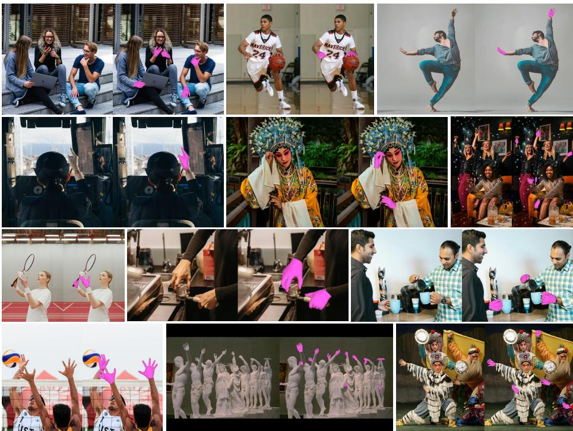  
Fig. 1: We propose AnyHand as a large-scale synthetic RGB-D dataset that substantially expands coverage of hand pose, hand-object interactions, occlusions, and viewpoint variations in the wild. When used to co-train state-of-the-art models such as HaMeR [50] and WiLoR [52], it yields consistent improvements and supports robust 3D hand pose reconstruction across diverse real-world scenes. Predicted hand meshes from WiLoR co-trained with AnyHand are shown in pink.

In this work, we consider the problem of 3D hand pose estimation, which aims to build models that can robustly estimate 3D hand pose from either RGB-only or RGB-D inputs across diverse real-world scenarios. Several recent advances have been made in this direction, driven by large-capacity transformerbased pipelines that regress parametric hand representations such as MANO [56] from a single image. Recent contributions such as HaMeR [50], Hamba [14], and WiLoR [52] demonstrate that relatively simple architectures perform well when trained on diverse, large-scale data. However, scaling such data coverage needed for foundational training remains difficult in practice. For instance, GigaHands [15] provides sequential hand-object interaction annotations, but as a real-captured dataset, its diversity is constrained by the capture setup/collection scale (e.g. viewing perspectives, subjects, and objects), and its 3D annotations might include noisy ones due to limitations of the annotation/reconstruction pipeline, especially under heavy occlusion.

Recent large-scale synthetic 3D corpora such as Objaverse(-XL) [11,12] demon strate a practical alternative: scaling synthetic data can measurably improve downstream 3D models on various of tasks [22, 31, 32, 60, 61, 64, 65, 67, 73]. Inspired by this data-scaling paradigm, we introduce AnyHand, a large-scale RGB-D synthetic dataset that consists of hand-only and hand-object interaction scenes with realistic textures and rich annotations. The resulting dataset provides guaranteed ground-truth labels, as the synthetic data is “perfect” by construction, avoiding annotation noise common in real datasets. It substantially expands visual diversity by randomizing camera viewpoints, backgrounds, and illumination, and by increasing subject-level variation in hand texture, skin tone, and hand shape beyond what is feasible with a limited pool of real participants. As a concrete example, we augment the attached-arm context with diverse realistic forearm appearances, including both bare skin and clothing such as short- and long-sleeves, which helps mitigate overfitting to clean capture conditions. We also release the generation pipeline to facilitate future research in this area.

We then design a co-training recipe that combines our created large-scale synthetic dataset AnyHand with existing real datasets and validate the state-ofthe-art models across multiple standard benchmarks. Without bells and whistles, that is, using the de facto architecture and exactly the same training protocol as HaMeR [50] and WiLoR [52], our retrained models surpass all previous state-ofthe-art methods, suggesting that data quality and scale, more than architecture complexity, are the limiting factors for this task.

This finding motivates an intuitive extension to the RGB-D format, which additionally enhances data quality with direct geometric cues that utilize the ground-truth intra-hand features, such as depth differences between fingers, to further improve the hand pose accuracy. To this end, we propose a lightweight depth fusion module that integrates these geometry cues from depth maps into the RGB-based architecture. Despite its simplicity, the module has a large impact on performance and is proven to surpass the prior works on RGB-D-based hand pose estimation, such as IPNet [55] and Keypoint Fusion [38].

In summary, our main contributions are as follows:

– We introduce AnyHand, a large-scale RGB-D synthetic hand dataset and a released generation pipeline that includes realistic single-hand and handobject interaction scenes with aligned depth and arm context.

– We proposed AnyHandNet-D as an RGB-D model by extending the original RGB-only pipeline with a depth fusion module to handle RGB-D input, and demonstrated that, when co-trained with our synthetic data, it leads to substantial performance gains and surpasses prior RGB-D methods.

– We show the benefits of our synthetic data and depth integration through extensive experiments on standard benchmarks, demonstrating improved generalization across diverse and challenging conditions.

## 2 Related Work

3D Hand Pose Estimation. Early 3D hand pose estimation approaches often relied on depth-based tracking, leveraging geometric cues from depth and articulated alignment (e.g. ICP-style optimization) for real-time recovery [53, 59].

Table 1: Comparisons with representative synthetic Hand-pose dataset. AnyHand provides the most comprehensive setting among prior work, combining the largest scale with realistic HDR indoor/outdoor backgrounds, diverse dynamic lighting, aligned depth, and arm/object configurations (AnyHand-Single/Interact).
<table><tr><td>Dataset</td><td>Size</td><td>Background</td><td>Lighting</td><td>Depth</td><td>Arm</td><td>Object</td></tr><tr><td>RHD [76]</td><td>44K</td><td>static</td><td>manual</td><td>&gt;&gt;x</td><td>×&gt;x</td><td>×&gt;x</td></tr><tr><td>ObMan [20]</td><td>154K</td><td>static</td><td>manual</td><td></td><td></td><td></td></tr><tr><td>Re: InterHand [44]</td><td>1.5M</td><td>HDR - Indoor</td><td>dynamic</td><td></td><td></td><td></td></tr><tr><td>RenderIH [29]</td><td>1M</td><td>HDR - Indoor / OurDoor</td><td>dynamic</td><td>×</td><td>×</td><td>×</td></tr><tr><td>AnyHand-Single</td><td>2.5M</td><td>HDR - Indoor / OutDoor</td><td>dynamic</td><td>:</td><td>:</td><td>×</td></tr><tr><td>AnyHand-Interact</td><td>4.1M</td><td>HDR - Indoor / OutDoor</td><td>dynamic</td><td></td><td></td><td></td></tr></table>

To move beyond depth sensors, Boukhayma et al. [3] introduced the first fully learnable pipeline that regresses MANO [56] parameters from RGB inputs. Subsequent RGB-based methods improved reconstruction using stronger 2D supervision and refinement modules [2, 74], while mesh/vertex regression with mesh convolutions further boosted reconstruction quality [25,26]. Additional work has focused on robustness to occlusion and motion blur [46, 48] and on including kinematic/biomechanical priors to suppress implausible poses [58, 68].

More recently, the dominant trend has been to scale both model capacity and training data using transformer backbones that have proven effective for full-body pose and mesh recovery [34,69]. HandDiff [8] explores a diffusion-based formulation that generates hand poses through iterative denoising. In contrast, HaMeR [50] adopts a minimalist foundation-style design that fine-tunes a ViT backbone [69] to directly regress MANO pose, shape, and camera pose from a single RGB image, trained on a mixed ∼2.7M-image corpus. Hamba [14] replaces attention with a graph-guided Mamba [16] backbone to capture joint spatial relations. WiLoR [52] further scales training to ∼4.2M RGB images with a coarseto-fine refinement module, achieving state-of-the-art RGB performance. These works validate the effectiveness of transformer-based methods with relatively simple architectures when trained on diverse, large-scale data.

However, purely RGB-based pipelines remain ill-posed in depth, leading to global translation and scale errors of the hand’s 3D location even when the corresponding 2D projection looks well aligned. To leverage geometric cues when depth is available, prior work explored RGB-D formulations that regress from depth maps or multimodal inputs such as image-point-cloud hybrids [37,55]. As a recent representative, Keypoint-Fusion [38] fuses RGB and depth features around hand keypoints to resolve RGB ambiguities. However, the scarcity of large-scale, well-aligned RGB-D datasets has limited these approaches to benchmark-specific training, hindering cross-dataset generalization. To address this limitation, we include depth in our synthetic data, enabling transformer-based models to utilize geometric cues while keeping strong data-driven generalization ability.

Synthetic Data for 3D Hand Pose Est. and the Synthetic-to-Real Gap. Collecting large-scale real 3D hand annotations is not easy, especially for handobject interactions where hands are small and heavily occluded. This challenge is even greater for RGB-D, as large datasets with well-aligned depth and reliable 3D labels are scarce, and depth quality varies across sensors. Therefore, synthetic data provides a practical way to scale supervision while obtaining paired RGB-D observations with full 3D ground truth.

As summarized in Tab. 1, existing synthetic hand datasets cover both singlehand and hand-object settings but often trade off scale, realism, and modality coverage. Early datasets such as RHD [76] provide aligned depth, but at a relatively modest scale and without arm context or object-induced occlusions. Handobject datasets such as ObMan [20] introduce object interactions, yet are limited in realism and scale. More recent large-scale efforts improve realism with HDR backgrounds and dynamic lighting, such as Re:InterHand [44] and RenderIH [29], but are primarily released as RGB data without aligned depth, explicit modeling of arm and object occlusion. As a result, depth, arm context, and hand-object occlusions are rarely available together at a large scale.

Beyond dataset design, synthetic-to-real transfer remains challenging. Zhao et al. [75] analyze this gap by factorizing the synthetic hand generation pipeline and building benchmark-matched synthetic counterparts (e.g. SynFrei/SynDex) by re-rendering real poses/shapes/cameras with controlled augmentations. Their results suggest that closing the gap requires more than scaling data: adding forearm context improves wrist localization; diverse backgrounds and textures help, but quickly saturate. Besides, realistic hand-object interactions and occlusions are critical for interaction benchmarks.

Inspired by these findings, and by prior successes in other relevant tasks such as object pose estimation [64] and single-image 3D reconstruction [22, 31, 60, 65, 67, 73] that benefit from training with large-scale synthetic data, we build a large-scale synthetic RGB-D dataset that jointly addresses scale and realism by including arm context, hand-object occlusions, and aligned depth rendering with rich 3D annotations. While existing real-world datasets are predominantly RGB, ours serves as a drop-in co-training source by scaling RGB training and, when paired with depth, providing additional geometric constraints.

## 3 AnyHand Dataset

A central goal of this work is to train 3D hand pose models that support either RGB-only or RGB-D inputs, while remaining robust under occlusions. However, the data requirements at scale are a significant bottleneck in this context, because real data is expensive to scale, and high-quality depths are not consistently available across real datasets. We therefore propose a large-scale synthetic dataset, AnyHand, which is guided by two principles. First, the data should be diverse in pose, shape, appearance, viewpoint, and interaction patterns to support largecapacity models. Second, the data should be geometrically grounded: we explicitly provide aligned depth and precise labels obtained directly from simulation.

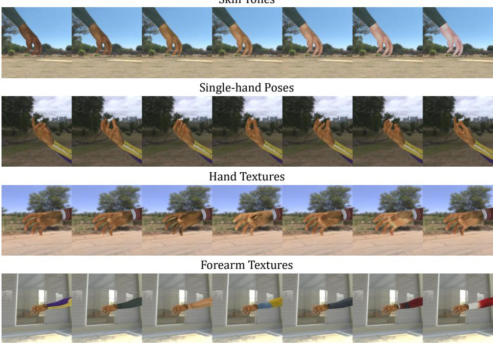  
Fig. 2: Qualitative Vis. of controllable variations. We showcase representative samples from our generator by varying one factor at a time: skin tones (top), singlehand poses from DPoser-Hand [40], hand textures from Handy [51], and forearm appearance from SMPLitex [4]. These examples demonstrate the diversity of appearance and context that we leverage in AnyHand to better match in-the-wild conditions.

Concretely, AnyHand comprises two complementary branches: AnyHand-Single and AnyHand-Interact. The former focuses on pure hand settings with highly diverse poses, while the latter targets hand-object interaction, where the hand experiences heavy, object-induced occlusion.

## 3.1 Dataset Creation

Hand Shapes. To cover a broad range of hand shapes, but also to avoid unrealistic geometry, we sample 47, 438 MANO shape parameters $\beta$ from the empirical distribution of FreiHAND [77] and InterHand2.6M [45], which are real datasets with large subject-level diversity and provide a good proxy for the true distribution of hand shapes in the population.

Hand Poses. Hand realism requires plausible articulation. Rather than sampling poses from simple heuristics, we leverage DPoser-Hand [40], a hand pose model trained on a mixture of large real datasets (e.g. FreiHand [77], HO-3D [17], DexYCB [5], H2O [27], and Re:InterHand [44]). The key advantage of such a diffusion prior is that it captures multi-modal pose distributions observed in real data, enabling us to generate a broad range of poses while avoiding unnatural articulations that often arise from naive sampling. During dataset generation, hand poses are sampled on the fly from this prior.

Hand Textures. A key limitation of prior synthetic datasets is the lack of high-fidelity hand textures, which are crucial for closing the sim-to-real gap. To address this, we leverage a hand texture generator, Handy [51], to produce a large variety of realistic high-frequency skin patterns, which improves the visual fidelity of rendered creases and shading transitions compared to the canonical MANO texture space. In particular, we adopt Handy as our primary source of hand textures and then augment it by applying controlled color transformations, such as hue and saturation perturbations, that broaden skin-tone distribution while preserving the high-frequency texture structure. This yields the diverse textures of 10, 240 unique hand appearances, which is significantly more than the limited hand-crafted texture libraries used in prior works [20, 29, 44, 76].

Forearm Textures. We also maintain realistic appearance continuity across the hand–forearm junction. We texture the forearm using SMPLitex [4], which provides 254 high-quality human-body textures suitable for rendering.

Backgrounds. To diversify environments, we sample high-resolution backgrounds by randomly selecting and cropping from the MIT Indoor Scenes dataset [54] (536 images) and from a pool of 734 HDRI environment maps for each sample.

Lighting. For foreground-background consistency, we randomize a small set of scene lights and correlate their color statistics with the background patch, so that the rendered hand inherits the dominant illumination tone of the scene (e.g. warm indoor tungsten vs. cooler daylight). For HDRI environment maps, we directly use the environment illumination to obtain coherent scene lighting.

Cameras. To ensure viewpoint diversity, we randomize camera intrinsics and extrinsics within realistic ranges, derived from the calibration statistics of real datasets (e.g. HO-3D [17], DexYCB [5], etc.), by mimicking their capture setups, such as hand-camera distance, FOV, and focal length. We constrain the hand to remain well-framed to avoid extreme truncation artifacts.

Rendering AnyHand-Single Dataset. After preparing the above-described components, we instantiate them into a unified rendering-and-compositing pipelin We render all scenes in SAPIEN [66], using its ray-tracing renderer to better capture realistic shading, cast shadows, and specular effects. For each sample, we first draw a plausible MANO shape and pose, and apply diffused hand textures with optional color perturbations to get the textured 3D hand mesh. Then, we attach a textured forearm segment to the hand in 3D, which provides consistent geometry and appearance across the hand–forearm junction and avoids boundary artifacts common in 2D compositing. In particular, we extract the arm mesh from a parametric body model (SMPL/SMPL+H family [39,49,56]), align it to the MANO wrist frame, and texture it using SMPLitex [4]. Finally, we render the foreground hand-arm with background-aware lighting by using the above-described camera randomization. For each scene, we render two images from two independently sampled camera poses, improving simulator efficiency while increasing viewpoint diversity. To further diversify the rendered data, we composite the rendered foreground onto a randomly cropped high-resolution background patch and pair it with HDR environment illumination, while keeping foreground-background consistency by correlating scene-light color statistics with the sampled background patch.

Aligned Depth Maps. We also provide aligned depth maps for all synthetic samples. To this end, we first render accurate metric depths for the hand and forearm from SAPIEN. For the background patch, we estimate a dense metric depth map using MoGe-2 [63]. We then directly fuse foreground and background depth in camera space to obtain a dense depth image for the final composite. While this is not a “perfect” ground truth depth map due to differences in camera intrinsics between the rendered foreground and background, as well as noise in the estimated background depth, it provides a useful approximation for training and evaluation purposes. Besides, we also store a foreground mask so models can optionally restrict losses or depth usage to valid hand/arm regions.

Rendering AnyHand-Interact Dataset. To model occluded hands in realworld scenarios at scale, we render a second branch of the dataset, AnyHand-Interact, by rendering the grasping behaviors from GraspXL [72], which provides over 10M physics-simulation-based hand-object interaction sequences on more than 500k realistically textured objects spanning diverse categories and surface appearances from Objaverse [12], with contact-consistent grasps and natural occlusion patterns. Therefore, we directly use the full GraspXL corpus and inherit its associated object set. The rendering pipeline follows the same strategy as the single-hand branch, but now includes realistic mutual occlusions between the hand and the manipulated object.

Environment Map Background  
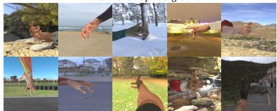  
Indoor Scenes Background

Environment Map Background  
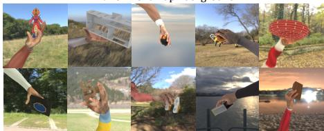

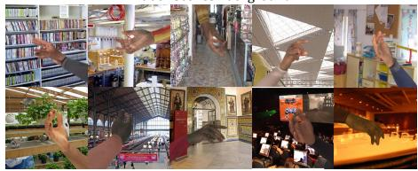

Indoor Scenes Background  
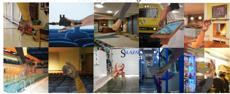  
Fig. 3: Qualitative Vis. Examples of AnyHand-Single (left) and AnyHand-Interact (right), with both HDR environment-map backgrounds (top) and real indoor scenes (bottom). In addition to diverse hand/arm appearance and poses, we have additional diversity on the interacted objects and grasp configurations, producing a wide range of object-induced hand occlusions and self-occlusions under varying perspectives.

Table 2: Comparison with the state-of-the-art on the FreiHAND benchmark [77]. Top results are emphasized in top1 top2 , and top3 . Notably, co-training with AnyHand yields a 7.6% PA-MPJPE improvement for HaMeR and a 1.9% improvement for WiLoR. A full comparison with more prior works can be found in the Suppl. Mat.
<table><tr><td>Method</td><td colspan="4">PA-MPJPE ↓ PA-MPVPE ↓ F@5mm ↑ F@15mm</td></tr><tr><td>AMVUR [23]cVPR23</td><td>6.2</td><td>6.1</td><td>0.767</td><td>0.987</td></tr><tr><td>HaMeR [50]cVPR24</td><td>6.0</td><td>5.7</td><td>0.785</td><td>0.990</td></tr><tr><td>Hamba [14]NeurIPS24</td><td>5.7</td><td>5.3</td><td>0.806</td><td>0.992</td></tr><tr><td>WiLoR [52]cVPR25</td><td>5.5</td><td>5.1</td><td>0.825</td><td>0.993</td></tr><tr><td>HaMeR w/ AnyHand</td><td>5.545</td><td>5.246</td><td>0.811</td><td>0.993</td></tr><tr><td>WiLoR w/ AnyHand</td><td>5.394</td><td>5.046</td><td>0.827</td><td>0.994</td></tr></table>

Table 3: Comparison with the state-of-the-art on the HO-3D v2 benchmark [17]. Top results are emphasized in top1 top2 , and top3 . Using AnyHand reduces PA-MPJPE by 3.0% for HaMeR and by 1.9% for WiLoR. A full comparison of more prior works can be found in the Suppl. Mat.
<table><tr><td>Method</td><td>AUCj ↑ PA-MPJPE ↓ AUCv ↑ PA-MPVPE ↓ F@5 ↑ F@15 ↑</td><td></td><td></td><td></td><td></td><td></td></tr><tr><td>AMVUR [23]</td><td>0.835</td><td>8.3</td><td>0.836</td><td>8.2</td><td>0.608</td><td>0.965</td></tr><tr><td>HaMeR [50]</td><td>0.846</td><td>7.7</td><td>0.841</td><td>7.9</td><td>0.635</td><td>0.980</td></tr><tr><td>Hamba [14]</td><td>0.850</td><td>7.5</td><td>0.843</td><td>7.7</td><td>0.648</td><td>0.982</td></tr><tr><td>WiLoR [52]</td><td>0.851</td><td>7.5</td><td>0.846</td><td>7.7</td><td>0.646</td><td>0.983</td></tr><tr><td>HaMeR w/ AnyHand</td><td>0.851</td><td>7.471</td><td>0.847</td><td>7.676</td><td>0.645</td><td>0.984</td></tr><tr><td>WiLoR w/ AnyHand</td><td>0.853</td><td>7.355</td><td>0.848</td><td>7.624</td><td>0.649</td><td>0.984</td></tr></table>

## 3.2 Dataset Statistics

In summary, AnyHand consists of AnyHand-Single (with 1.05M scenes and 2.1M images) and AnyHand-Interact (with 2.1M scenes and 4.2M images), which are rendered with a combination of 47, 438 hand shapes, 10, 240 hand textures, 254 arm textures, 1, 270 backgrounds, and more than 500k objects from Objaverse [12]. Note that, for all rendered samples, we store RGB, depth, foreground mask, 2D bounding boxes, together with camera intrinsics and extrinsics. We also provide precise 3D hand pose and shape parameters directly from the simulation, which can be used for supervised training or evaluation.

## 4 Assessing AnyHand Dataset on RGB-only Setting

## 4.1 Experiment

Method Setups. To evaluate the quality of AnyHand and its effectiveness for improving foundation-style hand mesh reconstruction, we study two representative frameworks, HaMeR [50] and WiLoR [52]. For each method, we augment its original training corpus with 6.6M synthetic samples generated by our

AnyHand pipeline (Sec. 3), while keeping the model architecture and training hyper-parameters identical to the official setups. For the training details and comprehensive comparisons to more prior works, please refer to the Suppl. Mat. Metrics. Following protocols in the original papers of HaMeR [50] and WiLoR [52], we report Procrustes-aligned Mean per Joint and Vertex Error (PA-MPJPE, PA-MPVPE) and the F-score of vertices at 5mm and 15mm (F@5, F@15) [24,77]. For the HO-3D [17] dataset, we additionally report $\mathrm { A U C } _ { j }$ and $\mathrm { A U C } _ { v }$ , defined as area under the PCK curve over joint and vertex error thresholds.

## 4.2 Results

In-domain Results. We perform an in-domain evaluation on the popular Frei-HAND [77] and HO-3D v2 [17] benchmarks. As shown in Tabs. 2 and 3, cotraining with AnyHand consistently improves performance across all metrics for both HaMeR and WiLoR, demonstrating the effectiveness of our synthetic data for enhancing RGB-based hand pose estimation. On FreiHAND, WiLoR w/ AnyHand achieves the best overall results, while the effect of synthetic augmentation is even more pronounced for HaMeR. The PA-MPJPE drops from 6.0 mm to 5.54 mm (a 7.6% reduction), and PA-MPVPE decreases from 5.7 mm to 5.24 mm (about 8.1%), lifting HaMeR into the same performance tier as the top-ranked approaches, without requiring any specific architecture modification. On HO-3D v2, which emphasizes hand-object interactions, the same trend holds. WiLoR w/ AnyHand attains the best overall results, while HaMeR also improves substantially, with PA-MPJPE of HaMer w/ AnyHand reduced by 3.0% from 7.7 mm to 7.47 mm. Further analysis in Fig. 4 reveals that the synthetic data helps reduce errors in challenging poses and occluded joints, which are common failure modes for RGB-based methods. More visual results are provided in the Suppl. Mat.

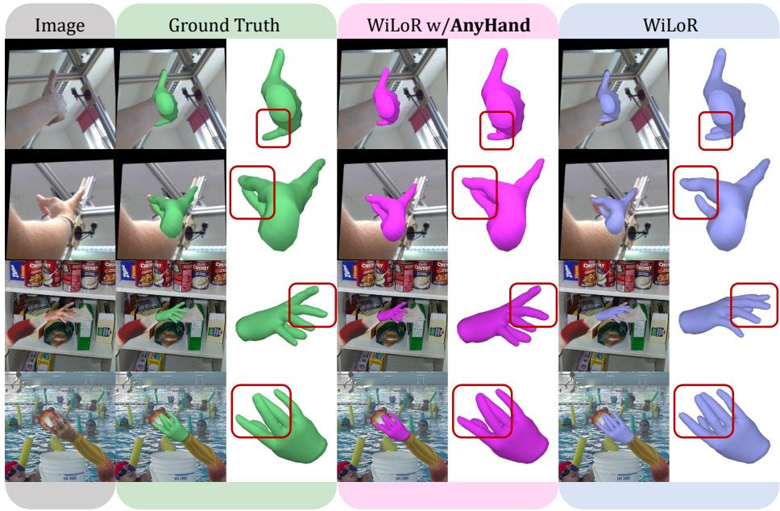  
Fig. 4: Qualitative Vis. WiLoR w/ AnyHand vs. WiLoR on FreiHAND [77] and AnyHand Test Set. Left to right: input, GT, WiLoR w/ AnyHand, WiLoR. Adding synthetic data improves fine-grained pose estimation, particularly fingertip bending and finger joint angles (as boxed), yielding meshes that better match the image evidence.

Table 4: Comparison with HaMeR [50] and WiLoR [52] on the HO-Cap benchmark [62] as a in-the-wild case. Better results are bolded.
<table><tr><td>Method</td><td>AUCj ↑</td><td>PA-MPJPE↓</td><td>F@5mm ↑</td><td>F@15mm ↑</td></tr><tr><td>HaMeR [50]</td><td>0.901</td><td>4.94</td><td>0.621</td><td>0.984</td></tr><tr><td>WiLoR [52]</td><td>0.899</td><td>5.02</td><td>0.615</td><td>0.981</td></tr><tr><td>HaMeR w/</td><td>AnyHand 0.907</td><td>4.66</td><td>0.662</td><td>0.985</td></tr><tr><td>WiLoR w/</td><td>AnyHand 0.906</td><td>4.69</td><td>0.652</td><td>0.987</td></tr></table>

Out-of-domain Results. To evaluate the out-of-domain generalization ability, we directly evaluate performance on the HO-Cap [62] benchmark without any fine-tuning, whose images are entirely from unseen sources with a clear domain shift. As reported in Tab. 4, augmenting training with AnyHand’s synthetic data improves both WiLoR and HaMeR, and yields a notable ranking change: HaMeR w/ AnyHand attains PA-MPJPE of 4.66 mm, slightly outperforming WiLoR w/ AnyHand, which has PA-MPJPE of 4.69 mm. This is particularly interesting because HaMeR is overall weaker than WiLoR on HO-Cap under the original training setup. The fact suggests that the performance gap between the two architectures is not fixed, but can be influenced by the training data distribution. Analysis. Two key observations emerge from these experiments. Firstly, cotraining with synthetic data provides consistent improvements across two representative ViT-based baselines (HaMeR and WiLoR), suggesting that the gains are not tied to a single pipeline design. The stronger gains on HaMeR are consistent with its smaller training dataset, whereas WiLoR’s additional refinements and larger training corpus leave less room for improvement. Moreover, on HO-Cap, the performance gains from adding AnyHand are substantially larger than the differences between architectures, suggesting that improvements from training data can outweigh architectural differences. Overall, these findings support our thesis that scaling training data quality, quantity, and diversity is a stronger lever than iterating on architectures alone.

## 4.3 Ablations on AnyHand

We ablate our AnyHand for in-domain and out-of-domain performance in Fig. 5 and Tab. 5. We keep the HaMeR [50] architecture and training protocol fixed, and only vary the data configuration used for co-training.

Scaling of Co-training with AnyHand. In Fig. 5, we study the impact of training data scale on model performance, by varying the amount of synthetic data used for co-training, while keeping the real-data portion unchanged. The results show that augmenting HaMeR with AnyHand yields a substantial performance boost over the no-synthetic baseline across all benchmarks. On the in-domain benchmarks (FreiHand and HO-3D v2), the small dataset $\left( { \frac { 1 } { 3 } } \right)$ on FreiHand, $\frac { 2 } { 3 }$ on HO-3D) already provides the main gains, while increasing it to full size only provides a modest improvement. However, on the out-of-domain HO-Cap benchmark, we see a more consistent improvement as the synthetic budget increases, suggesting that scaling up synthetic data may be particularly beneficial for improving robustness to domain shifts. This is likely because the larger synthetic dataset covers a wider range of poses, shapes, textures, and backgrounds that better match the diversity of unseen real-world scenarios. This provides a strong motivation for investing in large-scale synthetic data generation in future work. Ablations on Other Variants. As summarized in Tab. 5, we further ablate key design choices in AnyHand. First, dropping either the Single branch or the Interact branch degrades performance, suggesting that when the target benchmarks contain a mix of single-hand and hand-object interaction cases, jointly co-training with both single and interaction samples yields the best overall results. Second, removing arm texture slightly hurts performance, suggesting that realistic arm appearance (beyond geometry alone) provides useful contextual cues and improves generalization. Third, replacing diffusion-based pose synthesis with poses interpolated from real data leads to a consistent performance drop, indicating that diffusion provides more effective pose diversity for co-training.

Table 5: Ablations on AnyHand components on the FreiHAND [77] benchmark. In each experiment, the HaMeR [50] model is train with different data configurations while other settings are identical. Here $^ { 6 6 } \mathrm { w } /$ interp. pose” means using interpolated poses from real datasets instead of diffusing from the default DPoser-Hand [40].
<table><tr><td>HaMeR [50] Variant</td><td colspan="4">PA-MPJPE ↓ PA-MPVPE ↓ F@5mm ↑ F@15mm</td></tr><tr><td>HaMeR [50]</td><td>6.000</td><td>5.700</td><td>0.7850</td><td>0.9900</td></tr><tr><td>w/ AnyHand</td><td></td><td>5.545</td><td>5.246 0.8110</td><td>0.9930</td></tr><tr><td>w/</td><td>AnyHand-Interact</td><td>5.850</td><td>5.525 0.7940</td><td>0.9919</td></tr><tr><td rowspan="3">w/</td><td>AnyHand-Single</td><td>5.626 5.286</td><td>0.8109</td><td>0.9930</td></tr><tr><td>w/o realistic arm tex.</td><td>5.686</td><td>5.312 0.8096</td><td>0.9926</td></tr><tr><td>w/ interp. pose</td><td>5.707</td><td>5.335 0.8056</td><td>0.9926</td></tr></table>

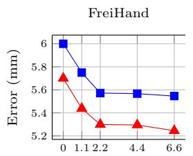  
# AnyHand samples (M)

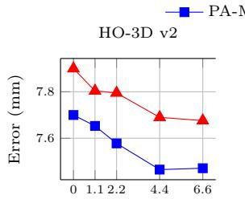  
# AnyHand samples (M)

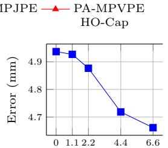  
# AnyHand samples (M)  
Fig. 5: Scaling of HaMeR co-training with AnyHand. We retrain HaMeR [50] while keeping its original real-data training set fixed, and vary the number of additional AnyHand samples used. We report PA-MPJPE and PA-MPVPE on FreiHand [77], HO-3D v2 [17], and HO-Cap [62], respectively. Co-training with synthetic data consistently reduces error, with diminishing returns beyond ∼2–4M samples.

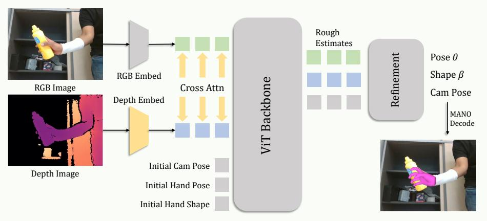  
Fig. 6: Workflow of AnyHandNet-D. Built upon WiLoR [52]’s RGB-only pipeline, we add a lightweight depth fusion module (highlighted in yellow ). RGB and depth are embedded into parallel token sequences, followed by a bidirectional RGB-Depth crossattention. The fused tokens are concatenated with other task tokens and fed into the ViT backbone and refinement head, whose outputs are finally MANO decoded.

## 5 Assessing AnyHand on RGB-D Setting

RGB-D Architecture. Unlike the RGB-only setting, where we focus on evaluating the impact of AnyHand, the RGB-D setting requires an architectural change to fuse depth, as illustrated in Fig. 6. We use dual embedding branches to tokenize RGB and depth, followed by a lightweight bidirectional cross-attention module that exchanges information between the two modalities at corresponding image patches. The fused tokens are then concatenated with task tokens and passed through the remaining transformer blocks for 3D hand pose estimation. Note that, the fusion module is designed to be lightweight and modular, allowing it to be easily integrated into existing ViT-based architectures like WiLoR [52] with minimal changes.

Training. We conduct two training variants: Real-only trains on the real RGB-D datasets HO-3D [17] and DexYCB [5], while Real + AnyHand further co-trains these with our proposed AnyHand, following the same co-training recipe as in the RGB experiments.

Table 6: Comparison with RGB-D methods on the HO-3D v2 benchmark. We report STA-MPJPE, and PA-MPJPE (in cm; ↓). Top results are emphasized in top1 , top2 and top3 . AnyHandNet-D achieves the best overall results, and the realonly variant also surpasses prior RGB-D methods. Ablation on Xttn is also included.
<table><tr><td>Input Method</td><td>STA-MPJPE ↓PA-MPJPE ↓</td></tr><tr><td>RGB-D DiffHand [30]</td><td>-</td></tr><tr><td>D&amp;PCL IPNet [55]</td><td>0.93 2.01 0.871</td></tr><tr><td>RGB-D Keypoint-Fusion [38]</td><td>1.87 0.943</td></tr><tr><td>RGB-D AnyHandNet-D (Real-only)</td><td>1.201 0.891</td></tr><tr><td>Eval w/ MoGe-2 [63] Estimated Depth</td><td>1.184</td></tr><tr><td>RGB-D AnyHandNet-D (Real + AnyHand)</td><td>0.802 1.097 0.814</td></tr><tr><td>Eval w/ MoGe-2 [63] Estimated Depth</td><td>0.793  $1 . 0 6 _ { 8 }$ </td></tr><tr><td>w/o RGB-D Cross Attention</td><td>1.211 0.855</td></tr></table>

Evaluation. We evaluate the models on HO-3D v2 [17] and report on (1) scaletranslation aligned MPJPE (STA-MPJPE), and (2) Procrustes-aligned MPJPE (PA-MPJPE), where for both metrics, lower is better.

Results. The quantitative results are reported in Tab. 6. Our method consistently outperforms prior RGB-D approaches on both the STA-MPJPE (no rotation) and PA-MPJPE (with rotation) metrics, indicating that the improvement is not merely from more accurate global hand orientation, but also a more accurate articulated hand structure after removing global similarity transforms. Compared to Keypoint-Fusion [38], our model reduces the STA-MPJPE from 1.87 cm to 1.09 cm, a relative error reduction of approximately 41.7%. Moreover, even the real-only variant remains competitive and already surpasses prior RGB-D baselines on STA and PA, indicating that the fusion module is robust on its own, while large-scale synthetic depth co-training provides an additional boost. As an ablation, removing RGB-D cross-attention leads to worse convergence and higher error, suggesting its effectiveness and importance in hinting the backbone to jointly consider RGB and depth cues on a given hand-like region.

Estimation with Missing Depth. In real-world applications, depth maps are not always available. We thus additionally evaluate our RGB-D model on HO-3D v2 by replacing the ground-truth depth maps with depth estimated from RGB using MoGe-v2 [63]. Surprisingly, this yields even better performance than using the ground-truth depth: STA-MPJPE improves from 1.09 cm to 1.06 cm, and PA-MPJPE improves from 0.81 cm to 0.79 cm. This is likely because ground-truth HO-3D depth maps are heavily quantized and contain missing values, whereas MoGe-v2 produces smoother, denser estimated depths that may better match the synthetic training distribution, where background depth is also MoGe-based.

## 6 Conclusions

We have introduced AnyHand, a large-scale synthetic dataset that provides diverse hand scenes with rich annotations. By co-training state-of-the-art hand pose estimation models on this dataset, we demonstrated consistent improvements across multiple benchmarks, validating the effectiveness of our synthetic data for enhancing RGB-based approaches. We have also proposed a novel RGB-D architecture that incorporates a lightweight depth fusion module, and showed that it outperforms prior RGB-D approaches on hand pose estimation. Overall, our results open a promising avenue for advancing hand pose estimation by improving the quality, diversity, and modality coverage of training data, rather than solely focusing on architectural innovations.

## References

1. Apple: Apple Vision Pro. https://www.apple.com/apple-vision-pro/ (2024), accessed: 2026-03-03

2. Baek, S., Kim, K.I., Kim, T.K.: Pushing the envelope for rgb-based dense 3d hand pose estimation via neural rendering. In: CVPR. pp. 1067–1076 (2019) 4

3. Boukhayma, A., Bem, R.d., Torr, P.H.: 3d hand shape and pose from images in the wild. In: CVPR. pp. 10843–10852 (2019) 4

4. Casas, D., Comino-Trinidad, M.: SMPLitex: A Generative Model and Dataset for 3D Human Texture Estimation from Single Image. In: BMVC (2023) 6, 7

5. Chao, Y.W., Yang, W., Xiang, Y., Molchanov, P., Handa, A., Tremblay, J., Narang, Y.S., Van Wyk, K., Iqbal, U., Birchfield, S., et al.: Dexycb: A benchmark for capturing hand grasping of objects. In: CVPR. pp. 9044–9053 (2021) 6, 7, 13

6. Chen, P., Chen, Y., Yang, D., Wu, F., Li, Q., Xia, Q., Tan, Y.: I2uv-handnet: Image-to-uv prediction network for accurate and high-fidelity 3d hand mesh modeling. In: ICCV. pp. 12929–12938 (2021) 26

7. Chen, X., Liu, Y., Dong, Y., Zhang, X., Ma, C., Xiong, Y., Zhang, Y., Guo, X.: Mobrecon: Mobile-friendly hand mesh reconstruction from monocular image. In: CVPR. pp. 20544–20554 (2022) 26

8. Cheng, W., Tang, H., Van Gool, L., Ko, J.H.: Handdiff: 3d hand pose estimation with diffusion on image-point cloud. In: CVPR. pp. 2274–2284 (2024) 4

9. Cheng, X., Li, J., Yang, S., Yang, G., Wang, X.: Open-television: Teleoperation with immersive active visual feedback. In: CoRL (2024) 1

10. Choi, H., Moon, G., Lee, K.M.: Pose2mesh: Graph convolutional network for 3d human pose and mesh recovery from a 2d human pose. In: European Conference on Computer Vision. pp. 769–787. Springer (2020) 26

11. Deitke, M., Liu, R., Wallingford, M., Ngo, H., Michel, O., Kusupati, A., Fan, A., Laforte, C., Voleti, V., Gadre, S.Y., et al.: Objaverse-xl: A universe of 10m+ 3d objects. NeurIPS 36, 35799–35813 (2023) 2

12. Deitke, M., Schwenk, D., Salvador, J., Weihs, L., Michel, O., VanderBilt, E., Schmidt, L., Ehsani, K., Kembhavi, A., Farhadi, A.: Objaverse: A universe of annotated 3d objects. In: CVPR. pp. 13142–13153 (2023) 2, 8, 9

13. Ding, R., Qin, Y., Zhu, J., Jia, C., Yang, S., Yang, R., Qi, X., Wang, X.: Bunnyvisionpro: Real-time bimanual dexterous teleoperation for imitation learning. In: IROS. pp. 12248–12255. IEEE (2025) 1

14. Dong, H., Chharia, A., Gou, W., Vicente Carrasco, F., De la Torre, F.D.: Hamba: Single-view 3d hand reconstruction with graph-guided bi-scanning mamba. NeurIPS 37, 2127–2160 (2024) 2, 4, 9, 26

15. Fu, R., Zhang, D., Jiang, A., Fu, W., Funk, A., Ritchie, D., Sridhar, S.: Gigahands: A massive annotated dataset of bimanual hand activities. In: CVPR. pp. 17461– 17474 (2025) 2

16. Gu, A., Dao, T.: Mamba: Linear-time sequence modeling with selective state spaces. In: COLM (2024) 4

17. Hampali, S., Rad, M., Oberweger, M., Lepetit, V.: Honnotate: A method for 3d annotation of hand and object poses. In: CVPR. pp. 3196–3206 (2020) 6, 7, 9, 10, 12, 13, 14, 22, 26

18. Hampali, S., Rad, M., Oberweger, M., Lepetit, V.: Honnotate: A method for 3d annotation of hand and object poses. In: CVPR. pp. 3196–3206 (2020) 26

19. Hampali, S., Sarkar, S.D., Rad, M., Lepetit, V.: Keypoint transformer: Solving joint identification in challenging hands and object interactions for accurate 3d pose estimation. In: CVPR. pp. 11090–11100 (2022) 26

20. Hasson, Y., Varol, G., Tzionas, D., Kalevatykh, I., Black, M.J., Laptev, I., Schmid, C.: Learning joint reconstruction of hands and manipulated objects. In: CVPR. pp. 11807–11816 (2019) 4, 5, 7

21. Hasson, Y., Varol, G., Tzionas, D., Kalevatykh, I., Black, M.J., Laptev, I., Schmid, C.: Learning joint reconstruction of hands and manipulated objects. In: CVPR. pp. 11807–11816 (2019) 26

22. Jiang, Z., Zheng, C., Laina, I., Larlus, D., Vedaldi, A.: Mesh4d: 4d mesh reconstruction and tracking from monocular video. In: CVPR (2026) 3, 5

23. Jiang, Z., Rahmani, H., Black, S., Williams, B.M.: A probabilistic attention model with occlusion-aware texture regression for 3d hand reconstruction from a single rgb image. In: CVPR. pp. 758–767 (2023) 9, 26

24. Knapitsch, A., Park, J., Zhou, Q.Y., Koltun, V.: Tanks and temples: Benchmarking large-scale scene reconstruction. ACM Transactions on Graphics (ToG) 36(4), 1–13 (2017) 10

25. Kulon, D., Guler, R.A., Kokkinos, I., Bronstein, M.M., Zafeiriou, S.: Weaklysupervised mesh-convolutional hand reconstruction in the wild. In: CVPR. pp. 4990–5000 (2020) 4

26. Kulon, D., Wang, H., Güler, R.A., Bronstein, M., Zafeiriou, S.: Single image 3d hand reconstruction with mesh convolutions. arXiv preprint arXiv:1905.01326 (2019) 4

27. Kwon, T., Tekin, B., Stühmer, J., Bogo, F., Pollefeys, M.: H2o: Two hands manip ulating objects for first person interaction recognition. In: ICCV. pp. 10138–10148 (2021) 6

28. Li, K., Li, P., Liu, T., Li, Y., Huang, S.: Maniptrans: Efficient dexterous bimanual manipulation transfer via residual learning. In: CVPR. pp. 6991–7003 (2025) 1

29. Li, L., Tian, L., Zhang, X., Wang, Q., Zhang, B., Bo, L., Liu, M., Chen, C.: Renderih: A large-scale synthetic dataset for 3d interacting hand pose estimation. In: ICCV. pp. 20395–20405 (2023) 4, 5, 7

30. Li, L., Zhuo, L., Zhang, B., Bo, L., Chen, C.: Diffhand: End-to-end hand mesh reconstruction via diffusion models. arXiv preprint arXiv:2305.13705 (2023) 14

31. Li, R., Zheng, C., Rupprecht, C., Vedaldi, A.: Dso: Aligning 3d generators with simulation feedback for physical soundness. In: ICCV (2025) 3, 5

32. Li, R., Zheng, C., Rupprecht, C., Vedaldi, A.: Puppet-master: Scaling interactive video generation as a motion prior for part-level dynamics. In: ICCV (2025) 3

33. Li, Y., Zhang, L., Qiu, Z., Jiang, Y., Li, N., Ma, Y., Zhang, Y., Xu, L., Yu, J.: Nimble: A non-rigid hand model with bones and muscles. ACM Trans. Graph. 41(4) (jul 2022). https://doi.org/10.1145/3528223.3530079, https://doi. org/10.1145/3528223.3530079 24

34. Lin, K., Wang, L., Liu, Z.: End-to-end human pose and mesh reconstruction with transformers. In: CVPR. pp. 1954–1963 (2021) 4, 26

35. Lin, K., Wang, L., Liu, Z.: Mesh graphormer. In: ICCV. pp. 12939–12948 (2021) 26

36. Liu, S., Jiang, H., Xu, J., Liu, S., Wang, X.: Semi-supervised 3d hand-object poses estimation with interactions in time. In: CVPR. pp. 14687–14697 (2021) 26

37. Liu, X., Ren, P., Chen, Y., Liu, C., Wang, J., Sun, H., Qi, Q., Wang, J.: Safusion: multimodal fusion approach for web-based human-computer interaction in the wild. In: Proceedings of the ACM Web Conference 2023. pp. 3883–3891 (2023) 4

38. Liu, X., Ren, P., Gao, Y., Wang, J., Sun, H., Qi, Q., Zhuang, Z., Liao, J.: Keypoint fusion for rgb-d based 3d hand pose estimation. In: AAAI. vol. 38, pp. 3756–3764 (2024) 3, 4, 14

39. Loper, M., Mahmood, N., Romero, J., Pons-Moll, G., Black, M.J.: SMPL: A skinned multi-person linear model. ACM Transactions on Graphics, (Proc. SIG-GRAPH Asia) 34(6), 248:1–248:16 (Oct 2015) 7

40. Lu, J., Lin, J., Dou, H., Zeng, A., Deng, Y., Liu, X., Cai, Z., Yang, L., Zhang, Y., Wang, H., et al.: Dposer-x: Diffusion model as robust 3d whole-body human pose prior. In: ICCV. pp. 9988–9997 (2025) 6, 12, 20, 24

41. Mandi, Z., Hou, Y., Fox, D., Narang, Y., Mandlekar, A., Song, S.: Dexmachina: Functional retargeting for bimanual dexterous manipulation. arXiv preprint arXiv:2505.24853 (2025) 1

42. Meta: Meta Quest 3. https://www.meta.com/quest/quest-3/ (2023), accessed: 2026-03-03 1

43. Moon, G., Lee, K.M.: I2l-meshnet: Image-to-lixel prediction network for accurate 3d human pose and mesh estimation from a single rgb image. In: European Conference on Computer Vision. pp. 752–768. Springer (2020) 26

44. Moon, G., Saito, S., Xu, W., Joshi, R., Buffalini, J., Bellan, H., Rosen, N., Richardson, J., Mize, M., De Bree, P., et al.: A dataset of relighted 3d interacting hands. NeurIPS 36, 17689–17701 (2023) 4, 5, 6, 7

45. Moon, G., Yu, S.I., Wen, H., Shiratori, T., Lee, K.M.: Interhand2. 6m: A dataset and baseline for 3d interacting hand pose estimation from a single rgb image. In: ECCV. pp. 548–564. Springer (2020) 6

46. Oh, Y., Park, J., Kim, J., Moon, G., Lee, K.M.: Recovering 3d hand mesh sequence from a single blurry image: A new dataset and temporal unfolding. In: CVPR. pp. 554–563 (2023) 4

47. Pan, C., Wang, C., Qi, H., Liu, Z., Bharadhwaj, H., Sharma, A., Wu, T., Shi, G., Malik, J., Hogan, F.: Spider: Scalable physics-informed dexterous retargeting. arXiv preprint arXiv:2511.09484 (2025) 1

48. Park, J., Oh, Y., Moon, G., Choi, H., Lee, K.M.: Handoccnet: Occlusion-robust 3d hand mesh estimation network. In: CVPR. pp. 1496–1505 (2022) 4, 26

49. Pavlakos, G., Choutas, V., Ghorbani, N., Bolkart, T., Osman, A.A.A., Tzionas, D., Black, M.J.: Expressive body capture: 3d hands, face, and body from a single image. In: CVPR (2019)

50. Pavlakos, G., Shan, D., Radosavovic, I., Kanazawa, A., Fouhey, D., Malik, J.: Reconstructing hands in 3d with transformers. In: CVPR. pp. 9826–9836 (2024) 2, 3, 4, 9, 10, 11, 12, 24, 26

51. Potamias, R.A., Ploumpis, S., Moschoglou, S., Triantafyllou, V., Zafeiriou, S.: Handy: Towards a high fidelity 3d hand shape and appearance model. In: CVPR. pp. 4670–4680 (June 2023) 6, 7, 24

52. Potamias, R.A., Zhang, J., Deng, J., Zafeiriou, S.: Wilor: End-to-end 3d hand localization and reconstruction in-the-wild. In: CVPR. pp. 12242–12254 (2025) 2, 3, 4, 9, 10, 11, 13, 26

53. Qian, C., Sun, X., Wei, Y., Tang, X., Sun, J.: Realtime and robust hand tracking from depth. In: CVPR. pp. 1106–1113 (2014) 3

54. Quattoni, A., Torralba, A.: Recognizing indoor scenes. In: CVPR. pp. 413–420. IEEE (2009) 7

55. Ren, P., Chen, Y., Hao, J., Sun, H., Qi, Q., Wang, J., Liao, J.: Two heads are better than one: Image-point cloud network for depth-based 3d hand pose estimation. In: AAAI. vol. 37, pp. 2163–2171 (2023) 3, 4, 14

56. Romero, J., Tzionas, D., Black, M.J.: Embodied hands: Modeling and capturing hands and bodies together. ACM Transactions on Graphics, (Proc. SIGGRAPH Asia) 36(6) (Nov 2017) 2, 4, 7

57. Shi, L., Liu, Y., Zeng, L., Ai, B., Hong, Z., Su, H.: Learning adaptive dexterous grasping from single demonstrations. In: IROS. pp. 9456–9463. IEEE (2025) 1

58. Spurr, A., Iqbal, U., Molchanov, P., Hilliges, O., Kautz, J.: Weakly supervised 3d hand pose estimation via biomechanical constraints. In: ECCV. pp. 211–228. Springer (2020) 4

59. Tagliasacchi, A., Schröder, M., Tkach, A., Bouaziz, S., Botsch, M., Pauly, M.: Robust articulated-icp for real-time hand tracking. In: Computer graphics forum. vol. 34, pp. 101–114. Wiley Online Library (2015) 3

60. Team, S.D., Chen, X., Chu, F.J., Gleize, P., Liang, K.J., Sax, A., Tang, H., Wang, W., Guo, M., Hardin, T., Li, X., Lin, A., Liu, J., Ma, Z., Sagar, A., Song, B., Wang, X., Yang, J., Zhang, B., Dollár, P., Gkioxari, G., Feiszli, M., Malik, J.: Sam 3d: 3dfy anything in images (2025), https://arxiv.org/abs/2511.16624 3, 5

61. Team, T.H.: Hunyuan3d 2.0: Scaling diffusion models for high resolution textured 3d assets generation (2025) 3

62. Wang, J., Zhang, Q., Chao, Y.W., Wen, B., Guo, X., Xiang, Y.: Ho-cap: A capture system and dataset for 3d reconstruction and pose tracking of hand-object interaction. arXiv preprint arXiv:2406.06843 (2024) 11, 12, 22

63. Wang, R., Xu, S., Dong, Y., Deng, Y., Xiang, J., Lv, Z., Sun, G., Tong, X., Yang, J.: Moge-2: Accurate monocular geometry with metric scale and sharp details (2025), https://arxiv.org/abs/2507.02546 8, 14

64. Wen, B., Yang, W., Kautz, J., Birchfield, S.: Foundationpose: Unified 6d pose estimation and tracking of novel objects. In: CVPR. pp. 17868–17879 (2024) 3, 5

65. Wu, T., Zheng, C., Guan, F., Vedaldi, A., Cham, T.J.: Amodal3r: Amodal 3d reconstruction from occluded 2d images. In: ICCV (2025) 3, 5

66. Xiang, F., Qin, Y., Mo, K., Xia, Y., Zhu, H., Liu, F., Liu, M., Jiang, H., Yuan, Y., Wang, H., et al.: Sapien: A simulated part-based interactive environment. In: Proceedings of the IEEE/CVF conference on computer vision and pattern recognition. pp. 11097–11107 (2020) 7

67. Xiang, J., Lv, Z., Xu, S., Deng, Y., Wang, R., Zhang, B., Chen, D., Tong, X., Yang, J.: Structured 3d latents for scalable and versatile 3d generation. In: CVPR (June 2025) 3, 5

68. Xie, P., Xu, W., Tang, T., Yu, Z., Lu, C.: Ms-mano: Enabling hand pose tracking with biomechanical constraints. In: CVPR. pp. 2382–2392 (2024) 4

69. Xu, Y., Zhang, J., Zhang, Q., Tao, D.: Vitpose: Simple vision transformer baselines for human pose estimation. NeurIPS 35, 38571–38584 (2022) 4

70. Yang, L., Li, K., Zhan, X., Lv, J., Xu, W., Li, J., Lu, C.: Artiboost: Boosting articulated 3d hand-object pose estimation via online exploration and synthesis. In: CVPR. pp. 2750–2760 (2022) 26

71. Yang, R., Yu, Q., Wu, Y., Yan, R., Li, B., Cheng, A.C., Zou, X., Fang, Y., Cheng, X., Qiu, R.Z., et al.: Egovla: Learning vision-language-action models from egocentric human videos. arXiv preprint arXiv:2507.12440 (2025) 1

72. Zhang, H., Christen, S., Fan, Z., Hilliges, O., Song, J.: GraspXL: Generating grasping motions for diverse objects at scale. In: ECCV (2024) 8, 24

73. Zhang, L., Wang, Z., Zhang, Q., Qiu, Q., Pang, A., Jiang, H., Yang, W., Xu, L., Yu, J.: Clay: A controllable large-scale generative model for creating high-quality 3d assets. ACM Transactions on Graphics (TOG) 43(4), 1–20 (2024) 3, 5

74. Zhang, X., Li, Q., Mo, H., Zhang, W., Zheng, W.: End-to-end hand mesh recovery from a monocular rgb image. In: ICCV. pp. 2354–2364 (2019) 4

75. Zhao, Z., Yang, L., Sun, P., Hui, P., Yao, A.: Analyzing the synthetic-to-real domain gap in 3d hand pose estimation. In: CVPR. pp. 12255–12265 (2025) 5, 22

76. Zimmermann, C., Brox, T.: Learning to estimate 3d hand pose from single rgb images. In: ICCV. pp. 4903–4911 (2017) 4, 5, 7

77. Zimmermann, C., Ceylan, D., Yang, J., Russell, B., Argus, M., Brox, T.: Freihand: A dataset for markerless capture of hand pose and shape from single rgb images. In: ICCV. pp. 813–822 (2019) 6, 9, 10, 12, 26

## Appendix

## A AnyHand Dataset Details

## A.1 Synthetic Data Generation Pipeline

We provide additional implementation details of AnyHand generation below. FOV range. For each rendered view, the camera field of view is sampled uniformly from $3 0 ^ { \circ }$ to 40◦.

Camera distance distribution. We sample the hand–camera distance from Gaussian distributions with means of 0.6m, 0.7m, and 1.0m, each with a standard deviation of 0.1m. This produces both close-up and distant views while keeping the hand at a realistic scale in the image.

Viewpoint sampling strategy. During rendering, the MANO hand is placed at the origin and a forearm mesh is attached at the wrist. We then sample a camera center at the chosen distance along a random 3D viewing direction, and orient the camera to look at the origin. This allows the hand–arm pair to be observed from diverse viewpoints in 3D space.

Lighting configuration. We use at most five lights per scene. For each scene, we randomly choose the number of lights from one to five. The ambient illumination is first set to roughly match the dominant color tone of the sampled background, as described in the main text, to maintain visual consistency between the rendered foreground and background. The remaining lights are randomly chosen from three types: point, directional, and spot. For each light, we randomize its placement and associated parameters, and assign either a vivid color with some probability or a near-white to slightly warm tone otherwise. We also randomly enable or disable shadows and vary the corresponding shadow ranges. This strategy increases illumination diversity while preserving overall scene coherence.

Table 7: Summary of the AnyHand generation pipeline and dataset statistics. The table summarizes the main design choices, rendering settings, and annotations used in AnyHand.
<table><tr><td>Component</td><td>Summary</td></tr><tr><td>Hand shapes</td><td>47,438, sampled from real datasets</td></tr><tr><td>Hand poses</td><td>On-the-fly samples from DPoser-Hand [40]</td></tr><tr><td>Hand textures</td><td>10,240 unique textures</td></tr><tr><td>Arm textures</td><td>254 textures</td></tr><tr><td>Backgrounds</td><td>1,270 indoor images and HDRI maps</td></tr><tr><td>Objects</td><td>&gt;500K objects</td></tr><tr><td>Camera FOV</td><td>Randomly sampled from 30° to  $4 0 ^ { \circ }$ </td></tr><tr><td>Camera distance</td><td>Mean 0.6m / 0.7m / 1.0m, std 0.1m</td></tr><tr><td>Lights</td><td>1 to 5 random lights per scene</td></tr><tr><td>Views per scene</td><td>2</td></tr><tr><td>AnyHand-Single</td><td>1.05M scenes, 2.1M images</td></tr><tr><td>AnyHand-Interact</td><td>2.1M scenes, 4.2M images</td></tr><tr><td>Stored annotations</td><td>RGB, depth, mask, bbox, camera, 3D pose/shape</td></tr></table>

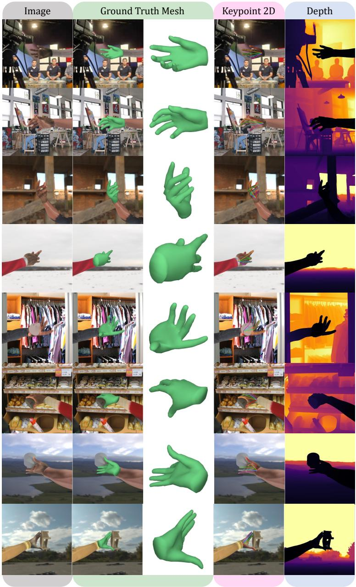  
Fig. 7: Qualitative Visualizations of AnyHand. Additional examples from AnyHand, showing the rendered RGB images together with their corresponding 3D hand meshes, 2D joint annotations, and depth maps. These examples illustrate the diversity of poses, appearances, viewpoints, and interaction scenarios covered by the dataset.

In summary, the details of AnyHand are listed in Tab. 7.

## A.2 Additional Visualization of AnyHand

We provide additional qualitative examples from AnyHand in Fig. 7. For each sample, we show the rendered RGB image together with its corresponding 3D hand mesh, 2D joint annotations, and depth map. These examples illustrate the diversity of AnyHand in hand pose, camera viewpoint, appearance, and interaction setting, while highlighting its rich multi-modal annotations.

## B More evaluation of AnyHand on RGB-only Settings

## B.1 In-the-Wild Qualitative Comparisons

To better illustrate the qualitative prediction quality of models co-trained with AnyHand, we provide additional visual comparisons in Fig. 8. The figure includes seven real-image examples from the HO-Cap [62] dataset, two from the HO-3D evaluation set [17], and one in-the-wild web image. These examples allow us to examine model behavior on both standard benchmark data and less controlled real-world imagery.

As shown in these examples, the most noticeable improvement of WiLoR trained with AnyHand over the original WiLoR and HaMeR is the substantially better mesh-to-image alignment in unconstrained real-world scenes. The predicted hand mesh more accurately covers the visible hand region, suggesting an improved estimation of hand shape and position. Compared with the original WiLoR and HaMeR predictions, WiLoR w/AnyHand more consistently recovers plausible palm width, finger thickness, and overall hand extent, whereas prior models often produce meshes that are slightly mis-scaled or less well aligned to the visible hand contour. This advantage becomes even more evident in handobject interaction cases, where WiLoR w/AnyHand better captures fine-grained articulation details such as finger bending angles, fingertip placement, and the projected perspective of the hand under foreshortening or viewpoint changes. Overall, these visualizations suggest that training with AnyHand improves not only pose estimation accuracy, but also the quality of shape recovery and imagespace alignment, leading to more realistic predictions in the wild.

## B.2 More discussion with Synthetic-to-Real paper

As stated in Sec. 2 of the main paper, a closely related prior work is Zhao et al. [75], which studies the synthetic-to-real gap in 3D hand pose estimation using benchmark-matched synthetic counterparts. Below, we provide a more detailed comparison between their work and ours.

Objective. Zhao et al. focus on controlled analysis, by constructing benchmarkmatched synthetic data, decomposing appearance and occlusion factors, and

Image

WiLoR w/AnyHand

WiLoR

HaMeR

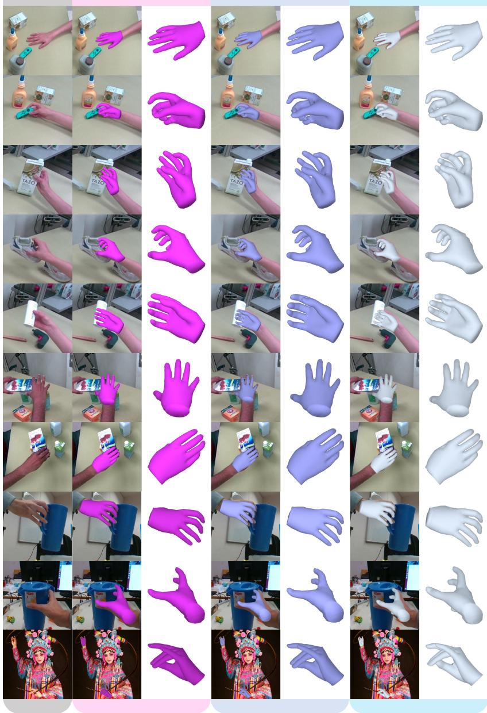  
Fig. 8: Additional in-the-wild qualitative comparisons. We compare WiLoR trained with AnyHand against the original WiLoR and HaMeR on more real-world images. WiLoR w/AnyHand shows better mesh-to-image alignment, more accurate hand scale and shape recovery, and more faithful articulation for challenging hand-object interactions and viewpoint changes.

studying how each component affects transfer. In contrast, AnyHand is designed as a large-scale synthetic RGB-D training resource for foundation-style hand pose learning, guided by two principles of broad diversity and geometric grounding. Accordingly, Zhao et al. aim to minimize confounding factors and stay close to the target benchmarks, whereas our goal is to build a scalable data-generation pipeline that extends beyond existing real datasets.

Modality and scale. Zhao et al. focus on the RGB-only setting and construct benchmark-specific synthetic datasets for controlled analysis, including 325,600 samples in SynFrei and 36,188 samples in SynDex, totaling about 362K images. By contrast, AnyHand is a substantially larger RGB-D resource, containing 2.5M single-hand and 4.1M hand-object images with aligned depth.

Hand Poses and Shapes. Zhao et al. align their synthetic pose distribution with benchmark datasets by fitting the NIMBLE [33] hand mesh to the MANO annotations. In contrast, AnyHand generate poses on the fly from the DPoser-Hand [40] diffusion prior trained on multiple real datasets, producing a broader multi-modal pose distribution. Our ablation further shows that replacing diffusion-based pose synthesis with interpolated real poses leads to worse performance.

Geometry and scene construction. Zhao et al. construct scenes compositionally by pasting segmented arms and objects from real images into synthetic ones, which can introduce boundary artifacts and limit the ability to generate consistent hand-arm depth data. By contrast, AnyHand renders these components directly in simulation: a textured forearm mesh is attached to the MANO wrist frame and rendered jointly with the hand, producing physically consistent hand-arm geometry.

Appearance diversity. Zhao et al. use 38 NIMBLE [33]-based hand textures and 669 HDRI scenes, while AnyHand uses Handy [51] to produce 10,240 unique hand appearances and 254 SMPLitex forearm textures, together with 1,270 backgrounds.

Hand-object interaction. AnyHand further includes a hand-object interaction branch derived from GraspXL [72]. Leveraging its over 10M physics-based handobject interaction sequences and more than 500k realistically textured objects, we generate large-scale RGB-D hand-object data with aligned depth maps.

Overall, AnyHand represents a simulation-native pipeline designed for scalable training, whereas Zhao et al. study synthetic-to-real transfer under a controlled benchmark-matching setting.

## B.3 A Study of Sim-and-real Co-train Recipe

To study the co-training recipe that mixes real data with AnyHand, we conduct an ablation study in which HaMeR [50] is trained on a fixed total of 2.7M samples, matching its original training recipe, while varying the proportion of AnyHand. For example, when the AnyHand proportion is 25%, the remaining 75% of the training corpus is drawn from HaMeR’s original training data and scaled down proportionally. All models are trained for the same number of steps for a controlled comparison. The results are reported in Fig. 9.

These results lead to two observations. First, training on AnyHand alone is insufficient. The 100% AnyHand proportion substantially worse than all mixed settings across the evaluated benchmarks, and also degrades noticeably relative to HaMeR’s original training recipe. This consistent drop indicates that, despite its scale and diversity, AnyHand can not fully replace real training data.

Second, incorporating AnyHand generally improves performance relative to the original training recipe. All mixed settings (25%, 50%, and 75%) outperform the 0% setting, indicating that adding AnyHand provides useful complementary supervision. However, the performance differences among the mixed settings are modest, and the current experiments do not clearly identify a single optimal mixing ratio. One possible explanation is that all models are trained for the same number of optimization steps, while different data mixtures may require different convergence schedules, and stochastic optimization introduces additional variance.

Overall, these results suggest that AnyHand is most beneficial when used jointly with real training data while determining the optimal mixing ratio remains an open question for future study.

## B.4 Full Benchmark on FreiHand

We report the complete version of Tab. 2 from the main paper in Tab. 8.

## B.5 Full Benchmark on HO-3D

We report the complete version of Tab. 3 from the main paper in Tab. 9.

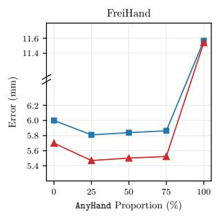

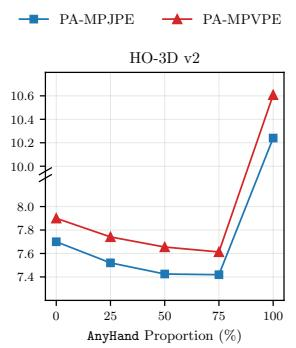

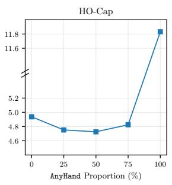  
Fig. 9: Effect of the training-data mixing ratio. HaMeR is trained with a fixed budget of 2.7M samples, matching its original training recipe, while varying the proportion of AnyHand. The remaining samples are drawn from HaMeR’s original training corpus and scaled down proportionally. The results provide a rough estimate of the impact of different mixture ratios under a fixed training budget.

Table 8: Comparison with the state-of-the-art on the FreiHAND benchmark [77]. Top results are emphasized in top1 top2 , and top3 . Notably, co-training with AnyHand yields a 7.6% PA-MPJPE improvement for HaMeR and a 1.9% improvement for WiLoR.
<table><tr><td rowspan=1 colspan=9>Method               PA-MPJPE ↓ PA-MPVPE ↓ F@5mm ↑ F@15mm</td></tr><tr><td rowspan=1 colspan=9>I2L-MeshNet [43]            7.4             7.6          0.681      0.973Pose2Mesh [10]              7.7             7.8         0.674      0.969</td></tr><tr><td rowspan=1 colspan=9>I2UV-HandNet [6]           6.7             6.9          0.707      0.977</td></tr><tr><td rowspan=1 colspan=5>METRO[34]                 6.5             6.3</td><td rowspan=1 colspan=2>0.731</td><td rowspan=1 colspan=2>0.984</td></tr><tr><td rowspan=1 colspan=5>Mesh Graphormer [35]      5.9             6.0</td><td rowspan=1 colspan=2>0.764</td><td rowspan=1 colspan=2>0.986</td></tr><tr><td rowspan=1 colspan=5>MobRecon[7]                5.7             5.8</td><td rowspan=1 colspan=1>0.784</td><td rowspan=1 colspan=1></td><td rowspan=1 colspan=1>0.986</td><td rowspan=1 colspan=1></td></tr><tr><td rowspan=1 colspan=5>AMVUR [23]CVPR23        6.2             6.1</td><td rowspan=1 colspan=1>0.767</td><td rowspan=1 colspan=1></td><td rowspan=1 colspan=1>0.987</td><td rowspan=1 colspan=1></td></tr><tr><td rowspan=1 colspan=5>HaMeR [50]cVPR24         6.0             5.7</td><td rowspan=1 colspan=1>0.785</td><td rowspan=1 colspan=1></td><td rowspan=1 colspan=1>0.990</td><td rowspan=1 colspan=1></td></tr><tr><td rowspan=1 colspan=5>Hamba $[ 1 4 ] _ { \mathrm { N e u r I P S 2 4 } }$         5.7             5.3</td><td rowspan=1 colspan=1>0.806</td><td rowspan=1 colspan=1></td><td rowspan=1 colspan=1>0.992</td><td rowspan=1 colspan=1></td></tr><tr><td rowspan=1 colspan=5>WiLoR[ [52]CVPR25         5.5            5.1</td><td rowspan=1 colspan=1>0.825</td><td rowspan=1 colspan=1></td><td rowspan=1 colspan=1>0.993</td><td rowspan=1 colspan=1></td></tr><tr><td rowspan=1 colspan=1>HaMeR w/ AnyHand</td><td rowspan=1 colspan=1> $5 . 5 _ { 4 5 }$ </td><td rowspan=1 colspan=1></td><td rowspan=1 colspan=1> $5 . 2 _ { 4 6 }$ </td><td rowspan=1 colspan=1></td><td rowspan=1 colspan=1>0.811</td><td rowspan=1 colspan=1></td><td rowspan=1 colspan=1>0.993</td><td rowspan=1 colspan=1></td></tr><tr><td rowspan=1 colspan=1>WiLoR w/ AnyHand</td><td rowspan=1 colspan=1> $5 . 3 _ { 9 4 }$ </td><td rowspan=1 colspan=1></td><td rowspan=1 colspan=1> $5 . 0 _ { 4 6 }$ </td><td rowspan=1 colspan=1></td><td rowspan=1 colspan=1>0.827</td><td rowspan=1 colspan=1></td><td rowspan=1 colspan=1>0.994</td><td rowspan=1 colspan=1></td></tr></table>

Table 9: Comparison with the state-of-the-art on the HO-3D v2 benchmark [17]. Top results are emphasized in top1 top2 and top3 . Using AnyHand reduces PA-MPJPE by 3.0% for HaMeR and by 1.9% for WiLoR.
<table><tr><td>Method AUCj ↑ PA-MPJPE ↓ AUCv ↑ PA-MPVPE ↓ F@5 ↑ F@15 ↑</td><td></td><td></td><td></td><td></td><td></td><td></td></tr><tr><td>Liu et al. [36]</td><td>0.803</td><td>9.9</td><td>0.810</td><td>9.5</td><td>0.528</td><td>0.956</td></tr><tr><td>HandOccNet [48]</td><td>0.819</td><td>9.1</td><td>0.819</td><td>8.8</td><td>0.564</td><td>0.963</td></tr><tr><td>I2UV-HandNet [6]</td><td>0.804</td><td>9.9</td><td>0.799</td><td>10.1</td><td>0.500</td><td>0.943</td></tr><tr><td>HOnnotate [18]</td><td>0.788</td><td>10.7</td><td>0.790</td><td>10.6</td><td>0.506</td><td>0.942</td></tr><tr><td>Hasson et al. [21]</td><td>0.780</td><td>11.0</td><td>0.777</td><td>11.2</td><td>0.464</td><td>0.939</td></tr><tr><td>ArtiBoost [70]</td><td>0.773</td><td>11.4</td><td>0.782</td><td>10.9</td><td>0.488</td><td>0.944</td></tr><tr><td>Pose2Mesh [10]</td><td>0.754</td><td>12.5</td><td>0.749</td><td>12.7</td><td>0.441</td><td>0.909</td></tr><tr><td>I2L-MeshNet [43]</td><td>0.775</td><td>11.2</td><td>0.722</td><td>13.9</td><td>0.409</td><td>0.932</td></tr><tr><td>METRO [34]</td><td>0.792</td><td>10.4</td><td>0.779</td><td>11.1</td><td>0.484</td><td>0.946</td></tr><tr><td>MobRecon [7]</td><td>-</td><td>9.2</td><td>-</td><td>9.4</td><td>0.538</td><td>0.957</td></tr><tr><td>KeypointTrans [19]</td><td>0.786</td><td>10.8</td><td>-</td><td>-</td><td>-</td><td>-</td></tr><tr><td>AMVUR [23]</td><td>0.835</td><td>8.3</td><td>0.836</td><td>8.2</td><td>0.608</td><td>0.965</td></tr><tr><td>HaMeR [50]</td><td>0.846</td><td>7.7</td><td>0.841</td><td>7.9</td><td>0.635</td><td>0.980</td></tr><tr><td>Hamba [14]</td><td>0.850</td><td></td><td>0.843</td><td></td><td>0.648</td><td>0.982</td></tr><tr><td>WiLoR [52]</td><td>0.851</td><td>7.5</td><td>0.846</td><td>$77r 7</td><td>0.646</td><td>0.983</td></tr><tr><td>HaMeR w/ AnyHand</td><td>0.851</td><td>7.471</td><td>0.847</td><td>7.676</td><td>0.645</td><td>0.984</td></tr><tr><td>WiLoR w/ AnyHand</td><td>0.853</td><td>7.355</td><td>0.848</td><td>7.624</td><td>0.649</td><td>0.984</td></tr></table>

## C Benchmark on AnyHand Test Set

We evaluate state-of-the-art RGB methods, including HaMeR [50] and WiLoR [52], as well as their variants co-trained with AnyHand, on AnyHand as a benchmark.

Table 10: Benchmarking methods on AnyHand. Best results in each sub-table are shown in bold. For F-scores, we report both pre-alignment and post-alignment values. These results serve as reference values for future methods utilizing AnyHand.
<table><tr><td></td><td colspan="6">Pose Metrics</td><td colspan="4">Mesh Metrics</td></tr><tr><td>Method</td><td>AUCj ↑ MPJPE ↓ AUCj_pa ↑ PA-MPJPE ↓ AUCj_ta ↑ STA-MPJPE ↓ F@5 ↑ F@15 ↑ F-al@5 ↑ F-al@15 ↑</td><td></td><td></td><td></td><td></td><td></td><td></td><td></td><td></td></tr><tr><td colspan="10">AnyHand-Single-EnvMap</td></tr><tr><td>HaMeR</td><td>0.600</td><td>21.290</td><td>0.800</td><td>10.090</td><td>0.624</td><td>19.840</td><td>0.098</td><td>0.552</td><td>0.293</td><td>0.854</td></tr><tr><td>WiLoR</td><td>0.567</td><td>23.486</td><td>0.778</td><td>11.199</td><td>0.588</td><td>22.088</td><td>0.090</td><td>0.518</td><td>0.245</td><td>0.817</td></tr><tr><td>HaMeR w/ AnyHand 0.701 WiLoR w/</td><td></td><td>14.980</td><td>0.890</td><td>5.500</td><td>0.805</td><td>9.780</td><td>0.139</td><td>0.625</td><td>0.593</td><td>0.967</td></tr><tr><td>AnyHand</td><td>0.715</td><td>14.290</td><td>0.904</td><td>4.820</td><td>0.811</td><td>9.530</td><td>0.140</td><td>0.658</td><td>0.681</td><td>0.973</td></tr><tr><td colspan="10">AnyHand-Single-Indoor</td></tr><tr><td>HaMeR</td><td>0.573</td><td>23.020</td><td>0.788</td><td>10.690</td><td>0.596</td><td>21.460</td><td>0.093</td><td>0.523</td><td>0.265</td><td>0.836</td></tr><tr><td>WiLoR</td><td>0.542</td><td>25.355</td><td>0.763</td><td>11.974</td><td>0.557</td><td>24.171</td><td>0.086</td><td>0.496</td><td>0.217</td><td>0.791</td></tr><tr><td>HaMeR w/</td><td>AnyHand 0.755</td><td>12.400</td><td>0.857</td><td>7.160</td><td>0.792</td><td>10.560</td><td>0.191</td><td>0.744</td><td>0.455</td><td>0.929</td></tr><tr><td>WiLoR w/ AnyHand</td><td>0.731</td><td>13.780</td><td>0.821</td><td>9.020</td><td>0.752</td><td>12.740</td><td>0.182</td><td>0.712</td><td>0.346</td><td>0.881</td></tr><tr><td colspan="10">AnyHand-Interact-EnvMap</td></tr><tr><td>HaMeR</td><td>0.638</td><td>19.250</td><td>0.801</td><td>10.030</td><td>0.664</td><td>17.860</td><td>0.107</td><td>0.582</td><td>0.260</td><td>0.840</td></tr><tr><td>WiLoR</td><td>0.579</td><td>23.304</td><td>0.772</td><td>11.523</td><td>0.603</td><td>21.946</td><td>0.091</td><td>0.507</td><td>0.200</td><td>0.789</td></tr><tr><td>HaMeR w/ AnyHand 0.891</td><td></td><td>5.480</td><td>0.933</td><td>3.360</td><td>0.892</td><td>5.460</td><td>0.601</td><td>0.956</td><td>0.827</td><td>0.986</td></tr><tr><td>WiLoR w/ AnyHand</td><td>0.890</td><td>5.510</td><td>0.934</td><td>3.300</td><td>0.892</td><td>5.440</td><td>0.607</td><td>0.951</td><td>0.829</td><td>0.986</td></tr><tr><td colspan="10">AnyHand-Interact-Indoor</td></tr><tr><td>HaMeR</td><td>0.595</td><td>21.990</td><td>0.795</td><td>10.360</td><td>0.642</td><td>19.380</td><td>0.096</td><td>0.526</td><td>0.247</td><td>0.828</td></tr><tr><td>WiLoR</td><td>0.545</td><td>25.594</td><td>0.768</td><td>11.757</td><td>0.583</td><td>23.332</td><td>0.085</td><td>0.464</td><td>0.195</td><td>0.778</td></tr><tr><td>HaMeR w/ AnyHand 0.887</td><td></td><td>5.690</td><td>0.932</td><td>3.400</td><td>0.889</td><td>5.590</td><td>0.579</td><td>0.952</td><td>0.883</td><td>0.986</td></tr><tr><td>WiLoR w/ AnyHand</td><td>0.882</td><td>5.940</td><td>0.931</td><td>3.440</td><td>0.885</td><td>5.770</td><td>0.560</td><td>0.944</td><td>0.817</td><td>0.985</td></tr></table>

As shown in Tab. 10, the original HaMeR and WiLoR models exhibit nontrivial generalization to AnyHand, despite not being trained on this data distribution. However, co-training with AnyHand consistently improves performance across all four splits and across both pose and mesh metrics, suggesting that exposure to AnyHand during training substantially reduces the domain gap to the AnyHand test set.

The gains are particularly pronounced on the hand-object interaction splits (AnyHand-Interact). On AnyHand-Interact-EnvMap and AnyHand-Interact-Indoor, co-training reduces MPJPE from roughly 19–26 mm to about 5–6 mm, while raising F@5 from around 0.09–0.11 to about 0.56–0.61. These improvements correspond to large gains in both pose accuracy and mesh reconstruction quality under challenging interaction scenarios. On the single-hand splits (AnyHand-Single), the improvements are smaller but still consistent across metrics, demonstrating that the benefits of AnyHand extend beyond interactionheavy cases. Overall, these results support the use of AnyHand both as a scalable training source and as a reference benchmark for future methods.