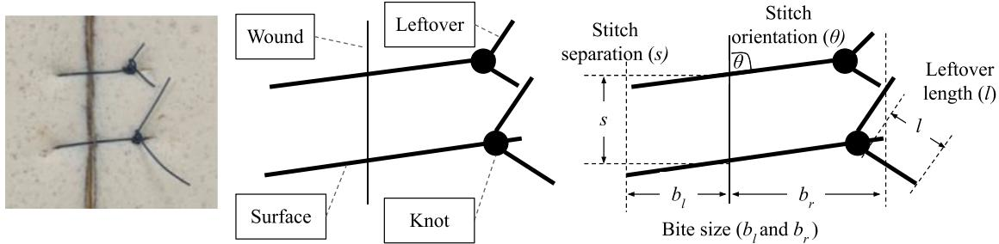
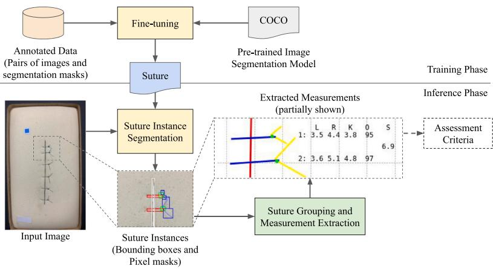
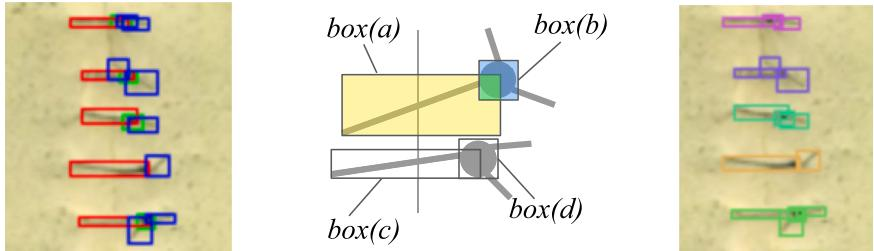
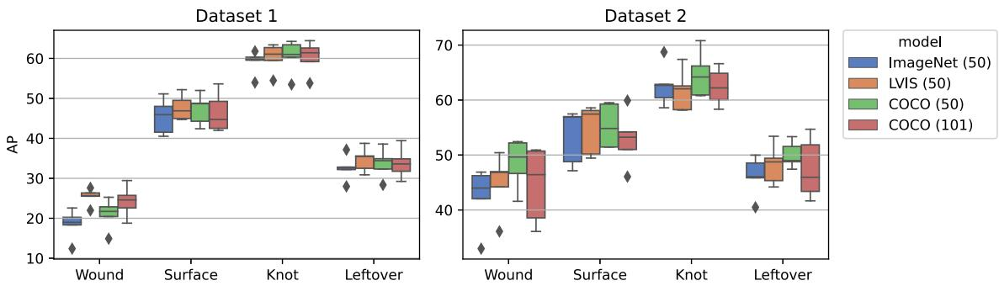
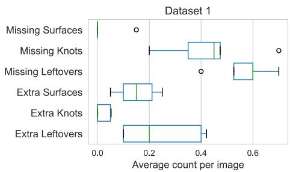
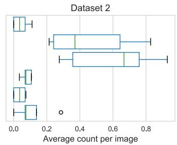
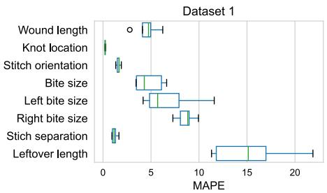
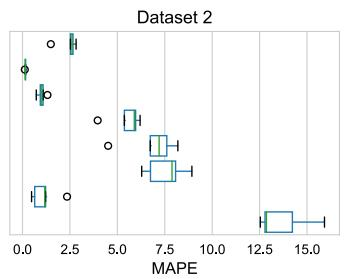
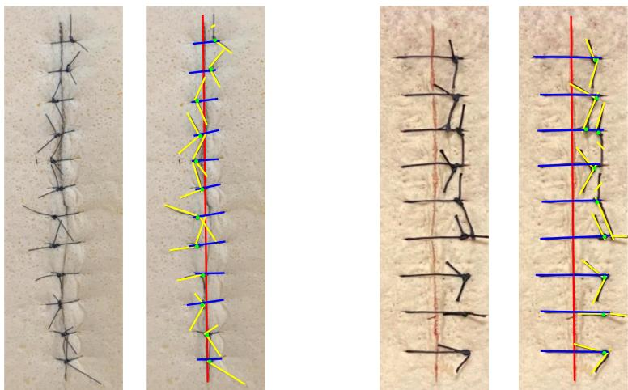
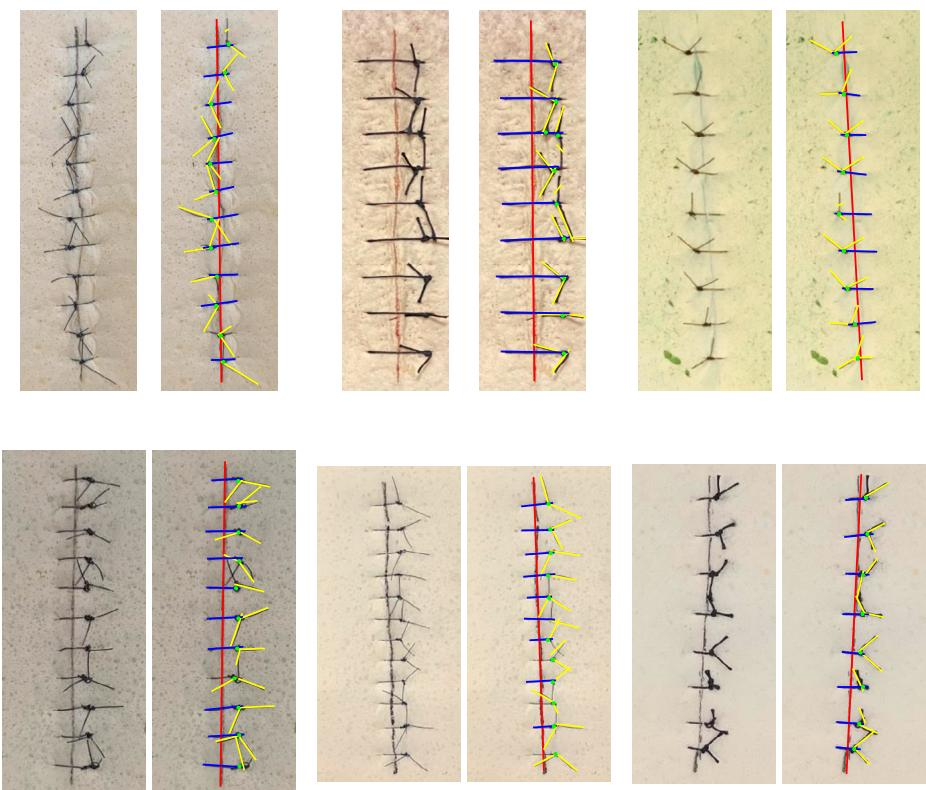

# Automated measurement extraction for assessing simple suture quality in medical education

Thanapon Noraset a, Prawej Mahawithitwong b, Wethit Dumronggittigule b, Pongthep Pisarnturakit b, Cherdsak Iramaneerat b, Chanean Ruansetakit b, Irin Chaikangwan Nattanit Poungjantaradej b, Nutcha Yodrabum b,∗

a Faculty of Information and Communication Technology, Mahidol University, Nakhon Pathom, Thailand b Faculty of Medicine Siriraj Hospital, Mahidol University, Bangkok, Thailand

## A R T I C L E I N F O

Dataset link: Simple Suture Datasets (Original d ata), Source Code

MSC: 68T45

Keywords:   
Suturing skill   
Deep learning   
Education   
Assessment tools

## A B S T R A C T

## 1. Introduction

Practicing open-wound suturing requires feedback, but evaluation of each suture practice takes instructors’ time and is often subjective. Recent work showed that deep-learning models can automate the evaluation by analyzing an image or a video of suturing into either pass or fail. However, they lacked fine-grained feedback offered by previous systems that required specialized devices or manual annotations. This work introduced a system that automatically extract geometric measurements from a suture practice end-product image for further evaluation. We proposed the suture instance segmentation task and a hand-crafted algorithm to extract interpretable metrics from an image. We collected two new simple suture datasets consisting of 240 images with instance segmentation and physical measurement annotations. The experiment results shows that current deep-learning model can accurately segment suture instances and the extracted measurements from our system are highly correlated with physical measurements from humans.

Open wound suturing is a procedure to close a wound and a required skill for all medical students (Birkmeyer et al., 2013). Fig. 1 illustrates an example of two sutures (also called stitches). A student learns the suturing skill by practicing on a bench model and receiving feedback (Emmanuel et al., 2020). However, evaluating and providing feedback take significant time from the instructors. In addition, the reliability of the evaluation of instructors is subjective (Kuzminsky et al., 2023). An essential part of the evaluation is the end-product quality of a suturing where the criteria are derived from lengths and angles of the wound and the stitches, shown in Fig. 1, right (Frischknecht et al., 2013). The evaluation criteria are difficult for humans to evaluate objectively on time.

Consequently, researchers proposed a system that automates the evaluation and provides feedback for open-wound suturing practice. Previous work showed that an automated evaluation was possible by using specialized devices (Kil, 2019; Kuzminsky et al., 2023; Nagayo et al., 2021; Solis et al., 2008; Yang & Shulruf, 2019). Some research showed that computer-vision approaches could also enable suturing evaluation for the ‘‘end-product’’ quality (Frischknecht et al., 2013; Miyahara et al., 2020), but the systems require some manual annotations. The main characteristic of these systems is providing either formative (in-process) or summative (end-product) feedback with finegrained measurements (angles, lengths, or force) per stitch or action. Recently, researchers showed that deep-learning methods could fully automate the evaluation. For example, Nagaraj et al. (2023) proposed a deep learning model to classify knot-tying videos into pass or fail, or Mansour et al. (2023) used a deep learning model to classify suture images, similarly, into pass or fail. While automatically processing images or videos without specialized devices was helpful, providing pass–fail feedback could be improved. However, it has yet to be shown that detailed feedback can be automatically derived from an image of a suturing practice.

This work follows the direction of automatically providing summative but fine-grained feedback for a suturing practice from an image. The objective of this work is to automate the measurement extraction fully. Then, the extracted measurements can be used for assessing the suturing end-product quality by other expert systems. We focused on a simple interrupted suture where a stitch consists of three types: knots, surfaces, and leftovers.

  
Fig. 1. Components and measurements for assessing suture end-product quality. A suture practice consists of many stitches. Each stitch composes of 3 main components: surface, knot, and leftovers.

Unlike previous end-to-end suture evaluation work that employed deep learning models to provide summative, coarse-grained feedback, the main idea of this work is to use deep learning models only to extract components from an input image for further processing. This allows the post-processing algorithm to provide formative, fine-grained feedback based on the output of deep learning models. Fig. 2 illustrates the overall approach. We trained a deep-learning model to segment wounds and instances of stitches (knots, surfaces, and leftovers). Since the output instances were not grouped into stitches, we introduced the GroupAndMeasure algorithm to group instances into stitches and extract measurements (Fig. 3). These measurements ( Table 2) can be used to create an evaluation with fine-grained feedback, as shown in Fig. 8. The main contributions of this work are as follows.

1. We enabled systematic evaluation of suturing measurement extraction by providing the first simple suture dataset containing images with rich annotations for both suture instance segmentation and physical measurements (Section 3.1).

2. We introduced a two-step approach to extract the suture quality measurements: suture instance segmentation using deep learning models (Section 3.2) and an algorithm based on the linear assignment problem to group the instances into stitches and extract measurements (Section 3.3).

3. We extensively validated our proposed approach on several evaluations and showed that the extracted metrics highly correlated with physically measured ones (Section 4).

The source code, trained models, and datasets are available at https: //codeocean.com/capsule/3182402/tree.

## 2. Preliminaries and related work

A self-directed suturing practice without any evaluation or feedback is hardly helpful — one can learn to be efficient yet lack proficiency to produce quality suture results (Frischknecht et al., 2013). Many studies support the principle of deliberate practice for self-training to improve the wound suturing skill (Anders Ericsson, 2008; Ericsson et al., 1993; Reznick, 2006; Routt et al., 2015). However, it is infeasible to implement in an education system due to the lack of immediate feedback from experts, an essential component of the deliberate practice (Veloski et al., 2006; Xeroulis et al., 2007). While many established evaluation criteria could be used as a guideline for developing an automated feedback system, these criteria are designed to be used by medical experts (Derossis et al., 1998; Martin et al., 1997; Niitsu et al., 2013; Vassiliou et al., 2005). Consequently, imitating the experts’ observations and judgments is extremely difficult. Unsurprisingly, a few systems attempt to evaluate automatically and provide feedback for wound suturing practice (Frischknecht et al., 2013; Kil, 2019; Levin et al., 2019; Miyahara et al., 2020; Solis et al., 2008). While some of them address open wound suturing similar to ours. However, their approaches have manual processes, such as tracing the wound and stitches or requiring a special set of equipment. These settings are not ideal in a class environment or large-scale research.

The following subsections will review related work in four groups. We first provide the preliminaries of suturing practice in medical education and surgical evaluation metrics. Then, we give an overview summary of existing automated assessment tools for suturing. Next, we discuss related work that proposed a system for evaluating open wound suturing, followed by a brief review of similar applications of computer vision techniques using deep learning in medical research.

## 2.1. Simple interrupted sutures

Wound suturing is an essential medical process of attaching two separate tissues using a suturing needle and thread. Many open wound suture patterns exist, such as a simple continuous or vertical mattress pattern. This project focused on a simple interrupted suture — a typical pattern learned by most medical students. This wound suturing technique is called interrupted due to the unconnected stitches, and a knot is placed for each stitch. Fig. 1 shows the basic components of stitches of the simple interrupted sutures. For one suture practice on a bench model, the components include (1) a wound: an artificial incision, usually located on the center of the bench model, (2) bite surfaces: a loop of thread pulling the tissue together, (3) knots: a small tie fastening the thread, and (4) leftovers: the ends of the thread at after a knot. A reliable method to identify these components is essential to evaluate and provide student feedback.

## 2.2. Suture assessments and metrics

In order to have effective training, immediate feedback is required for learners to perform deliberate practice (Ericsson et al., 1993) and assessment criteria can be a source of useful feedback. Traditionally, there are many established assessment criteria developed to assess suturing skills. For example, the objective structured assessment of technical skills (OSATS) (Niitsu et al., 2013; Reznick et al., 1997) is a validated assessment criterion for evaluating surgical skills. OSATS is designed to test the surgical skills of an open wound suturing on a bench model. Similarly, Global Operative Assessment of Laparoscopic Skills (GOALS) (Vassiliou et al., 2005) is used in laparoscopic operations. Another example of an open wound suturing assessment tool is scoring criteria during the suture exam developed at a medical school in Thailand (shown in Table 6). These assessment criteria use the operation’s ‘‘in-process’’ and ‘‘end-product’’. Thus, they rely on the constant observation of a medical doctor who has to study the assessment criteria and objectively evaluate several students in classes. While it may be practical for the exam, this kind of assessment tool is not practical during the learning period for students. It would take significant time and effort for medical doctors to observe and score every student who would like to practice. Nevertheless, some of the criteria are on the quality of the end products; thus, the automated assessment tool developed in this work can use the information as a guideline. For example, the criteria in Table 6 have four items that evaluate the quality of the end products.

The assessment tools discussed often describe the quality of the endproduct of a suturing practice in variables of the suture components and their sizes, densities, symmetry, and orientation. Frischknecht et al. (2013) suggested that the variables could be defined on the X-Y coordinate plane and created metrics for the quality assessment of the simple continuous suture pattern. In this project, we adapted the (Frischknecht et al., 2013)’s metrics and introduced knots and leftovers into the variables to work with the simple interrupted suture pattern. Specifically, the metrics of interested in this project includes: (1) Bite size (left and right), (2) Bite separation, (3) Stitch orientation, (4) Knot distance (from the wound), and (5) Leftover length. Fig. 1 (right) illustrated these metrics. Note that our definitions of distances are slightly different from those of Frischknecht et al. (2013) as we define the distances parallel to the components rather than perpendicular to the wound.

## 2.3. Automated methods of surgical skill assessment

Developing an automated assessment tool for training surgical skills is a growing field in medical education (Veloski et al., 2006). They focus mainly on two types of surgical operations: laparoscopy and open wound suturing. Laparoscopy is a minimally invasive surgery with several incisions to insert tools and cameras into patients (often abdomen). The complex technical skills involved in the operations are difficult to reach proficiency, while the laparoscopic instruments and cadavers are expensive for repeated practice (Oquendo et al., 2018; Tekkis et al., 2005). Unsurprisingly there are many works related to laparoscopy. For example, Botden et al. (2008) proposes ProMIS, an augmented reality laparoscopic simulator. Alternatively, Diesen et al. (2011) studied the learning effectiveness of a computer simulator and a boxing trainer. Extensive literature reviews of Kil (2019) and Levin et al. (2019) show that most automated assessment tools are developed for laparoscopy. There are few works related to automated open wound suturing assessment in education. Open wound suturing is easier to learn and has a lower risk to patients than laparoscopy. Nevertheless, wound suturing is essential for all medical doctors to be able to perform proficiently — medical students will learn how to perform this common procedure. Thus, an automated open wound suturing assessment tool will have to be scalable in the class environment but not as high fidelity.

Since the training is usually performed on a simulation (or a medium) to avoid using animals and cadavers (Nesbitt et al., 2016; Stefanidis et al., 2012). The medium can be simple bench models or simulators such as instrumented bench models (Kil, 2019; Solis et al., 2008), augmented reality simulators (Botden et al., 2008), and virtual reality simulators (Nagendran et al., 2013). The simulators are a complete assessment system that can provide real-time feedback by constantly assessing the surgical performance, including motion tracking, eye tracking, and force measurement (Levin et al., 2019). There are two notable open wound suturing instrumented bench models. First, WKS-2RII is a suturing evaluation system developed by Takanishi Laboratory in 2018.1 The system comprises of a bench model with embedded sensors, a fixed-position camera, and software (Solis et al., 2008; Yang & Shulruf, 2019). Second, Kil (2019) proposes an instrumental bench model that can collect force, motion, touch, and video data during practice. Both systems can provide both in-process and end-product metrics for trainees. However, these systems are expensive to develop and maintain because of costly equipment, high-fidelity sensors, and complicated software. This work focuses on a simple bench model and a computer vision solution. This approach has a significant advantage for a large-scale classroom where many students can take a bench model and get feedback during practice at home.

Simple bench models are more affordable and suitable for a large classroom but lack any built-in performance assessment. Consequently, researchers have studied a system that can evaluate the quality of the suturing end product. For example, an automated end-product suturing assessment system proposed by Miyahara et al. (2020) evaluated anastomosed graft suturing (connecting vessels). The system relied on the user to manually trace all stitch lines (no wound). The most relevant system is that of Frischknecht et al. (2013). They proposed a computer vision system that takes an input image of a simple continuous suture and measures several metrics. The user had to manually trace a line of a wound to enable the system to detect the stitch lines automatically. These metrics included the number of stitches, total bite size, stitch length, stitch orientation, and stitch separation. The authors found significant differences in metrics between a group of experts (?? = 5) and a group of novices (?? = 15). In this work, we focus on simple interrupted sutures.

In contrast to the simple continuous sutures, the simple interrupted sutures have additional components, including knots and leftovers, that increase the complexity of the analysis. Unlike previous works, an algorithm based on edge detection would not be able to separate components accurately. In addition, we aim to make a fully automated system, i.e., the user only uploads an image. We believe this feature will facilitate student practice and enable us to conduct large-scale studies. With an expectation of the actual adoption of the system, this work also extensively validated the proposed systems from more than forty participants, including more than two hundred images, each comprising six stitches on average.

## 2.4. Deep learning in open-wound suture evaluation

Applications of deep learning techniques in medical area are typical, especially computer vision. For example, a deep learning system can outperform experts at detecting diabetic retinopathy (Gulshan et al., 2016), or screening tuberculosis from a chest X-ray image (Pasa et al., 2019). In terms of evaluation of open-wound sutures, recent work employed deep-learning model to predict a pass–fail judgment from a suture image (Mansour et al., 2023) or a knot-tying video (Nagaraj et al., 2023)

We are not aware of a study on automatically extracting measurements for assessing open-wound suturing quality. However, there is related work using similar idea. The first step in assessing a quality of end-products or a surgical skill is to analyze and understand the input image (or video). An instance segmentation model can detect and segment individual important components in the image. Additional, hand-crafted algorithms can then process the instances.

With this framework, Davids et al. (2021) fine-tuned a Mask R-CNN models that was pre-trained using COCO dataset (Lin et al., 2015) to segment the surgical tools in neurosurgery videos and used the segments to compute various metrics for classifying skill levels (novices vs experts). Although (Davids et al., 2021) showed that the proposed twostep approach could extract metrics to separate experts from novices, they did not validate whether the extracted metrics were accurate. This work took a similar approach to a different task altogether. In addition to having different tasks, this project evaluated the extracted metrics on actual measurements rather than only classifying skill levels as in many other works (Frischknecht et al., 2013; Kirubarajan et al., 2022). We believe that an evaluation using actual measurements is essential for establishing reliability and trust in an automated assessment tool.

  
Fig. 2. The overall process of the quality assessments in this work. An input image is first segmented into instances: a wound, knots, surfaces, leftovers using a suture instance segmentation model, fine-tuned from a pre-trained model using our proposed datasets. Then, the instances are grouped into stitches to extract the measurements. The measurements shown are left bite size (L), right bite size (R), knot distance (K), stitch orientation (O), and stitch separation (S). The measurements are essential inputs of the analytic assessment criteria.

## 3. Methodology

Siriraj Institutional Review Board, Faculty of Medicine Siriraj Hospital, Mahidol University permitted the collection and use of images of suturing practice end-products. The Certificate of Approval number is Si 514/2021, Protocol No. 304/2564(IRB2).

Our goal was to investigate the validity of the deep learning-based computer vision approach in analyzing images of the simple suturing practice end-products. In particular, we hypothesized that a system incorporating deep learning algorithms could learn to identify and segment components of sutures reliably, and a hand-crafted algorithm could accurately compute metrics used in assessing suturing quality. We formulated the quality assessment task of the suturing practice endproducts into a two-step approach (shown in Fig. 2). First, given an input image, an instance segmentation model detected and segmented components of the suture as illustrated in Fig. 2 (center). The instance segmentation outputs included bounding boxes and pixel masks for each component. Then, a metric extraction algorithm grouped components into individual stitches (a surface, a knot, and two leftovers) and computed the metrics in Fig. 1 (right).

## 3.1. Data collection

This work collected images of suture practice end-products performed by students (novices) and medical staff (experts) and manual annotations for training models and evaluating the system. All participants were either a student or personnel of a Thai medical school. They used the same toolset and similar simple bench models. For ease of use in future applications, we only included the top-view images.

Table 1

We collected the images in two phases: in-class volunteering and paid participants. The initial phase aimed to collect real-world data from students learning to suture during the semester. All participants were provided with a guideline on how to take suture images. Participants in the first data collection phase could be considered inexperienced in suturing. There were a total of 145 participants and over two thousand images. The latter phase aimed to collect finer detail of annotations. Paid participants, including twenty novices and fifteen experts, performed suturing and physically measured bite sizes (left and right), leftover lengths, and stitch separations for each end-product. The novices had no experience in suturing and had a small group training session before performing. Another key difference was that the participants in the initial phase used silk thread (a cheaper alternative) for suturing, while the latter phase used medical-grade nylon. The nylon was much thinner: and more challenging to identify and segment components. In addition, images in Dataset 2 have a marker line on an incision. An example of a stitch using the silk and nylon threads can be seen in Table 1.

The numbers of images used in this project. There were two datasets collected from in-class volunteers and paid participants respectively.
<table><tr><td>Item</td><td>Dataset 1</td><td>Dataset 2</td></tr><tr><td rowspan="3">Thread material</td><td>Silk</td><td>Nylon</td></tr><tr><td>4</td><td></td></tr><tr><td></td><td>→</td></tr><tr><td>Participants</td><td>145</td><td>35</td></tr><tr><td>-novices</td><td>145</td><td>20</td></tr><tr><td>experts</td><td>0</td><td>15</td></tr><tr><td>Total images</td><td>2,050</td><td>142</td></tr><tr><td rowspan="3">Annotated for instance segmentation -from novices</td><td>98</td><td>142</td></tr><tr><td>98</td><td>60</td></tr><tr><td>0</td><td>82</td></tr><tr><td>-from experts Annotated for suture measurements</td><td>0</td><td>142</td></tr></table>

In addition to the images, we collected annotations in two formats: (1) instance segmentation annotations for training and evaluating the suture instance segmentation models and (2) physical measurement annotations for validating overall performance. These annotations were simple procedures and did not require expert judgments. Since there were many images from the first phase, we randomly sampled 98 images from the first set. For the second phase, we used all images. We had 240 annotated by four paid annotators for the suture instance segmentation tasks. We deployed a self-hosted version of Computer Annotation Vision Tool (CVAT), an open-source image labeling tool, for the annotators.2 For the second dataset, we asked participants in the second phase to provide physical measurements after each practice. Researchers checked the consistency and quality of all annotations. Table 1 shows the detail of the datasets.

## 3.2. Suture instance segmentation

A prerequisite for assessing the quality of suture practice endproducts was identifying suture components. Since there are many instances of the same components in one image (i.e., many stitches), we cast the problem as an instance segmentation problem, where each instance of the same type has a distinct identification. In this paper, we include the study of the mask region-based convolutional neural networks (Mask R-CNN): the state-of-the-art framework of the instance segmentation (He et al., 2017). The original Mask R-CNN used the Feature Pyramid Network (FPN) as a backbone to extract features from an image. While new backbones have been proposed recently, such as Swin Transformer (Liu et al., 2021), the Mask R-CNN with FPN is still a robust architecture in standard instance segmentation benchmarks (Wu et al., 2019).

  
Fig. 3. Suture instances were identified by an suture instance segmentation model (left). A bipartite matching between two types of instances minimized the distances and IoUs of all groups (center). A series of bipartite matching grouped instances into stitches (right).

However, there are variables that we need to study in order to employ the instance segmentation model effectively. In the deep learning literature, pre-training and fine-tuning is a current paradigm for building a model. A Mask R-CNN can be trained on another dataset and then on the suture datasets. An appropriate choice of a pre-trained models is an essential step. In addition, model sizes can also affect the performance. A larger model has a higher potential to perform better, but it is also easier to overfit the training data and perform poorly on unseen data.

## Evaluation of instance segmentation

In order to evaluate performance of instance segmentation models, we compared the bounding boxes and pixel masks between the predictions and the manual annotations. A standard method is to compute the Intersection-Over-Union (??????) for each instance as the following:

$$
I o U = \frac { \mathrm { o v e r l a p ~ a r e a } } { \mathrm { u n i o n ~ a r e a } }\tag{1}
$$

; where an overlap area is the number of correctly classified pixels as part of a label instance, and a union area is the number of pixels that are either part of a label instance or a predicted instance.

The ?????? does not decisively informs us about the correct identification (e.g., true positive). We have to apply a threshold of ??????, such as true positive only when ?????? > 0.5 (overlapping more than half) to obtain precision and recall. Instead of computing precision and recall at a threshold, the object detection community often reports the mean average precision (???? or ?????? ), computed as the following:

$$
A P = \sum _ { t \in T } { \frac { A P ^ { I o U = t } } { | T | } } ,\tag{2}
$$

where $A P ^ { I o U = t }$ is the area under the precision–recall curve at a threshold ?? of $I o U$ , and ?? is a set of threshold staring from 0.5 to 0.95 increasing 0.05 each step. When there are many types of components, ???? is averaged over all categories. The ???? gives us an overall performance of an instance segmentation models (Girshick et al., 2016). In this work, we evaluated the performance of suture instance segmentation models by the mean ???? of the segmentation, ????????∕???? , (i.e., overlapping pixel masks).

## 3.3. Suture grouping and measurement extraction

After the model output instances of suture components, we extract the metrics from the instances by using a two-step process: grouping and measuring. First, we group independent suture instances into stitches, each stitch consists of a knot, a surface, and two leftover instances. Then, we compute the metrics in Table 2 from the stitches. Algorithm 1 details the process.

Grouping suture instances

The predicted instances do not form stitches for computing the metrics as in Fig. 3 (left). Thus, this step group instances into stitches as in Fig. 3 (right). While the grouping seems easy for human eyes, it is non-trivial because there can be errors in the predicted instances, and leftovers are placed randomly.

We cast this problem as the assignment problem where we find matching pairs of two sets of suture instances that minimizes the total matching cost of all pairs. We assume that two instances of the same stitch are close and overlapping each other. Thus, the matching cost of each pair is computed based on their distance and the number of overlapping pixels using the predicted bounding boxes. Fig. 3 (center) illustrates ??????(??) and ??????(??) and their overlap region in green compared to ??????(??) that is close to ??????(??) but not overlapping. Specifically, given two bounding boxes of two instances, ??????(??) and ??????(??), the cost of matching ?? and ?? is

$$
C _ { a , b } ^ { \prime } = \left\{ \begin{array} { l l } { E } & { \mathrm { i f ~ } a \mathrm { ~ i s ~ } b , } \\ { d i s t ( \mathbf { b o x } ( a ) , \mathbf { b o x } ( b ) ) - I o U ( \mathbf { b o x } ( a ) , \mathbf { b o x } ( b ) ) } & { \mathrm { o t h e r w i s e } } \end{array} \right. ,\tag{3}
$$

where $d i s t ( \cdot )$ is the minimum Euclidean distance between all four corners of the bounding boxes and ?? is a maximum cost allowed in cases where self-assignment is possible. The values in the cost matrix ?? are shifted to have a minimum of zero.

$$
C _ { a , b } = C _ { a , b } ^ { \prime } - m i n ( C ^ { \prime } )\tag{4}
$$

We apply the Jonker–Volgenant linear assignment algorithm (LapJV) to find the matching (Jonker & Volgenant, 1987).

In order to group instances into stitches, we apply a series of linear assignments as shown in Step 1 of Algorithm 1. The Cost(??, ??) returns the matching costs of all pairs between instances in ?? and ?? using Eq. (4). First, we match the set of surface instances and the set of knot instances, then match the leftover instances together. The bounding box of a pair is the union of the two bounding boxes. Finally, we match the surface-knot pairs and leftover-leftover pairs to form stitches. Note that ?? in Eq. (3) is only used when matching leftover instances. We set ?? = 10 based on an observation that a correct matching of two leftover lines should originate from the same knot, and a knot is typically smaller than 20 × 20 pixels.

## Computing suture metrics

We extract measurements from the stitches as shown in the Step 2 of Algorithm 1. We model the wound, surfaces, and leftovers as straight lines. This straight-line assumption reduces the computation of measurements into relationships between points. To obtain a line for each instance, we fit the segmentation mask of the instance to a linear equation (LineFit). Most of the measurements are distances between the endpoints of the fitted lines. Table 2 listed the metrics and their descriptions.

Overall, the algorithm time complexity is dominated by the grouping step. The LapJV algorithm time complexity is $O ( n ^ { 3 } )$ , where ?? is the maximum number of instances in a suture type.

Input: A wound ??, and sets of surfaces ??, knots ??, and leftovers ?? from a segmentation model. L from a segmentation model.

Output: A set of stitches ?? with measurements for each stitch ??.m   
// Step 1: Group structure instances   
$G _ { S K } \gets \mathrm { L a p J V } ( \mathrm { C o s t } ( S , K ) )$ // Group surfaces and knots   
$G _ { L L } \gets \mathrm { L a p J V } ( \mathrm { C o s t } ( L , L )$ // Group leftover lines   
$G \gets \mathrm { L a p J V } ( \mathrm { C o s t } ( G _ { S K } , G _ { L L } ) )$ // Group into stitches   
// Step 2: Compute the metrics   
for ?? ← 1 to |??| do   
?? ← ??[??]   
// compute a line segment (two extreme points).   
??.surface_line ← LineFit(??.surface)   
??.leffover_line1 ← LineFit(??.leffover1)   
??.leffover_line2 ← LineFit(g.leffover2)   
// compute measures according to Table 2   
??.m ← ComputeMeasures(??, ??)   
end   
return ??   
Algorithm 1: GroupAndMeasure returns measurements of stitches.  
Table 2

Metrics for assessing suture that can be extracted by the system.
<table><tr><td>Metric</td><td>Description</td></tr><tr><td>Wound length:</td><td>The distance between the top point and the bottom point of a wound instance.</td></tr><tr><td>Left bite size:</td><td>The distance between the most left point of a surface and the intersection with the wound line.</td></tr><tr><td>Right bite size:</td><td>The distance between the most right point of a surface and the intersection with the wound line.</td></tr><tr><td>Bite size:</td><td>The sum of left bite size and the right bite size.</td></tr><tr><td>Stitch separation:</td><td>The distance between two intersection points. In case of the first stitch, the distance between the top point of a</td></tr><tr><td>Stitch Orientation:</td><td>wound instance and the first stitch intersection. The angle (in degree) between a surface line and a wound line.</td></tr><tr><td>Knot distance:</td><td>The distance between the knot&#x27;s center point and the stitch-wound intersection point. Since most wounds was a vertical line, knot distances are simplified as a knot&#x27;s x coordinate.</td></tr></table>

## Evaluation of metric extraction

We validate the extracted measurements in two settings: comparing the labeled instances and the physical measurements. The prior setting validates the measurement accuracy using measurements extracted from predicted and labeled instances. This comparison helps ensure that the metric extraction algorithm (including grouping) works accurately. We compute the mean absolute percentage error (?????? ??) for each measurement (see Fig. 1). Note that we must exclude the extra and missing instances from the validation. In the second setting, we compare the extracted and human annotated measurements. This comparison validates the overall performance of the system. We compute Pearson’s correlation coefficients of the measurements we have human annotation. Only Dataset 2 is available for this setting. Since the extracted metrics depend on the size of the bench model in an image (i.e., zoom-in or zoom-out), we normalize all measurements by the wound lengths.

## 4. Experiments and results

We present experiments and results for each step of the proposed method: the suture instance segmentation and then the suture grouping and measurement extraction. Despite having one of the largest datasets in suture practice images, our datasets could be considered small for machine learning experiments. To mitigate this limitation, for all experiments, we conducted a 5-fold cross-validation to evaluate the performance. In other words, each dataset had five mutually-exclusive sets of similar sizes. Thus, an experiment configuration was repeated five times using a single set for validation and the rest for training. This allowed us to utilize all images to validate the system’s performance fully. Since most of the evaluation metrics were on each instance, this gave us over one-thousand instances for validation.

It is worth mentioning that the input images varied in size depending on the mobile phone used to take the pictures. In addition, the participants could place the camera closer or further away from the bench model when taking the picture. Since this was similar to how the system would be deployed, we did not correct this. The only preprocessing we did was to resize all images to have a width of 1024 pixels while preserving the image aspect ratio.

## 4.1. Instance segmentation results

In this step, we would like to study the performance of the current deep-learning-based instance segmentation models. We compared the mean average precisions for models from different configurations of the Mask R-CNN architecture. We considered pre-trained models and backbones. The pre-trained models included models trained on the following standard datasets: ImageNet : a large-scale image classification dataset (Deng et al., 2009); COCO: a large-scale instance segmentation dataset of general images (Lin et al., 2015); and LVIS: an instance segmentation dataset focusing on a large number of object types (Gupta et al., 2019). For the backbone networks, we considered ResNet with FPN of two depths: 50 layers (ResNet-50-FPN) and a larger version, 101 layers (ResNet-101-FPN ) (He et al., 2016). All pre-trained models were provided by Detectron2 library version 0.6 from Meta AI Research (Wu et al., 2019).3

## Training procedure

For the training, we followed the recommended training procedure from the Detectron2 library. Specifically, we apply the scale jitter algorithm for data augmentation (Ghiasi et al., 2021) and a long training schedule (8000 steps). We used the standard stochastic gradient descent to train the models with the step-wise decayed learning rate ([0.025, 0.0125, 0.005] spread evenly across the 8000 steps). Most of the training converged around 4000 steps. All models were trained using the set of instance segmentation losses (He et al., 2017) with an additional CIoU as a regularization (Zheng et al., 2020). We reported mean average precisions for both bounding box (APbb) and segmentation (APm) from the best validating models.

## Suture instance segmentation results

We first presented our main results on the AP averaged over all types of components. Table 3 shows the performance of the models under different configurations. The models that initialized with the COCO pre-trained weights performed best — both backbones, ResNet-50-FPN (COCO (50)) and ResNet-101-FPN (COCO (101)), had similar APs. The paired t-test between the models initialized with the pre-trained COCO, ImageNet, and LVIS weights had the ??-value of < 0.005 (right-tailed), indicating that transferring from the model pre-trained using the COCO dataset to the Suture Instance Segmentation task was significantly better than transferring from the models pre-trained using the other datasets. Surprisingly, the higher-depth model (ResNet-101-FPN) did not significantly outperform the smaller counterpart (ResNet-50-FPN).

Further analyses on the performance of individual suture components showed similar results — Models initialized with COCO pretrained weights performed best on all components. Fig. 4 shows (APm) of the suture instance segmentation models breaking down by suture components. Since each image only contained one wound instance (i.e. fewer training instances), all models performed worse when segmenting wounds. On the other hand, the leftover component had the highest number of training instances, but the models performed relatively worse when segmenting leftovers. In general, all models could reliably segmented knots and surfaces with $\mathbf { A P } ^ { \mathrm { m } } \geq 6 0$ and $\mathrm { A P } ^ { \mathrm { m } } \geq $ 45 respectively. This reliability is the reason the grouping algorithm matches surfaces and knots first.

Table 3  
Average precisions of the suture instance segmentation models with different pre-trained models labeled with their pre-trained datasets and depths of the backbone network (ResNet with FPN) in parentheses. Data are the median values of bounding boxes $( \bar { \mathbf { A } } \bar { \mathbf { P } } ^ { \mathrm { { b b } } } )$ and segmentation masks (APm) from the 5-fold cross-validation. ?? -values were calculated with the paired t-test (right-tailed).
<table><tr><td rowspan="2">Pre-trained models (data (depth))</td><td colspan="4">Dataset 1</td><td colspan="4">Dataset 2</td></tr><tr><td> $\overline { { { \bf A } { \bf P } ^ { \mathrm { b b } } } }$ </td><td>p</td><td> $\mathsf { A P } ^ { \mathrm { m } }$ </td><td>p</td><td> $\overline { { { \bf A } { \bf P } ^ { \mathrm { b b } } } }$ </td><td>p</td><td> $\mathsf { A P } ^ { \mathrm { m } }$ </td><td>p</td></tr><tr><td>ImageNet (50)</td><td>54.43</td><td>0.001</td><td>38.36</td><td>0.001</td><td>45.10</td><td>0.001</td><td>51.36</td><td>0.003</td></tr><tr><td>LVIS (50)</td><td>55.59</td><td>0.003</td><td>40.35</td><td>0.044</td><td>45.45</td><td>0.001</td><td>52.30</td><td>0.004</td></tr><tr><td>COCO (50)</td><td>56.63</td><td>0.143</td><td>41.61</td><td>−</td><td>48.53</td><td></td><td>52.76</td><td></td></tr><tr><td>COCO (101)</td><td>58.72</td><td>−</td><td>41.28</td><td>0.921</td><td>46.79</td><td>0.943</td><td>48.81</td><td>0.985</td></tr></table>

  
Fig. 4. Performance of the suture instance segmentation by suture components in (APm). All models performed worst on segmenting wounds while performing best on segmenting knots, followed by surfaces.

Furthermore, we observed the effects of the different data collection procedures. First, the models were better at segmenting wounds in Dataset 2 than in Dataset 1. The difference was due to the Dataset 2 having a marker line on the incision, giving the models a clear signal. Second, the models were surprisingly better at segmenting suture components in Dataset 2 than in Dataset 1. While the nylon threads are thinner than the silk threads and harder to identify by human eyes, they had no negative in the suture instance segmentation models. Dataset 1 had more erratic stitches with fewer stitches per image than Dataset 2. In addition, the silk threads are also more challenging to cut cleanly and organize. We reckoned that these differences caused the model performance discrepancy between the two datasets.

## 4.2. Validation of the extracted measurements

Based on the results in Section 4.1, we selected the Mask R-CNN with the ResNet-50-FPN backbone pre-trained using the COCO dataset (COCO (50)) as the primary suture instance segmentation model for further study in suture grouping and measurement extraction. Following the suture instance segmentation experiments, we evaluated based on the five-fold cross-validation. In other words, the input images and the predicted instances were from the validation sets following the same five splits. Then, we ran the suture grouping and measurement extraction for each image.

## Comparing with labeled instances

We ran the grouping and measurement extraction algorithm (Section 3.3) on labeled and predicted instances. The grouping step outputs stitches (groups of suture components). In order to validate the predicted instances and measurements, we created a one-to-one mapping between stitches from the labeled and predicted instances for each image. We consider any unmapped stitch as an instance error. For matched stitches, we can further validate the extracted measurements.

We first present the reliability of the approach in identifying suture components. We report the errors in the average instance count per image. Note that each suture practice contains at least five stitches, so an error of 1.0 would be at most 20% component error (and less for the leftovers). Fig. 5 showed the average count per image of missing instances (false negative) and extra instances (false positive). We can observe similar the same trend in both datasets. First, knots and leftovers have relatively high false negatives but less than 0.7 and 0.9 instances per image overall for Dataset 1 and 2, respectively. In other words, the system might miss one instance of knots and leftovers on an image but reliably identifies the surfaces. On the other hand, most of the suture components have low false positives of less than 0.4 and 0.2 extra instances per image for Dataset 1 and 2, respectively. The result indicates that the proposed method reliably identified stitches.

Next, we present the validation of the extracted measurements. We extracted the measurements from the predicted and labeled instances and computed the error between the two measurements. Fig. 6 showed the mean absolute percentage errors (MAPE) of the extracted metrics by suture components. Note that we could not match the leftovers within a stitch because of how they were randomly arranged. Thus, we opted to compute the sum of the two leftover lengths per stitch. Unsurprisingly, the leftover lengths had noticeably high MAPE. However, except for the leftover lengths, the proposed method achieves low Mapes of less than 12% and 9% for Dataset 1 and 2, respectively.

## Comparing with human measurements

In the second settings of evaluation, we presented the correlations between the physically measured metrics and extracted metrics in Table 4. Only Dataset 2 had the manually labeled metrics, so we omitted Dataset 1 from this evaluation. We included both metrics extracted from the labeled instances and the predicted instances. For the leftover lengths, we computed the correlations of the sum again. As shown in Table 4, the metrics extracted from the labeled instances had slightly higher correlations — indicating that the suture extraction method was robust to the errors from the suture segmentation models. More importantly, the extracted metrics from both labeled instances and predicted instances had significant correlation with the physically measured metrics (??-value < 0.001). The leftover lengths had the lowest correlation followed by the right bite size, and the stitch separation had the highest correlation.

Overall, the proposed approach outputs highly correlated measurements with the physical ones (more than 0.8 on average). Since the

  
Fig. 5. Instance errors in average instance count for missing and extra instances by suture components. The proposed approach can reliably identify instances with less than one extra/missing instance per image.

  
Fig. 6. Measurement errors in mean absolute percentage errors (MAPE) by measurement types. Except for leftover lengths, the proposed approach can accurately extract suture quality measurements with a median MAPE of less than 9%.

Table 4  
Pearson’s correlation coefficients between manually measured metrics and extracted metrics. All correlations have ??-value < 0.001. The extracted metrics had high correlations with the manually measured ones on both labeled instances and predicted instances (from the model).
<table><tr><td>Metrics</td><td colspan="2">Labeled instances</td><td colspan="2">Predicted instances</td></tr><tr><td></td><td>Pearson&#x27;s p</td><td>Sample size</td><td>Pearson&#x27;s ρ</td><td>Sample Size</td></tr><tr><td>Bite size</td><td>0.869</td><td>1,183</td><td>0.845</td><td>1,166</td></tr><tr><td>Left bite size</td><td>0.865</td><td>1,183</td><td>0.851</td><td>1,166</td></tr><tr><td>Right bite size</td><td>0.773</td><td>1,183</td><td>0.738</td><td>1,166</td></tr><tr><td>Leftover length (sum)</td><td>0.692</td><td>1,168</td><td>0.642</td><td>1,130</td></tr><tr><td>Stitch separation</td><td>0.927</td><td>1,029</td><td>0.956</td><td>1,022</td></tr></table>

MAPE from Fig. 6 is relatively low, both labeled instances and predicted instances yield similar correlations. When looking into the detail of Table 4, the leftover lengths have the lowest correlations. We suspect that our straight-line assumption is poorly fitted with the leftovers. In addition, the leftovers could be missing 5, causing the predicted metrics to be zero. Regarding the right bite size, the knots are usually placed on the right side and can add noise in both measurements and segmentation annotations. For example, an annotator might measure lengths, including a knot, while another might not.

## 5. Discussion

## 5.1. Using a single model for both datasets

In Section 4, we present results on Dataset 1 and 2 by using two separate models to ensure that our overall approach is accurate on both situations. However, deploying and maintaining two models might not be practical. In this subsection, we explore whether a single suture segmentation model can generalize in both situations. We trained another suture segmentation model (the best configuration from Section 4.1) using the combinations of both datasets. In these experiments, we kept the same five-fold cross-validation splits as in the main experiments. Table 5 shows that using a single suture segmentation model trained on both datasets results in comparable performance with the two separate models. In fact, some median errors are lower, but not significantly different. Thus, we can imply that a single suture segmentation model will be sufficient for the downstream applications.

Table 5

Median instance errors and median measurement errors by using the suture segmentation models trained on individual datasets (Individual) and the combined dataset (Combined).
<table><tr><td>Metrics</td><td colspan="2">Dataset 1</td><td colspan="2">Dataset 2</td></tr><tr><td></td><td>Individual</td><td>Combined</td><td>Individual</td><td>Combined</td></tr><tr><td colspan="5">Median instance errors (Average count per image)</td></tr><tr><td>Missing Surfaces</td><td>0.000</td><td>0.050</td><td>0.036</td><td>0.037</td></tr><tr><td>Missing Knots</td><td>0.450</td><td>0.150</td><td>0.370</td><td>0.321</td></tr><tr><td>Missing Leftovers</td><td>0.600</td><td>0.400</td><td>0.667</td><td>0.500</td></tr><tr><td>Extra Surfaces</td><td>0.150</td><td>0.100</td><td>0.074</td><td>0.034</td></tr><tr><td>Extra Knots</td><td>0.000</td><td>0.000</td><td>0.036</td><td>0.000</td></tr><tr><td>Extra Leftovers</td><td>0.200</td><td>0.105</td><td>0.074</td><td>0.069</td></tr><tr><td colspan="5">Median measurement errors (MAPE)</td></tr><tr><td>Wound length</td><td>4.74</td><td>4.05</td><td>2.61</td><td>2.77</td></tr><tr><td>Knot location</td><td>0.22</td><td>0.22</td><td>0.15</td><td>0.15</td></tr><tr><td>Stitch orientation</td><td>1.67</td><td>1.43</td><td>1.02</td><td>1.04</td></tr><tr><td>Bite size</td><td>4.30</td><td>4.35</td><td>5.89</td><td>5.35</td></tr><tr><td>Left bite size</td><td>5.70</td><td>5.58</td><td>7.20</td><td>7.58</td></tr><tr><td>Right bite size</td><td>8.83</td><td>9.11</td><td>7.88</td><td>8.16</td></tr><tr><td>Stich separation</td><td>1.15</td><td>1.57</td><td>1.17</td><td>1.04</td></tr><tr><td>Leftover length</td><td>15.13</td><td>13.85</td><td>12.86</td><td>13.23</td></tr></table>

## 5.2. Instance errors and the impacts on feedback

In Table 5, we found that knots and leftovers had relatively high false negatives but overall less than 0.5 instances per image. On the other hand, we found that most of the suture components had low false positives of less than 0.1 extra instances per image. While this is not ideal, the impact of false-positive errors is lower than the false-positive errors. A false negative, such as missing a knot or leftover, results in an omission of some feedback on that particular component of the suture; overall scores can still be computed from other suture instances. On the other hand, a false positive, such as identifying an extra surface that is not present, may result in incorrect overall feedback.

  
Fig. 7. False-positive and false-negative samples of the outputs after segmenting and grouping suture instances.

<table><tr><td rowspan=1 colspan=5>Simple suture assesment score</td></tr><tr><td rowspan=1 colspan=1>Criteria</td><td rowspan=1 colspan=1>Outcome</td><td rowspan=1 colspan=1>3</td><td rowspan=1 colspan=1>2</td><td rowspan=1 colspan=1>1</td></tr><tr><td rowspan=1 colspan=1>1. Bite site</td><td rowspan=1 colspan=1></td><td rowspan=1 colspan=1></td><td rowspan=1 colspan=1></td><td rowspan=1 colspan=1></td></tr><tr><td rowspan=1 colspan=1>Average diffference of length between both side (mm)</td><td rowspan=1 colspan=1>1.2</td><td rowspan=1 colspan=1>≤2</td><td rowspan=1 colspan=1>&gt;2to ≤4</td><td rowspan=1 colspan=1>&gt;4</td></tr><tr><td rowspan=1 colspan=1>2. Stitch seperation</td><td rowspan=1 colspan=1></td><td rowspan=1 colspan=1></td><td rowspan=1 colspan=1></td><td rowspan=1 colspan=1></td></tr><tr><td rowspan=1 colspan=1>Average of interval between stitch (mm)</td><td rowspan=1 colspan=1>12.5</td><td rowspan=1 colspan=1>5-10</td><td rowspan=1 colspan=1>&gt; 10 to ≤ 15</td><td rowspan=1 colspan=1>&lt;5or &gt;15</td></tr><tr><td rowspan=1 colspan=1>Average diffference of interval between stitch (mm)</td><td rowspan=1 colspan=1>2.2</td><td rowspan=1 colspan=1>≤2</td><td rowspan=1 colspan=1>&gt; 2 to ≤ 3</td><td rowspan=1 colspan=1>&gt;3</td></tr><tr><td rowspan=1 colspan=1>3. Stitch orientation</td><td rowspan=1 colspan=1></td><td rowspan=1 colspan=1></td><td rowspan=1 colspan=1></td><td rowspan=1 colspan=1></td></tr><tr><td rowspan=1 colspan=1>Average deviation from perpendicular between wound and stitches (θ)</td><td rowspan=1 colspan=1>4.6</td><td rowspan=1 colspan=1>≤5</td><td rowspan=1 colspan=1>&gt;5to ≤ 10</td><td rowspan=1 colspan=1>&gt;10</td></tr><tr><td rowspan=1 colspan=1>4. Knot distance</td><td rowspan=1 colspan=1></td><td rowspan=1 colspan=1></td><td rowspan=1 colspan=1></td><td rowspan=1 colspan=1></td></tr><tr><td rowspan=1 colspan=1>Knot position in the same side</td><td rowspan=1 colspan=1>Yes</td><td rowspan=1 colspan=1>-</td><td rowspan=1 colspan=1>-</td><td rowspan=1 colspan=1>Yes</td></tr><tr><td rowspan=1 colspan=1>Average distance between knot center and stitch-wound intersection (mm)</td><td rowspan=1 colspan=1>4.0</td><td rowspan=1 colspan=1>5-10</td><td rowspan=1 colspan=1>&gt; 10 to ≤ 15</td><td rowspan=1 colspan=1>&lt;5or &gt;15</td></tr><tr><td rowspan=1 colspan=1>5.Leftover</td><td rowspan=1 colspan=1></td><td rowspan=1 colspan=1></td><td rowspan=1 colspan=1></td><td rowspan=1 colspan=1></td></tr><tr><td rowspan=1 colspan=1>Average of leftover length (mm)</td><td rowspan=1 colspan=1>6.0</td><td rowspan=1 colspan=1>5-10</td><td rowspan=1 colspan=1>&gt; 10 to ≤ 15</td><td rowspan=1 colspan=1>&lt; 5or &gt; 15</td></tr><tr><td rowspan=1 colspan=1>6. Number of stitch more than 2 stitchs</td><td rowspan=1 colspan=1>6</td><td rowspan=1 colspan=1>-</td><td rowspan=1 colspan=1>-</td><td rowspan=1 colspan=1>Yes</td></tr><tr><td rowspan=1 colspan=1>Total score</td><td rowspan=1 colspan=1></td><td rowspan=1 colspan=3>16/20</td></tr></table>

Fig. 8. An example of feedback for a suture practice. The report is generated by using the measurements extracted from the proposed approach.

In addition, we qualitatively analyzed the samples that contained false positives or false negatives. We found that most of the error stemmed from the leftover lines, as suggested in Table 5. Fig. 7 shows examples of the inputs and outputs. On the left pair, the model missed one surface and two leftovers (false negatives). On the right, the model outputted an extra knot (false positive). In the examples, there were also measurement errors on the leftovers (incorrect yellow lines). Additional samples that contain false positives and false negatives are illustrated in Fig. 9 in Appendix. Note that most of the samples were error-free.

## 5.3. Recommendation for applying the system in education

The experiments showed that there were small errors in terms of the stitches and the metrics. However, the application of this work is in medical education where majority of feedback come from medical doctors in person (Emmanuel et al., 2020). The evaluation is then subjective and recent research found that the agreement between expert evaluations was not high (Kuzminsky et al., 2023). Our system enables new methods to objectively evaluate suture practices from the extracted metrics. The small errors might result in some incorrect feedback, but a systematic one. An assessment derived from the extracted metrics can yield meaningful feedback for students.

Even though the extracted measurements from the proposed approach have relative low errors and high correlation with physical measurements, there are some measurements that can be improved. Since it is difficult to guarantee that the system works perfectly, we recommend that the application should allow users to inspect and edit the predicted segmentation to recover from unlikely errors. Currently, the approach can reliably extract number of stitches, bite sizes, stitch orientations, stitch separation, and knot locations. An educator can define various suture assessment criteria based on these measurements. Fig. 8 an example of feedback report for a suture practice.

## 5.4. Inference time

The Mask R-CNN model is a relatively complex model, but it is well-suited for instance segmentation and has been shown to achieve high accuracy in various computer vision applications. However, we acknowledge that the computation speed and time consumption of the model can be a concern, especially when dealing with large datasets or real-time applications.

To address this concern, we performed a load test on the system. The load test started by reading an input image to output the criteria described in Section 5.3 We ran the system on a workstation with Intel i9-9820X CPU. The segmentation model was running on Nvidia GeForce RTX 2080 Ti. The load test consisted of thirty images randomly selected from the datasets. We repeated the test seven times. On average, each load test took 13.4 s ± ms, resulting in less than 450 ms per image. This suggested that we could provide instant feedback to students, given the class size was around thirty.

Table 6  
Simple suture assessment criteria used at a Thai medical school. The assessment consist of both ‘‘in-process’’ and ‘‘end-product’’ criteria.
<table><tr><td>Criteria</td><td>Above expectations</td><td>Below expectations</td><td>Clearly lack skills</td></tr><tr><td>1. Hold needle holder, forceps, and scissor correctly</td><td>Hold needle holder or use hand grip technique correctly; Hold scissor like holding a pen</td><td>Hold tools correctly 50%95% of the practice duration</td><td>Hold tools correctly less than 50% of the practice duration</td></tr><tr><td>2. Insert and drive needle appropriately</td><td>Insert the needle perpendicular to the skin; Drive the needle along the curve; Use correct and efficient motion</td><td>Insert the needle slightly off-perpendicular to the skin; Drive the needle not along the curve; Use incorrect or inefficient motion</td><td>Insert the needle incorrectly; Not using forceps when appropriate</td></tr><tr><td>3. Tie square knot or surgical knot securely</td><td>Tie a knot efficiently; Secured knots</td><td>Tie a knot inefficiently; Loose knots</td><td>Tie an incorrect knot;No knot</td></tr><tr><td>4. Pull stitch to fit the skin</td><td>Wound closed perfectly</td><td></td><td>Wound closed loosely or too tight</td></tr><tr><td>5. Stitch appropriate locations</td><td>Stitch using the simple suture pattern with bite size 0.5-2 cm.; Evenly place appropriate amount of stitches</td><td>Stitch using the simple suture pattern with inappropriate bite size.; Place stitches unevenly.</td><td>Not using the simple suture pattern</td></tr><tr><td>6. Use scissors correctly</td><td>Cut near the knots and above the skin; Hold scissors correctly during the cut</td><td>Cut at a wrong position; Hold scissors incorrectly during the cut</td><td>No use of scissors</td></tr><tr><td>7. Leave leftovers with appropriate length</td><td>Leave leftovers around 0.5-1 cm.</td><td>Leave leftover less than 0.5 cm. or greater than 2 cm.</td><td>No use of scissors</td></tr></table>

  
Fig. 9. Additional samples with false positives and false negatives. Note that most of the samples were error-free.

## 5.5. Limitations and future work

This study was limited in some directions. First, we proposed to use a series of linear assignments to group instances into stitches — disconnected from the suture segmentation model. The relationship between instances within a stitch could also be helpful for the segmentation model. We believe that exposing the stitch structure (a knot, a surface, and two leftovers) to the segmentation models will further improve the accuracy of the approach. However, there is little work regarding this direction. Our future direction will investigate a method to train a segmentation model with structural constraints that can recognize the relationship between instances in the same group.

This work focused on the simple interrupted suture because it is the most common in our institution. But, there are other types of suture techniques, such as the vertical interrupted suture or the simple continuous suture. For future work, we would like to investigate whether our proposed system can be applied to the other types as well.

In this work, we had a limited comparison between the expert’s and the novice’s assessment, present in other work. Previous work showed that suture quality metrics could be derived from measurements and validated the result by comparing expert and novice performance. This paper, however, focused on validating accurate measurements with ground-truth data. Measurements obtained from the proposed system could be used to derive new suture scoring criteria that are more objective and rich in feedback. For future work, new scoring criteria should be studied to validate the discriminative power of the proposed system to distinguish between expert and novice suture images. Finally, a study of the effectiveness of automated feedback in a real classroom should also be conducted.

## 6. Conclusion

This paper presents a deep learning-based approach to analyze the end products of suture practice on a simple bench model to extract measurements. The measurements are essential input for the downstream assessment tool. We formulate the problem into a two-step approach of suture instance segmentation and suture grouping and measurement extraction. The experiments on two datasets show that the Mask R-CNN can accurately identify and segment instances (wounds, knots, surfaces, and leftovers) from input images. Furthermore, there were only a few missing or extra instances after grouping instances into stitches. In terms of the extracted measurements, the proposed approach can automatically extract highly correlated measurements with the physical measurements from human annotators. The results in this paper suggest that it is feasible to apply this approach to an automated assessment tool in a classroom to support students’ learning or improve the current assessment method.

## CRediT authorship contribution statement

Thanapon Noraset: Conceptualization, Methodology, Software, Validation, Formal analysis, Investigation, Writing – original draft, Visualization, Project administration, Funding acquisition. Prawej Mahawithitwong: Data curation, Investigation. Wethit Dumronggittigule: Data curation, Investigation. Pongthep Pisarnturakit: Data curation, Investigation. Cherdsak Iramaneerat: Investigation, Writing – review & editing. Chanean Ruansetakit: Data curation, Investigation. Irin Chaikangwan: Software, Validation, Data curation, Investigation. Nattanit Poungjantaradej: Software, Validation, Data curation, Investigation. Nutcha Yodrabum: Conceptualization, Software, Validation, Data curation, Investigation, Writing – review & editing, Supervision.

## Declaration of competing interest

The authors declare that they have no known competing financial interests or personal relationships that could have appeared to influence the work reported in this paper.

## Data availability

Simple Suture Datasets (Original data) (Google Drive)

Source Code (Code Ocean)

## Acknowledgments

This research is supported by Mahidol University, Thailand. Furthermore, we would like to thank research participants who contributed in creating rich datasets used in this paper.

## Appendix

See Table 6 and Fig. 9.

## References

Anders Ericsson, K. (2008). Deliberate Practice and Acquisition of Expert Performance: A General Overview. Academic Emergency Medicine, 15(11), 988–994. http://dx. doi.org/10.1111/j.1553-2712.2008.00227.x, URL http://doi.wiley.com/10.1111/j. 1553-2712.2008.00227.x.

Birkmeyer, J. D., Finks, J. F., O’Reilly, A., Oerline, M., Carlin, A. M., Nunn, A. R., Dimick, J., Banerjee, M., Birkmeyer, N. J. O., & Michigan Bariatric Surgery Collaborative (2013). Surgical skill and complication rates after bariatric surgery. New England Journal of Medicine, 369(15), 1434–1442. http://dx.doi.org/10.1056/ NEJMsa1300625.

Botden, S. M. B. I., Buzink, S. N., Schijven, M. P., & Jakimowicz, J. J. (2008). ProMIS Augmented Reality Training of Laparoscopic Procedures Face Validity. Simulation in Healthcare: The Journal of the Society for Simulation in Healthcare, 3(2), 97– 102. http://dx.doi.org/10.1097/SIH.0b013e3181659e91, URL https://journals.lww. com/01266021-200800320-00005.

Davids, J., Makariou, S.-G., Ashrafian, H., Darzi, A., Marcus, H. J., & Giannarou, S. (2021). Automated Vision-Based Microsurgical Skill Analysis in Neurosurgery Using Deep Learning: Development and Preclinical Validation. World Neurosurgery, 149, e669–e686. http://dx.doi.org/10.1016/j.wneu.2021.01.117, URL https://www.sciencedirect.com/science/article/pii/S1878875021001480.

Deng, J., Dong, W., Socher, R., Li, L.-J., Li, K., & Fei-Fei, L. (2009). ImageNet: A largescale hierarchical image database. In 2009 IEEE Conference on computer vision and pattern recognition (pp. 248–255). http://dx.doi.org/10.1109/CVPR.2009.5206848, ISSN: 1063-6919.

Derossis, A. M., Fried, G. M., Abrahamowicz, M., Sigman, H. H., Barkun, J. S., & Meakins, J. L. (1998). Development of a Model for Training and Evaluation of Laparoscopic Skills. (p. 6).

Diesen, D. L., Erhunmwunsee, L., Bennett, K. M., Ben-David, K., Yurcisin, B., Ceppa, E. P., Omotosho, P. A., Perez, A., & Pryor, A. (2011). Effectiveness of Laparoscopic Computer Simulator Versus Usage of Box Trainer for Endoscopic Surgery Training of Novices. Journal of Surgical Education, 68(4), 282–289. http://dx.doi.org/10. 1016/j.jsurg.2011.02.007, URL http://www.sciencedirect.com/science/article/pii/ S1931720411000596.

Emmanuel, T., Nicolaides, M., Theodoulou, I., Yoong, W., Lymperopoulos, N., & Sideris, M. (2020). Suturing Skills for Medical Students: A Systematic Review. In Vivo, 35(1), 1–12. http://dx.doi.org/10.21873/invivo.12226.

Ericsson, K. A., Krampe, R. T., & Tesch-Römer, C. (1993). The role of deliberate practice in the acquisition of expert performance. Psychological Review, 100(3), 363–406. http://dx.doi.org/10.1037/0033-295X.100.3.363, Place: US Publisher: American Psychological Association.

Frischknecht, A. C., Kasten, S. J., Hamstra, S. J., Perkins, N. C., Gillespie, R. B., Armstrong, T. J., & Minter, R. M. (2013). The Objective Assessment of Experts’ and Novices’ Suturing Skills Using An Image Analysis Program:. Academic Medicine, 88(2), 260–264. http://dx.doi.org/10.1097/ACM.0b013e31827c3411, URL http:// journals.lww.com/00001888-201302000-00032.

Ghiasi, G., Cui, Y., Srinivas, A., Qian, R., Lin, T.-Y., Cubuk, E. D., Le, Q. V., & Zoph, B. (2021). Simple Copy-Paste Is a Strong Data Augmentation Method for Instance Segmentation. (pp. 2918–2928). URL https://openaccess.thecvf.com/content/CVPR2021/html/Ghiasi_Simple_Copy-Paste_Is_a_Strong_Data_Augmentation_Method_for_Instance_CVPR_2021_paper.html.

Girshick, R., Donahue, J., Darrell, T., & Malik, J. (2016). Region-Based Convolutional Networks for Accurate Object Detection and Segmentation. IEEE Transactions on Pattern Analysis and Machine Intelligence, 38(1), 142–158. http://dx.doi.org/ 10.1109/TPAMI.2015.2437384, Conference Name: IEEE Transactions on Pattern Analysis and Machine Intelligence.

Gulshan, V., Peng, L., Coram, M., Stumpe, M. C., Wu, D., Narayanaswamy, A., Venugopalan, S., Widner, K., Madams, T., Cuadros, J., Kim, R., Raman, R., Nelson, P. C., Mega, J. L., & Webster, D. R. (2016). Development and Validation of a Deep Learning Algorithm for Detection of Diabetic Retinopathy in Retinal Fundus Photographs. JAMA, 316(22), 2402–2410. http://dx.doi.org/10.1001/jama. 2016.17216, URL https://jamanetwork.com/journals/jama/fullarticle/2588763.

Gupta, A., Dollar, P., & Girshick, R. (2019). LVIS: A Dataset for Large Vocabulary Instance Segmentation. (pp. 5356–5364). URL https://openaccess.thecvf.com/ content_CVPR_2019/html/Gupta_LVIS_A_Dataset_for_Large_Vocabulary_Instance_ Segmentation_CVPR_2019_paper.html.

He, K., Gkioxari, G., Dollár, P., & Girshick, R. (2017). Mask r-cnn. In Proceedings of the IEEE international conference on computer vision (pp. 2961–2969).

He, K., Zhang, X., Ren, S., & Sun, J. (2016). Deep Residual Learning for Image Recognition. In 2016 IEEE Conference on Computer Vision and Pattern Recognition (pp. 770–778). http://dx.doi.org/10.1109/CVPR.2016.90, ISSN: 1063-6919.

Jonker, R., & Volgenant, A. (1987). A shortest augmenting path algorithm for dense and sparse linear assignment problems. Computing, 38(4), 325–340. http://dx.doi. org/10.1007/BF02278710.

Kil, I. (2019). Development and Preliminary Validation of Image-enabled Process Metrics for Assessment of Open Surgery Suturing Skill. All Dissertations, 113, URL https://tigerprints.clemson.edu/all_dissertations/2462.

Kirubarajan, A., Young, D., Khan, S., Crasto, N., Sobel, M., & Sussman, D. (2022). Artificial Intelligence and Surgical Education: A Systematic Scoping Review of Interventions. Journal of Surgical Education, 79(2), 500–515. http://dx.doi.org/10. 1016/j.jsurg.2021.09.012, URL https://www.sciencedirect.com/science/article/pii/ S1931720421002580.

Kuzminsky, J., Phillips, H., Sharif, H., Moran, C., Gleason, H. E., Topulos, S. P., Pitt, K., McNeil, L. K., McCoy, A. M., & Kesavadas, T. (2023). Reliability in performance assessment creates a potential application of artificial intelligence in veterinary education: Evaluation of suturing skills at a single institution. American Journal of Veterinary Research, 84(8), http://dx.doi.org/10.2460/ajvr.23.03.0058.

Levin, M., McKechnie, T., Khalid, S., Grantcharov, T. P., & Goldenberg, M. (2019). Automated Methods of Technical Skill Assessment in Surgery: A Systematic Review. Journal of Surgical Education, 76(6), 1629–1639. http://dx.doi. org/10.1016/j.jsurg.2019.06.011, URL https://linkinghub.elsevier.com/retrieve/ pii/S1931720419301643.

Lin, T.-Y., Maire, M., Belongie, S., Bourdev, L., Girshick, R., Hays, J., Perona, P., Ramanan, D., Zitnick, C. L., & Dollár, P. (2015). Microsoft COCO: Common Objects in Context. arXiv:1405.0312 [cs].

Liu, Z., Lin, Y., Cao, Y., Hu, H., Wei, Y., Zhang, Z., Lin, S., & Guo, B. (2021). Swin transformer: Hierarchical vision transformer using shifted windows. In Proceedings of the IEEE/CVF international conference on computer vision (pp. 10012–10022).

Mansour, M., Cumak, E. N., Kutlu, M., & Mahmud, S. (2023). Deep learning based suture training system. Surgery Open Science, 15, 1–11. http://dx.doi.org/10.1016/ j.sopen.2023.07.023.

Martin, J. A., Regehr, G., Reznick, R., MacRae, H., Murnaghan, J., Hutchison, C., & Brown, M. (1997). Objective structured assessment of technical skill (OSATS) for surgical residents. The British Journal of Surgery, 84(2), 273–278. http://dx.doi.org/ 10.1046/j.1365-2168.1997.02502.x.

Miyahara, K., Hoshina, K., Akai, T., Isaji, T., Yamamoto, K., & Takayama, T. (2020). Development of a Web Application That Evaluates Suture Performance in Offthe-Job Training. Annals of Vascular Diseases, 13(1), 52–55. http://dx.doi.org/10. 3400/avd.oa.19-00108, URL https://www.jstage.jst.go.jp/article/avd/13/1/13_oa. 19-00108/_article.

Nagaraj, M. B., Namazi, B., Sankaranarayanan, G., & Scott, D. J. (2023). Developing artificial intelligence models for medical student suturing and knot-tying videobased assessment and coaching. Surgical Endoscopy, 37(1), 402–411. http://dx.doi. org/10.1007/s00464-022-09509-y.

Nagayo, Y., Saito, T., & Oyama, H. (2021). A Novel Suture Training System for Open Surgery Replicating Procedures Performed by Experts Using Augmented Reality. Journal of Medical Systems, 45, http://dx.doi.org/10.1007/s10916-021-01735-6.

Nagendran, M., Gurusamy, K. S., Aggarwal, R., Loizidou, M., & Davidson, B. R. (2013). Virtual reality training for surgical trainees in laparoscopic surgery. The Cochrane Database of Systematic Reviews, 2013(8), http://dx.doi.org/10.1002/14651858. CD006575.pub3, URL https://www.ncbi.nlm.nih.gov/pmc/articles/PMC7388923/.

Nesbitt, C. I., Birdi, N., Mafeld, S., & Stansby, G. (2016). The role of simulation in the development of endovascular surgical skills. Perspectives on Medical Education, 5(1), 8–14. http://dx.doi.org/10.1007/s40037-015-0250-4, URL https://www.ncbi.nlm. nih.gov/pmc/articles/PMC4754211/.

Niitsu, H., Hirabayashi, N., Yoshimitsu, M., Mimura, T., Taomoto, J., Sugiyama, Y., Murakami, S., Saeki, S., Mukaida, H., & Takiyama, W. (2013). Using the Objective Structured Assessment of Technical Skills (OSATS) global rating scale to evaluate the skills of surgical trainees in the operating room. Surgery Today, 43(3), 271– 275. http://dx.doi.org/10.1007/s00595-012-0313-7, URL http://link.springer.com/ 10.1007/s00595-012-0313-7.

Oquendo, Y. A., Riddle, E. W., Hiller, D., Blinman, T. A., & Kuchenbecker, K. J. (2018). Automatically rating trainee skill at a pediatric laparoscopic suturing task. Surgical Endoscopy, 32(4), 1840–1857. http://dx.doi.org/10.1007/s00464-017-5873-6.

Pasa, F., Golkov, V., Pfeiffer, F., Cremers, D., & Pfeiffer, D. (2019). Efficient Deep Network Architectures for Fast Chest X-Ray Tuberculosis Screening and Visualization. Scientific Reports, 9, http://dx.doi.org/10.1038/s41598-019-42557-4, URL https://www.ncbi.nlm.nih.gov/pmc/articles/PMC6472370/.

Reznick, R. K. (2006). Teaching Surgical Skills — Changes in the Wind. New England Journal of Medicine (Boston, MA), 6.

Reznick, R., Regehr, G., MacRae, H., Martin, J., & McCulloch, W. (1997). Testing technical skill via an innovative "bench station" examination. American Journal of Surgery, 173(3), 226–230. http://dx.doi.org/10.1016/s0002-9610(97)89597-9.

Routt, E., Mansouri, Y., de Moll, E. H., Bernstein, D. M., Bernardo, S. G., & Levitt, J. (2015). Teaching the Simple Suture to Medical Students for Long-term Retention of Skill. JAMA Dermatology, 151(7), 761–765. http://dx.doi.org/10.1001/ jamadermatol.2015.118.

Solis, J., Oshima, N., Ishii, H., Matsuoka, N., Hatake, K., & Takanishi, A. (2008). Development of a sensor system towards the acquisition of quantitative information of the training progress of surgical skills. In 2008 2nd IEEE RAS EMBS international conference on biomedical robotics and biomechatronics (pp. 959–964). http://dx.doi. org/10.1109/BIOROB.2008.4762785, ISSN: 2155-1782.

Stefanidis, D., Scerbo, M. W., Montero, P. N., Acker, C. E., & Smith, W. D. (2012). Simulator training to automaticity leads to improved skill transfer compared with traditional proficiency-based training: a randomized controlled trial. Annals of Surgery, 255(1), 30–37. http://dx.doi.org/10.1097/SLA.0b013e318220ef31.

Tekkis, P. P., Senagore, A. J., Delaney, C. P., & Fazio, V. W. (2005). Evaluation of the Learning Curve in Laparoscopic Colorectal Surgery. Annals of Surgery, 242(1), 83–91. http://dx.doi.org/10.1097/01.sla.0000167857.14690.68, URL https://www. ncbi.nlm.nih.gov/pmc/articles/PMC1357708/.

Vassiliou, M. C., Feldman, L. S., Andrew, C. G., Bergman, S., Leffondré, K., Stanbridge, D., & Fried, G. M. (2005). A global assessment tool for evaluation of intraoperative laparoscopic skills. American Journal of Surgery, 190(1), 107–113. http://dx.doi.org/10.1016/j.amjsurg.2005.04.004.

Veloski, J., Boex, J. R., Grasberger, M. J., Evans, A., & Wolfson, D. B. (2006). Systematic review of the literature on assessment, feedback and physicians’ clinical performance: BEME Guide No. 7. Medical Teacher, 28(2), 117–128. http://dx.doi. org/10.1080/01421590600622665.

Wu, Y., Kirillov, A., Massa, F., Lo, W.-Y., & Girshick, R. (2019). Detectron2. https: //github.com/facebookresearch/detectron2.

Xeroulis, G. J., Park, J., Moulton, C.-A., Reznick, R. K., Leblanc, V., & Dubrowski, A. (2007). Teaching suturing and knot-tying skills to medical students: a randomized controlled study comparing computer-based video instruction and (concurrent and summary) expert feedback. Surgery, 141(4), 442–449. http://dx.doi.org/10.1016/j. surg.2006.09.012.

Yang, Y.-Y., & Shulruf, B. (2019). An expert-led and artificial intelligence systemassisted tutoring course to improve the confidence of Chinese medical interns in suturing and ligature skills: a prospective pilot study. Journal of Educational Evaluation for Health Professions, 16, http://dx.doi.org/10.3352/jeehp.2019.16.7, URL https://www.ncbi.nlm.nih.gov/pmc/articles/PMC6517322/.

Zheng, Z., Wang, P., Liu, W., Li, J., Ye, R., & Ren, D. (2020). Distance-iou loss: Faster and better learning for bounding box regression. In Proceedings of the AAAI conference on artificial intelligence, vol. 34, no. 07 (pp. 12993–13000).